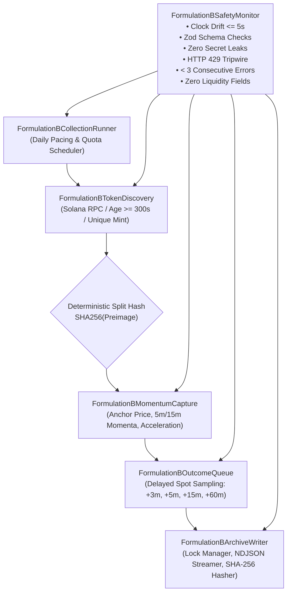
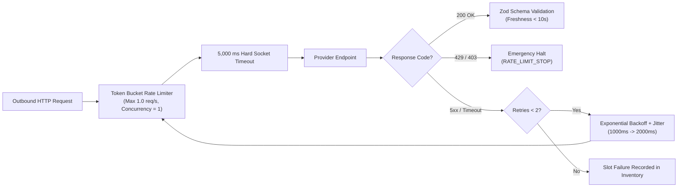

# NeXusTrade Phase 10.6B Formulation B Collection Detailed Implementation Checklist & Architecture Specification

Status: **PROPOSED — Awaiting Human Approval Prior to Implementation**

Date: 2026-09-24  
Author: Planning and Implementation Developer  
Decision Owner: User / Human Reviewer  
Governing Protocol: [Approved Formulation B Protocol Design](file:///u:/Projects/TopG/docs/research-protocols/formulation-b-exploratory-protocol-design.md)  
Pinned Protocol Specification: [Phase 10.6A Formulation B Protocol JSON](file:///u:/Projects/TopG/docs/research-protocols/phase10.6a-exploratory-cohort.formulation-b.v1.json)  
Verified Tooling Baseline: [Phase 10.6B Formulation B Tooling Verification Record](file:///u:/Projects/TopG/docs/Phase-10.6B-Formulation-B-Tooling-Verification.md)  
Approved Scope Proposal: [Formulation B Collection Scope Proposal](file:///u:/Projects/TopG/docs/research-planning/formulation-b-collection-scope.md)

---

## 1. Purpose & Core Research Objectives

The purpose of this document is to specify the detailed architecture, modular subsystems, provider rate budgets, safety tripwires, and phased implementation tasks for conducting an automated **Exploratory Data Collection Run under Formulation B**.

### 1.1 Core Research Question

Formulation B evaluates whether an anchor-liquidity-independent momentum acceleration screening rule ($\text{ACCELERATION\_\_HIGH\_V1}$) can produce a statistically defensible and replicable positive 60-minute forward return effect in held-out validation data:

$$\text{Research Hypothesis: } \Delta_{\text{Validation}} = P(\text{return}_{60m} > 0 \mid \text{Rule}) - P(\text{return}_{60m} > 0 \mid \text{Comp}) > 0.00$$

### 1.2 Approved Governance & Directional Baseline

On 2026-09-24, the user approved the collection scope proposal with the following three binding directional choices:

1. **Provider Strategy (Option A — Multi-Source Fallback)**: Standard Solana RPC for mint discovery / age validation, with redundant public price/momentum fetchers falling closed if fresh momentum ($< 10\text{s}$ latency) cannot be obtained.
2. **Slot Pacing Model (Option A — Uniform Distributed Sampling)**: 12 collection slots per day at uniform intervals across 8 consecutive UTC dates (12.5% daily concentration, comfortably below the 20.00% cap).
3. **Forward Outcome Capture (Option A — Delayed Real-Time Spot Queue)**: Decision-time facts anchored immediately; forward spot prices sampled via real-time queue at $+3\text{m}$, $+5\text{m}$, $+15\text{m}$, and $+60\text{m}$ horizons.

---

## 2. Target Cohort Parameters & Sufficiency Thresholds

The collection process must produce a cohort meeting all pre-registered criteria:

| Cohort Parameter               | Pre-Registered Floor                   | Implementation Target                      | Enforcement Mechanism                  |
| :----------------------------- | :------------------------------------- | :----------------------------------------- | :------------------------------------- |
| **Total Collection Slots**     | Exactly 96 slots attempted             | 96 planned units                           | Paced slot scheduler loop              |
| **Minimum Valid Units**        | $\ge 72$ valid units                   | 96 units target                            | Fails closed if $< 72$ valid units     |
| **Partition Allocation**       | $\ge 32$ units per partition           | $\sim 48$ Discovery / $\sim 48$ Validation | Deterministic split hash               |
| **Temporal Span**              | $\ge 8$ distinct UTC dates             | Exactly 8 consecutive UTC dates            | 12 slots/day across 8 days             |
| **Partition Date Diversity**   | $\ge 4$ UTC dates per partition        | $\sim 8$ dates per partition               | Balanced daily hashing                 |
| **Maximum Date Concentration** | $\le 20.00\%$ of valid units           | $12.50\%$ (12/96 units per date)           | Hard daily quota cap of 12 slots       |
| **Token Deduplication**        | Exactly 0 repeat canonical mints       | 96 distinct canonical mints                | In-memory `seenMints` set              |
| **Decision Momentum Floor**    | $\ge 90.00\%$ availability / partition | $100.00\%$ target                          | Fail slot on unresolvable momentum     |
| **Forward Label Floor**        | $\ge 90.00\%$ 60m label coverage       | $100.00\%$ target                          | Real-time queue retry backoff          |
| **Liquidity Exclusion**        | Exactly 0 liquidity features           | Strict absence of liquidity                | Runtime assertion on decision payloads |

---

## 3. Modular Architecture & Subsystem Specifications

The collector will be implemented as an isolated, strongly-typed TypeScript subsystem under `backend/src/research-formulation-b-collection/`:



### 3.1 Subsystem Specifications

#### 1. Configuration & Argument Parser (`FormulationBCollectionConfig.ts`)

- Strict CLI arguments parser accepting:
  - `--target-slots=96` (default 96)
  - `--days=8` (default 8)
  - `--slots-per-day=12` (default 12)
  - `--archive-root=data/archive/phase10.6a/exploratory-cohort-formulation-b-<timestamp>`
  - `--dry-run` (synthetic mock execution)
- Validates repository-contained archive paths and rejects traversal attempts (`..`, `*`).

#### 2. Token Discovery Subsystem (`FormulationBTokenDiscovery.ts`)

- Queries Solana RPC for recently active SPL mints.
- Verifies asset age $\ge 300\text{ seconds}$ from first block slot.
- Filters out non-SPL programs and non-token mints.
- Enforces strict canonical mint deduplication against `seenMints` set.

#### 3. Momentum & Decision Evidence Engine (`FormulationBMomentumCapture.ts`)

- Fetches anchor-time price (USD), 5-minute price history, and 15-minute price history via public endpoints.
- Calculates:
  $$\text{momentum5mPct} = \frac{P_{\text{anchor}} - P_{-5m}}{P_{-5m}} \times 100, \quad \text{momentum15mPct} = \frac{P_{\text{anchor}} - P_{-15m}}{P_{-15m}} \times 100$$
  $$\text{momentumAccelerationPct} = \text{momentum5mPct} - \text{momentum15mPct}$$
- Verifies timestamp freshness ($< 10\text{s}$ latency between quote and anchor time).
- **Prohibition Guard**: Explicit runtime check confirming that `liquidityUsd`, `quoteImpactBps`, and `poolReserveUsd` are omitted.

#### 4. Delayed Outcome Queue (`FormulationBOutcomeQueue.ts`)

- Non-blocking in-memory scheduler registering timer callbacks for $+3\text{m}$, $+5\text{m}$, $+15\text{m}$, and $+60\text{m}$.
- Samples spot price at exact elapsed horizons ($P_{+3m}, P_{+5m}, P_{+15m}, P_{+60m}$).
- Calculates:
  $$\text{return}_{60m} = \frac{P_{+60m} - P_{\text{anchor}}}{P_{\text{anchor}}} \times 100$$
- Assigns primary label: `POSITIVE_60M` ($\text{return}_{60m} > 0$), `NON_POSITIVE_60M` ($\text{return}_{60m} \le 0$), or `UNUSABLE_60M` (if quote fails after retries).

#### 5. Safety & Health Monitor (`FormulationBSafetyMonitor.ts`)

- Encapsulates 6 fail-closed safety tripwires (Section 5).
- Maintains safety counters and halts execution immediately on any non-zero tripwire event.

#### 6. Archive Writer & Lock Manager (`FormulationBArchiveWriter.ts`)

- Manages `collection.lock` lifecycle.
- Appends completed unit records to `units.v1.ndjson`.
- Logs all provider interactions to `source-inventory.v1.json`.
- On completion, writes `collection-summary.v1.json`, computes all artifact SHA-256 hashes, writes `cohort-manifest.v1.json`, and atomically unlinks `collection.lock`.

#### 7. Collection Orchestration Runner (`FormulationBCollectionRunner.ts`)

- Manages daily 12-slot distribution, rate limiter pacing, graceful shutdown on SIGINT/SIGTERM, and completion verification.

---

## 4. Provider Call Budgets, Rate Limits & Serialization Rules

To guarantee zero provider overload, prevent IP bans, and ensure predictable execution:



### 4.1 Budget Specifications

| Scope                    | Maximum Cap                       | Enforcement Mechanism                               |
| :----------------------- | :-------------------------------- | :-------------------------------------------------- |
| **Concurrency**          | Exactly 1 request at a time       | Serialized async queue                              |
| **Request Pacing**       | $\le 1.0\text{ request / second}$ | Token-bucket rate limiter ($1000\text{ms}$ delay)   |
| **Per-Request Timeout**  | Hard $5,000\text{ ms}$            | `AbortController` timeout                           |
| **Retry Limit**          | Maximum 2 retries / call          | Bounded retry loop with exponential jitter          |
| **Per-Slot Budget**      | Maximum 6 requests                | Tracked per slot (1 discovery, 1 anchor, 4 forward) |
| **Daily Request Budget** | Maximum 120 requests / date       | Daily quota counter                                 |
| **Total Cohort Budget**  | Maximum 600 requests total        | Global request counter                              |
| **Cost Ceiling**         | \$0.00 USD (Public / Free tier)   | Zero paid APIs permitted                            |

---

## 5. Safety Tripwires & Emergency Fail-Closed Stops

The collector will immediately halt, preserve `collection.lock`, log full diagnostics, and exit with status code 1 if any of the following 6 tripwires are triggered:

| Tripwire ID                          | Trigger Condition                                                       | Safety Action & Outcome                                   |
| :----------------------------------- | :---------------------------------------------------------------------- | :-------------------------------------------------------- |
| **TRIPWIRE-1: Clock Drift**          | Clock skew relative to network time headers $> \pm 5.0\text{s}$         | Abort run; write `CLOCK_DRIFT_STOP` in manifest           |
| **TRIPWIRE-2: Schema Violation**     | Zod validation failure on provider response payload                     | Abort run; write `SCHEMA_INTEGRITY_STOP` in manifest      |
| **TRIPWIRE-3: Secret Leakage**       | API key, private key, or credential string detected in memory/logs      | Abort run; write `SECRET_LEAKAGE_STOP` in manifest        |
| **TRIPWIRE-4: Rate-Limit Response**  | HTTP `429 Too Many Requests` or `403 Forbidden` received                | Abort run; write `RATE_LIMIT_STOP` in manifest            |
| **TRIPWIRE-5: Consecutive Errors**   | $\ge 3$ consecutive collection slots fail                               | Abort run; write `CONSECUTIVE_ERROR_STOP` in manifest     |
| **TRIPWIRE-6: Liquidity Field Leak** | Any field named `liquidity`, `reserve`, or `impact` in decision payload | Abort run; write `LIQUIDITY_PROHIBITION_STOP` in manifest |

---

## 6. Archive Directory & Artifact Schema Contracts

### 6.1 Directory Structure

```text
data/archive/phase10.6a/exploratory-cohort-formulation-b-20260925-1400Z/
├── collection.lock             (Present only during collection; unlinked upon clean finalization)
├── cohort-manifest.v1.json     (Final manifest, protocol SHA, artifact hashes, zero safety counters)
├── units.v1.ndjson             (96 unit records with identity, anchor facts, and forward returns)
├── source-inventory.v1.json    (Ledger of all provider calls, timestamps, latency buckets, and status)
└── collection-summary.v1.json  (Aggregate cohort statistics, dates, and partition unit counts)
```

### 6.2 Schema Specifications

#### `cohort-manifest.v1.json`

```json
{
  "contractVersion": "1",
  "protocolId": "EXPLORATORY_COHORT_FORMULATION_B@v1",
  "protocolPath": "docs/research-protocols/phase10.6a-exploratory-cohort.formulation-b.v1.json",
  "protocolSha256": "241ac7b18711c0b08cc9083b02085c847f71594448c7d9286eb4333194036fda",
  "archiveRoot": "data/archive/phase10.6a/exploratory-cohort-formulation-b-20260925-1400Z/",
  "finalOutcome": "COHORT_COMPLETE",
  "attemptedSlotCount": 96,
  "validUnitCount": 96,
  "distinctMintCount": 96,
  "safetyCounters": {
    "clockDriftStops": 0,
    "schemaIntegrityStops": 0,
    "secretLeakageStops": 0,
    "budgetExceededStops": 0
  },
  "executionFlags": {
    "walletLoaded": false,
    "transactionSigned": false,
    "orderSubmitted": false
  },
  "finalFileHashes": {
    "units.v1.ndjson": "<sha256-hex>",
    "source-inventory.v1.json": "<sha256-hex>",
    "collection-summary.v1.json": "<sha256-hex>"
  }
}
```

#### `units.v1.ndjson` (Per-Line Record)

```json
{
  "unitId": "unit-001",
  "canonicalMint": "EPjFWdd5AufqSSqeM2qN1xzybapC8G4wEGGkZwyTDt1v",
  "slotId": "slot-20260925-001",
  "anchorAt": "2026-09-25T14:00:00.000Z",
  "partition": "DISCOVERY",
  "decisionTimeEvidence": {
    "priceUsd": 1.0002,
    "momentum5mPct": 4.52,
    "momentum15mPct": 1.2,
    "momentumAccelerationPct": 3.32,
    "assetAgeSeconds": 1420
  },
  "forwardOutcomeLabels": {
    "return60mPct": 2.45,
    "primaryLabel": "POSITIVE_60M",
    "return3mPct": 0.35,
    "return5mPct": 0.8,
    "return15mPct": 1.1
  }
}
```

---

## 7. Phased Implementation Tasks Checklist

The following 6 ordered tasks will be implemented and verified:

- [ ] **Task 1: Configuration & CLI Argument Parser**
  - [ ] Implement `FormulationBCollectionConfig.ts` with strict Zod parsing.
  - [ ] Enforce archive path validation and reject unsafe path shapes.
  - [ ] Add unit tests in `FormulationBCollectionConfig.test.ts`.

- [ ] **Task 2: Rate Limiter & Provider Fetchers**
  - [ ] Implement token-bucket rate limiter ($\le 1.0\text{ req/s}$, $\text{concurrency}=1$).
  - [ ] Implement `FormulationBTokenDiscovery.ts` with mint deduplication.
  - [ ] Implement `FormulationBMomentumCapture.ts` with $< 10\text{s}$ freshness verification and liquidity exclusion.
  - [ ] Add unit tests with mock HTTP fixtures in `FormulationBMomentumCapture.test.ts`.

- [ ] **Task 3: Delayed Real-Time Outcome Queue**
  - [ ] Implement `FormulationBOutcomeQueue.ts` with delayed timers at $+3\text{m}, +5\text{m}, +15\text{m}, +60\text{m}$.
  - [ ] Calculate return percentages and assign primary/descriptive labels.
  - [ ] Add timer simulation tests in `FormulationBOutcomeQueue.test.ts`.

- [ ] **Task 4: Safety Monitor & Lock Protocol**
  - [ ] Implement `FormulationBSafetyMonitor.ts` with all 6 tripwires.
  - [ ] Implement `FormulationBArchiveWriter.ts` with `collection.lock` management and SHA-256 artifact hashing.
  - [ ] Add fail-closed tripwire tests in `FormulationBSafetyMonitor.test.ts`.

- [ ] **Task 5: Collection Orchestrator & CLI Runner**
  - [ ] Implement `FormulationBCollectionRunner.ts` managing 12 slots/day across 8 days.
  - [ ] Implement CLI entrypoint `backend/src/scripts/research-formulation-b-collect.ts`.
  - [ ] Add script to `package.json`: `"research:exploratory-cohort:collect-formulation-b"`.

- [ ] **Task 6: Synthetic Verification & Isolated Harness Conformance**
  - [ ] Add comprehensive synthetic test suite running end-to-end dry-run collection.
  - [ ] Verify that finalized synthetic collection archive passes `pnpm research:exploratory-cohort:analyze-formulation-b`.
  - [ ] Execute `node scripts/verify-isolated.mjs` to ensure 100% pass across all static checks and test suites.

---

## 8. Operating Boundaries & Governance Non-Authorizations

1. **Documentation Only**: This document is an architecture specification and implementation checklist. It does **NOT** authorize running collection or making live network requests.
2. **Default Denial**: All trading, paper trading, wallet loading, and order submission surfaces remain strictly disabled.
3. **Separate Authorization Required**: Implementation of collector code (Tasks 1–6) and live data collection execution each require separate, explicit human approval.
