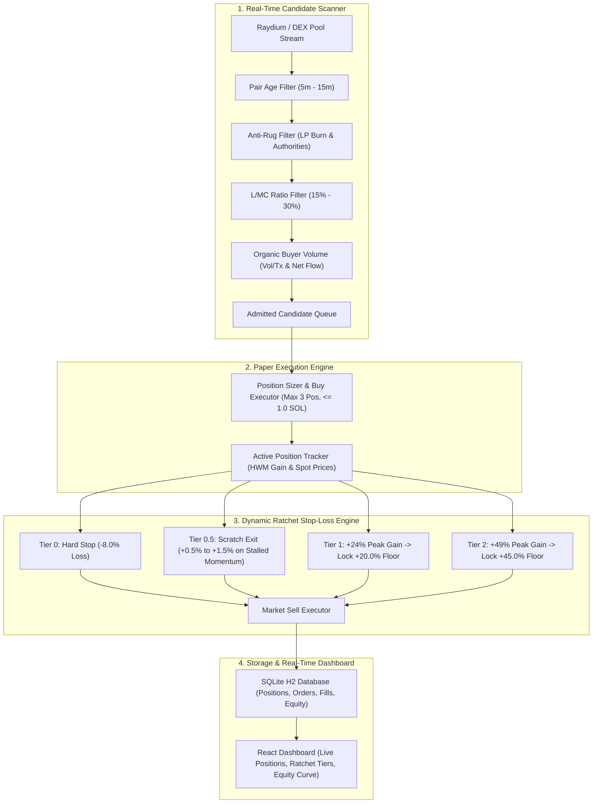
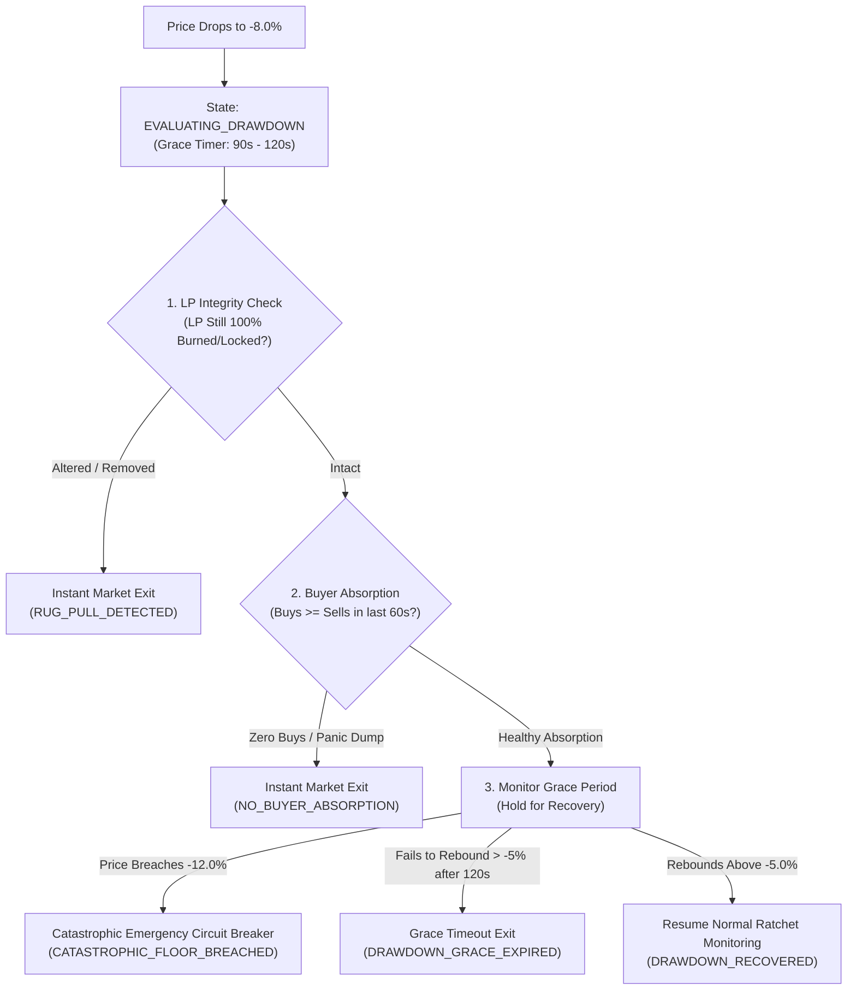

# NeXusTrade Phase 11: Live Scanner & Dynamic Ratchet Exit Engine Detailed Implementation Checklist & Architecture Specification

Status: **APPROVED & READY FOR IMPLEMENTATION**

Date: 2026-09-24  
Author: Architecture and Implementation Team  
Decision Owner: User / Human Reviewer  
Governing Scope: [Approved Phase 11 Scope Proposal](file:///u:/Projects/TopG/docs/research-planning/phase-11-live-scanner-and-ratchet-engine-scope.md)  
Baseline Repository Commit: `984fb74` (`node scripts/verify-isolated.mjs` 100% Passing)

---

## 1. Purpose & Architecture Overview

The purpose of Phase 11 is to build, synthetically verify, and deploy an automated, end-to-end live trading system on Solana combining:

1. **A Real-Time Candidate Scanner** (`backend/src/scanner/`): Streams new and active Solana liquidity pools from Raydium and DEX aggregators, applying strict quantitative admission filters for Liquidity-to-Market-Cap (L/MC) depth, pair maturity, anti-rug safety (LP burn/lock and authority renunciation), and organic buyer volume.
2. **A Dynamic Multi-Tiered Ratchet Stop-Loss Engine** (`backend/src/exits/`): Tracks position-level high-water-mark peak gains to enforce a strict \(-8.0\%\) initial hard circuit breaker, early scratch exits on momentum exhaustion, and monotonically advancing profit floors (\(+24\% \to +20\%\), \(+49\% \to +45\%\)).
3. **An Autonomous Live Paper Trading Daemon** (`backend/src/paper/`): Executes continuous 4–10 hour daily paper trading sessions with portfolio-level drawdown tripwires and clean session accounting.
4. **An Interactive React Trading Dashboard** (`frontend/src/`): Provides real-time visibility into open positions, dynamic ratchet tiers, trade logs, portfolio equity curves, and scanner radar metrics.



---

## 2. Quantitative Filter Specifications & Math Formulas

### 2.1 Scanner Filters

| Filter Dimension            | Mathematical Formula                                                                   | Acceptance Threshold                                      | Failure Rejection Reason                  |
| :-------------------------- | :------------------------------------------------------------------------------------- | :-------------------------------------------------------- | :---------------------------------------- |
| **Pair Maturity**           | \(\text{Age}_{\text{sec}} = t_{\text{now}} - t\_{\text{pool_open}}\)                   | \(300\text{s} \le \text{Age} \le 900\text{s}\) (5–15 min) | `REJECTED_OUTSIDE_MATURITY_WINDOW`        |
| **Liquidity-to-Market-Cap** | \(\text{L/MC} = \frac{\text{Liquidity USD}}{\text{FDV / Market Cap USD}}\)             | \(0.15 \le \text{L/MC} \le 0.30\) (15%–30%)               | `REJECTED_IMBALANCED_LIQUIDITY_DEPTH`     |
| **LP Burn / Lock**          | \(\text{BurnPct} = \frac{\text{Burned LP Tokens}}{\text{Total LP Tokens}} \times 100\) | \(\text{BurnPct} \ge 90.0\%\)                             | `REJECTED_UNLOCKED_LP_RISK`               |
| **Mint Authority**          | \(\text{MintAuth} \in \{\text{null}, \text{disabled}, \text{"1111...1111"}\}\)         | Renounced / Disabled                                      | `REJECTED_ACTIVE_MINT_AUTHORITY`          |
| **Freeze Authority**        | \(\text{FreezeAuth} \in \{\text{null}, \text{disabled}\}\)                             | Renounced / Disabled                                      | `REJECTED_ACTIVE_FREEZE_AUTHORITY`        |
| **Unique Tx Count**         | \(\text{TxCount}\_{5m}\)                                                               | \(\ge 20\) unique transactions / 5 min                    | `REJECTED_INSUFFICIENT_TRANSACTION_COUNT` |
| **Average Tx Size**         | \(\text{AvgTx} = \frac{\text{Volume}_{5m}\text{ (USD)}}{\text{TxCount}_{5m}}\)         | \(\$15 \le \text{AvgTx} \le \$2,500\)                     | `REJECTED_WASH_TRADE_SIZE_ANOMALY`        |
| **Net Buyer Flow**          | \(\Delta*{\text{flow}} = \text{Buys}*{5m} - \text{Sells}\_{5m}\)                       | \(\Delta\_{\text{flow}} \ge 0\)                           | `REJECTED_NET_SELLER_DOMINANCE`           |

---

### 2.2 Dynamic Ratchet Stop-Loss & Smart Re-evaluation State Machine

For an open position with weighted entry price \(P_0\) and current spot price \(P_t\):

- **Unrealized PnL**: \(\text{PnL}\_t = \frac{P_t - P_0}{P_0}\)
- **High-Water-Mark Peak Gain**: \(\text{PeakGain}_t = \max_{0 \le \tau \le t} \left(\frac{P\_\tau - P_0}{P_0}\right)\)
- **Monotonic Stop Floor Invariant**: \(\text{StopFloor}\_{t+1} \ge \text{StopFloor}\_t\) (locked profit floors can never be lowered).



| Ratchet / Exit Tier              | Trigger Conditions                                                                                    | Active Stop Floor Price / State                                | Exit Action                                                   |
| :------------------------------- | :---------------------------------------------------------------------------------------------------- | :------------------------------------------------------------- | :------------------------------------------------------------ |
| **Tier 0: Re-evaluation Gate**   | \(\text{PnL}\_t \le -8.0\%\)                                                                          | Enters `EVALUATING_DRAWDOWN` state (90–120s grace)             | Re-evaluates LP integrity & buyer absorption                  |
| **Tier 0-R: Rug / Abandon Exit** | LP altered OR \(\text{Buys}\_{60s} = 0\)                                                              | Immediate exit at current price                                | Market Sell-All (`RUG_PULL_DETECTED` / `NO_BUYER_ABSORPTION`) |
| **Tier 0-C: Catastrophic Floor** | \(\text{PnL}\_t \le -12.0\%\) at any point                                                            | Non-negotiable hard floor at \(P_0 \times 0.88\)               | Immediate Market Sell-All (`CATASTROPHIC_FLOOR_BREACHED`)     |
| **Tier 0-T: Grace Timeout**      | Fails to recover above \(-5.0\%\) in 120s                                                             | Time-out at current price (\(\approx -8\%\text{ to }-10\%\))   | Market Sell-All (`DRAWDOWN_GRACE_EXPIRED`)                    |
| **Tier 0.5: Scratch Exit**       | \(+0.5\% \le \text{PnL}_t \le +1.5\%\) AND (\(M_{5m} \le 0\%\) or Volume Drops for \(\ge 3\text{m}\)) | Immediate Market Exit                                          | Market Sell-All to recycle capital                            |
| **Tier 1: Ratchet 1**            | \(\text{PeakGain}\_t \ge +24.0\%\)                                                                    | \(P\_{\text{stop}} = P_0 \times (1 + 0.20) = P_0 \times 1.20\) | Market Sell-All on \(P*t \le P*{\text{stop}}\)                |
| **Tier 2: Ratchet 2**            | \(\text{PeakGain}\_t \ge +49.0\%\)                                                                    | \(P\_{\text{stop}} = P_0 \times (1 + 0.45) = P_0 \times 1.45\) | Market Sell-All on \(P*t \le P*{\text{stop}}\)                |

---

## 3. Ordered Implementation Tasks

### Task 1: Real-Time Candidate Scanner (`backend/src/candidate-scanner/`)

- [x] **1.1 Scanner Types & Config**:
  - Implement `backend/src/candidate-scanner/CandidateScannerTypes.ts` declaring `ScannedPoolRecord`, `CandidateScannerCandidate`, and `CandidateScannerRuntimeConfig`.
  - Implement `backend/src/candidate-scanner/CandidateScannerConfig.ts` with CLI argument parser (`--min-age-sec=300`, `--max-age-sec=900`, `--min-lmc=0.15`, `--max-lmc=0.30`, `--min-lp-burn=90.0`).
- [x] **1.2 Stream Ingestion Engine**:
  - Implement `backend/src/candidate-scanner/CandidateStreamEngine.ts` querying Raydium AMM / CLMM pool lists with automated pagination and candidate deduplication.
- [x] **1.3 Architecture Policy Registration**:
  - Register `backend/src/candidate-scanner/` modules in `scripts/architecture-policy.json` with audited import boundaries and capabilities (`fetch`, `setTimeout`).
- [x] **1.4 Unit Tests**:
  - Create `backend/src/candidate-scanner/CandidateScannerConfig.test.ts` and `backend/src/candidate-scanner/CandidateStreamEngine.test.ts`.

---

### Task 2: Anti-Rug & L/MC Evaluator (`backend/src/candidate-scanner/`)

- [x] **2.1 L/MC Depth Evaluator**:
  - Implement `backend/src/candidate-scanner/evaluators/LiquidityMarketCapEvaluator.ts` asserting \(0.15 \le \text{L/MC} \le 0.30\).
- [x] **2.2 Anti-Rug & Authority Evaluator**:
  - Implement `backend/src/candidate-scanner/evaluators/AntiRugEvaluator.ts` verifying \(\ge 90\%\) LP burn/lock and renounced Mint/Freeze authorities.
- [x] **2.3 Organic Buyer Flow Evaluator**:
  - Implement `backend/src/candidate-scanner/evaluators/OrganicFlowEvaluator.ts` evaluating \(\text{TxCount}\_{5m} \ge 20\), average transaction size bounds (\$15 to \$2,500), and net buyer ratio.
- [x] **2.4 Composite Scanner Evaluator**:
  - Implement `backend/src/candidate-scanner/CandidateScannerEvaluator.ts` executing all evaluators with structured pass/fail diagnostics and rejection codes.
- [x] **2.5 Unit Test Suite**:
  - Create `backend/src/candidate-scanner/CandidateScannerEvaluator.test.ts` testing 11 synthetic fixtures (boundary edge cases, rug attempts, wash trading).

---

### Task 3: Dynamic Ratchet Stop-Loss & Smart Re-evaluation Engine (`backend/src/exits/`)

- [x] **3.1 High-Water-Mark & Drawdown State Model**:
  - Implement `backend/src/exits/DynamicRatchetTypes.ts` and `backend/src/exits/RatchetStateStore.ts` tracking `peakGainBps`, `currentStopFloorBps`, `drawdownState` (`NORMAL`, `EVALUATING_DRAWDOWN`), and `drawdownEnteredAtMs`.
- [x] **3.2 Smart Re-evaluation & Dynamic Ratchet Trigger Evaluator**:
  - Implement `backend/src/exits/DynamicRatchetService.ts` implementing the state machine:
    - **Re-evaluation Gate at -8%**: Enters `EVALUATING_DRAWDOWN` with a 90–120s grace period.
    - **Health Classifier**: Checks LP integrity (instant exit if modified) and buyer absorption (holds if \(\text{Buys}_{60s} \ge \text{Sells}_{60s}\)).
    - **Catastrophic Disaster Floor at -12%**: Non-negotiable hard circuit breaker at \(-12.0\%\).
    - **Grace Timeout**: Exits if price fails to recover \(\ge -5.0\%\) after 120s.
    - **Scratch Exit**: \(+0.5\%\text{ to }+1.5\%\) with stalled momentum / volume drop.
    - **Level 1 Ratchet**: Peak gain \(\ge +24.0\% \to\) Floor locked at \(+20.0\%\).
    - **Level 2 Ratchet**: Peak gain \(\ge +49.0\% \to\) Floor locked at \(+45.0\%\).
    - **Monotonicity Assertion**: Fails closed if locked profit floor decreases.
- [x] **3.3 Exit Manager Wiring**:
  - Wire `DynamicRatchetService` into `backend/src/exits/ExitManagerService.ts` and `backend/src/paper/PaperSellExecutionService.ts`.
- [x] **3.4 Unit & Property Tests**:
  - Create `backend/src/exits/DynamicRatchetService.test.ts` verifying all re-evaluation triggers, dip vs rug health checks, grace timeouts, -12% catastrophic floor breaches, ratchet transitions, and monotonicity invariants across synthetic price paths.

---

### Task 4: Autonomous Paper Trading Daemon (`backend/src/paper/`)

- [x] **4.1 Paper Daemon Runner**:
  - Implement `backend/src/paper/PaperTradingDaemon.ts` orchestrating:
    - Candidate Scanner \(\to\) Position Sizer (\(\le 3\) open positions, \(1.0\text{ SOL}\) max allocation) \(\to\) Paper Buy Execution \(\to\) Dynamic Ratchet Monitoring Loop \(\to\) Accounting & Snapshotting.
- [x] **4.2 Portfolio Risk & Circuit Breakers**:
  - Implement daily drawdown limit (\(-5.0\%\) portfolio loss), consecutive error halt (\(\ge 3\)), and clock drift detection (\(\le 5.0\text{s}\)).
- [x] **4.3 CLI Entrypoint**:
  - Create `backend/src/scripts/paper-trading-daemon.ts` and register pnpm script `pnpm trading:paper-daemon`.
- [x] **4.4 Integration Tests**:
  - Create `backend/src/paper/PaperTradingDaemon.test.ts` verifying synthetic multi-hour sessions, buy/sell fill accounting, and circuit breaker tripwires.

---

### Task 5: Interactive React Trading Dashboard (`frontend/src/`)

- [x] **5.1 Data Models & Shared Schemas**:
  - Add `livePaperPositionSchema`, `ratchetTierSchema`, and `scannerRadarItemSchema` to `shared/src/phase11-schemas.ts`.
- [x] **5.2 Live Position & Ratchet Component**:
  - Implement `frontend/src/components/LivePositionsGrid.tsx` rendering open positions, entry/spot prices, unrealized PnL, peak gains, and color-coded active ratchet tiers (HARD_STOP, SCRATCH, TIER_1, TIER_2).
- [x] **5.3 Scanner Radar Feed**:
  - Implement `frontend/src/components/ScannerRadarTable.tsx` displaying streamed candidates, L/MC ratios, LP burn status, and admission/rejection diagnostics.
- [x] **5.4 Trade History & Equity Curve**:
  - Implement `frontend/src/components/EquityCurveChart.tsx` and `frontend/src/components/TradeHistoryTable.tsx` tracking win rate, loss rate, scratch rate, and realized PnL.
- [x] **5.5 Dashboard Unit Tests**:
  - Create `frontend/src/components/LivePositionsGrid.test.tsx` and `frontend/src/components/ScannerRadarTable.test.tsx`.

---

### Task 6: PowerShell Operator Tooling & Isolated Verification

- [x] **6.1 Operator Scripts**:
  - Create `scripts/start-paper-daemon.ps1` launching the background daemon using standard Windows PowerShell (`powershell.exe`).
  - Create `scripts/inspect-paper-session.ps1` inspecting live open positions, ratchet tiers, equity, and error counters.
  - Create `scripts/stop-paper-session.ps1` safely signalling graceful session termination and market-closing open positions.
- [x] **6.2 Full Isolated Verification**:
  - Execute `node scripts/verify-isolated.mjs` confirming 100% pass across static checks, TypeScript compilation, ESLint, Prettier, Architecture Policy, and all Vitest suites.
- [ ] **6.3 Mainnet Verification Run**:
  - Execute a 1-hour live mainnet paper session to prove real token candidate screening and live ratchet price monitoring.

---

## 4. Synthetic Verification Test Matrix

```
+-----------------------------------------------------------------------------------------------+
| SYNTHETIC TEST FIXTURES                                                                       |
+-----------------------------------------------------------------------------------------------+
| Test Name                     | Input Conditions                         | Expected Outcome   |
+-------------------------------+------------------------------------------+--------------------+
| LMC_Evaluator_Underflow       | Liquidity $10k, MC $100k (L/MC = 10.0%)  | REJECT (< 15.0%)   |
| LMC_Evaluator_Valid           | Liquidity $20k, MC $100k (L/MC = 20.0%)  | PASS (15% - 30%)   |
| LMC_Evaluator_Overflow        | Liquidity $40k, MC $100k (L/MC = 40.0%)  | REJECT (> 30.0%)   |
| AntiRug_LP_Unlocked           | LP Burned = 50.0%                        | REJECT (< 90.0%)   |
| AntiRug_Mint_Active           | Mint Authority != null                   | REJECT (Active)    |
| AntiRug_Freeze_Active         | Freeze Authority != null                 | REJECT (Active)    |
| Organic_WashTrade_Anomaly     | Vol = $50k, TxCount = 2 (Avg = $25k)     | REJECT (Wash Tx)   |
| ReEval_Dip_HealthyRecovery    | PnL -8.5%, LP 100% Locked, Buys > Sells   | HOLD & RECOVER (-5%)|
| ReEval_Rug_Pull_ImmediateExit | PnL -8.5%, LP Altered / Removed           | SELL NOW (Rug Exit)|
| ReEval_NoBuyers_ImmediateExit | PnL -8.5%, 0 Buys in 60s, Sell Wave       | SELL NOW (No Buyer)|
| ReEval_Catastrophic_HardStop  | PnL drops to -12.1% during grace window   | SELL (-12.0% Floor)|
| ReEval_Grace_Timeout_Exit     | PnL stays -8.5% for > 120s without rebound| SELL (Grace Timeout|
| Ratchet_ScratchExit_Triggered | Entry 1.0 SOL, Spot 1.01 SOL, M5m <= 0   | SCRATCH (+1.0%)    |
| Ratchet_Tier1_Lock            | Entry 1.0 SOL, Peak 1.25 SOL, Spot 1.19  | SELL (+20.0% Floor)|
| Ratchet_Tier2_Lock            | Entry 1.0 SOL, Peak 1.50 SOL, Spot 1.44  | SELL (+45.0% Floor)|
| Ratchet_Monotonicity_Check    | Price drops from 1.30 to 1.10 SOL        | Floor stays +20.0% |
+-----------------------------------------------------------------------------------------------+
```

---

## 5. Windows PowerShell Operator Commands

```powershell
# 1. Start Background Paper Trading Daemon (Windows PowerShell)
powershell.exe -File .\scripts\start-paper-daemon.ps1 -DurationHours 6 -MaxPositions 3 -PositionSizeSol 1.0

# 2. Inspect Running Paper Trading Session & Positions
powershell.exe -File .\scripts\inspect-paper-session.ps1 -SessionId "paper-daemon-latest"

# 3. Gracefully Stop Paper Trading Session
powershell.exe -File .\scripts\stop-paper-session.ps1 -SessionId "paper-daemon-latest"
```

---

## 6. Strict Operating Boundaries & Verification Criteria

1. **Default Denial & Isolated Execution**:
   - All unit and integration test suites run strictly against synthetic fixtures and in-memory mock adapters.
   - Zero live network requests or external RPC calls during `node scripts/verify-isolated.mjs`.
2. **Deterministic Accounting**:
   - Every paper order, fill, position state change, and equity snapshot must record clean H2 database transactions with exact lamport accounting.
3. **Fail-Closed Safety**:
   - Any anomaly in pool schema, authority state, clock drift (\(> 5\text{s}\)), or provider rate limit (HTTP 429/403) immediately fails closed without risking capital.
