# NeXusTrade Phase 12: Interactive Trading Dashboard & Control Plane Detailed Implementation Checklist

Status: **APPROVED FOR IMPLEMENTATION**  
Date: 2026-09-24  
Author: Architecture & Implementation Team  
Decision Owner: User / Human Reviewer  
Governing Scope: [Phase 12 Scope Specification](file:///u:/Projects/TopG/docs/research-planning/phase-12-trading-dashboard-and-control-plane-scope.md)  
Baseline Repository State: Phase 11 Verified (69 test files, 654 tests passing)

---

## 1. Overview & Architectural Blueprint

The purpose of Phase 12 is to build, integrate, and verify the full interactive **Trading Dashboard and Control Plane** according to the operator's 3-page vision:

```mermaid
flowchart TD
    subgraph UI ["Phase 12: 3-Page React Dashboard"]
        Nav["Navigation Bar (Tabs: Settings | Active Session | Past Sessions)"]
        Nav --> P1["1. Settings View"]
        Nav --> P2["2. Active Session View"]
        Nav --> P3["3. Past Sessions View"]

        P1 --> P1_W["Refresh Wallet Info (SOL & SPL Tokens)"]
        P1 --> P1_S["Concurrency Slider (1-10) & Sizing"]
        P1 --> P1_R["Gas Fee Reserve & Deployable SOL"]
        P1 --> P1_G["Goal Switch (% Gain vs Final SOL)"]

        P2 --> P2_T["Telemetry (Unrealized / Realized / Net PnL)"]
        P2 --> P2_C["Counters (Open, Closed, W / L / Scratch)"]
        P2 --> P2_G["Position Cards (Ratchet Badges & Stop Distance)"]
        P2 --> P2_A["Controls (Pause | Resume | Start Exiting)"]

        P3 --> P3_L["Session History Ledger"]
        P3 --> P3_E["Cumulative Equity Curve Chart"]
    end

    subgraph StateAndIPC ["State & IPC Engine"]
        ActiveState[".tmp/paper-session-active.json"]
        SettingsState[".tmp/dashboard-settings.json"]
        HistoryFiles["data/sessions/*.json"]
    end

    subgraph DaemonBackend ["Paper Trading Daemon Backend"]
        Daemon["PaperTradingDaemon & Runner"]
    end

    P1 <--> SettingsState
    P2 <--> ActiveState
    P3 <--> HistoryFiles
    Daemon <--> ActiveState
```



---

## 2. Ordered Implementation Tasks

### Part A: Interactive Dashboard & Visual Control Plane (Phase 12A)

#### Task 1: Shared Data Contracts & Schemas

- [ ] Define type-safe Zod schemas in `shared/src/phase12-dashboard-schemas.ts`:
  - `DashboardSettingsSchema`:
    - `maxConcurrentPositions`: `z.number().int().min(1).max(10).default(3)`
    - `positionSizeSol`: `z.number().positive().default(1.0)`
    - `gasReserveSol`: `z.number().nonnegative().default(0.05)`
    - `goalMode`: `z.enum(["PERCENT_GAIN", "FINAL_SOL_BALANCE"]).default("PERCENT_GAIN")`
    - `targetGoalValue`: `z.number().positive().default(10.0)`
    - `walletAddress`: `z.string().default("")`
    - `strategyThresholds`: `z.object({ minLmcRatio: z.number().default(0.15), maxLmcRatio: z.number().default(0.30), minBuyToSellRatio: z.number().default(1.5), minVolume5mUsd: z.number().default(2500), minMaturityAgeSec: z.number().default(300), maxMaturityAgeSec: z.number().default(900) }).default({})`
  - `WalletTelemetrySchema`:
    - `solBalance`: `z.number().nonnegative()`
    - `deployableSol`: `z.number().nonnegative()`
    - `tokens`: array of `{ mint: string, symbol: string, amount: number, decimals: number }`
    - `signatureReady`: `z.boolean()`
    - `fetchedAt`: `z.string()`
  - `SessionControlCommandSchema`:
    - `action`: `z.enum(["PAUSE", "RESUME", "START_EXITING", "MANUAL_EXIT", "EMERGENCY_STOP"])`
    - `targetPositionId`: `z.string().optional()`
    - `issuedAt`: `z.number()`
- [ ] Export schemas and TypeScript inference types from `shared/src/index.ts`.

---

#### Task 2: Backend Wallet Query & IPC Control Service

- [ ] Create `backend/src/wallet/WalletTelemetryService.ts`:
  - Connects to Solana RPC to fetch native lamport balance via `getBalance`.
  - Parses SPL token accounts via `getTokenAccountsByOwner` with token program ID.
  - Formats balances and computes `deployableSol = Math.max(0, solBalance - gasReserveSol)`.
- [ ] Create `backend/src/session/SessionControlIpcService.ts`:
  - Manages IPC communication between React UI and `PaperTradingDaemon`.
  - Reads and dispatches commands:
    - `PAUSE`: Halts new pool admissions in daemon.
    - `RESUME`: Re-enables pool admissions in daemon.
    - `START_EXITING`: Freezes admissions, sets daemon wind-down flag, waits for natural scratch or profit exits before stopping.
    - `MANUAL_EXIT`: Immediately triggers market close for a specific position.
    - `EMERGENCY_STOP`: Closes all open positions and halts daemon immediately.
- [ ] Unit tests in `backend/src/wallet/WalletTelemetryService.test.ts` and `backend/src/session/SessionControlIpcService.test.ts`.

---

#### Task 3: Settings View (`frontend/src/views/SettingsView.tsx`)

- [ ] Implement Settings View component:
  - **Wallet Header Card**:
    - "Refresh Wallet Info" button with loading state.
    - SOL Balance display and SPL token account list.
    - Connection / Signature readiness badge.
  - **Capital & Position Sizing Controls**:
    - Max Concurrent Positions slider (`1` to `10`) with synchronized numeric input.
    - Position Size text input in SOL.
  - **Gas Reserve & Available SOL Display**:
    - Gas Fee Reserve input (SOL).
    - Highlighted card showing: $\text{Deployable SOL} = \max(0, \text{Total SOL} - \text{Gas Reserve})$.
    - Max position capacity indicator: $\lfloor \text{Deployable SOL} / \text{Position Size} \rfloor$.
  - **Profit Goal Mode Switch**:
    - Toggle between `% Gain Goal` and `Final SOL Target`.
    - Input field for target value with validation.
    - Informational badge explaining auto-trigger of graceful wind-down when target is reached.
  - **Strategy Threshold Controls**:
    - Sliders and inputs for Min/Max L/MC, Min Buy/Sell ratio, Min 5m Volume.
  - **Save & Apply**: Persists settings to local storage / `.tmp/dashboard-settings.json`.
- [ ] Unit test in `frontend/src/views/SettingsView.test.tsx`.

---

#### Task 4: Active Session View (`frontend/src/views/ActiveSessionView.tsx`)

- [ ] Implement Active Session View component:
  - **Telemetry Banner**:
    - Session Status badge (`IDLE`, `RUNNING`, `PAUSED`, `EXITING`, `COMPLETED`).
    - Realized P/L ($SOL$ and `bps`/`%`).
    - Unrealized P/L ($SOL$ and `bps`/`%`).
    - Net Total Session P/L with color-coded profit/loss styling.
    - Session timer (Elapsed / Remaining).
  - **5-Stat Metric Counter Grid**:
    - Open Positions counter (e.g., `2 / 3`).
    - Closed Trades count.
    - Wins count ($\ge +1.0\%$).
    - Losses count ($< -1.0\%$).
    - Scratches count ($-1.0\%$ to $+1.0\%$).
  - **Open Positions Cards / Grid**:
    - Token symbol and truncated mint address.
    - Entry price & current spot price ($SOL$).
    - Real-time PnL ($SOL$ and `bps`/`%`).
    - **Ratchet Tier Badge**:
      - `ENTRY` (Initial stop $-12\%$).
      - `SCRATCH ARMED` ($+0.5\%$ gain reached).
      - `SMART HOLD` ($-8.0\%$ dip grace hold active).
      - `TIER 1 LOCKED` ($+20.0\%$ floor locked).
      - `TIER 2 LOCKED` ($+45.0\%$ floor locked).
    - **Stop-Loss Trigger Distance**:
      - Floor price in SOL.
      - Relative distance meter (e.g., `-3.8% away from stop`).
    - **Manual Exit Button**: One-click market close modal with confirmation.
  - **Candidate Watchlist / Radar Table**:
    - Live table of tokens currently on the Watchlist.
    - Real-time age, L/MC ratio, 5m buys/sells, and Buy Gate status (`WATCHING`, `BUY_TRIGGERED`, `DROPPED`).
  - **Session Control Suite**:
    - `PAUSE SESSION` button.
    - `RESUME SESSION` button.
    - `START EXITING` button (graceful wind-down mode).
    - `EMERGENCY STOP` button.
  - **Live Activity Feed**: Real-time log of buys, ratchet advancements, and sell executions.
- [ ] Unit test in `frontend/src/views/ActiveSessionView.test.tsx`.

---

#### Task 5: Past Sessions & History View (`frontend/src/views/HistoryView.tsx`)

- [ ] Implement Past Sessions View component:
  - **Historical Sessions Ledger Table**:
    - Columns: Session ID, Date/Time, Duration, Final Equity, Net PnL ($SOL$), Win Rate (%), Total Trades, W / L / Scratch counts.
    - Row expander showing individual trades for that session.
  - **Cumulative Equity Curve Chart**:
    - Interactive line chart tracking portfolio equity progression over historical sessions.
    - Annotations for starting capital and session milestones.
- [ ] Unit test in `frontend/src/views/HistoryView.test.tsx`.

---

#### Task 6: Main Shell & Navigation Integration (`frontend/src/App.tsx`)

- [ ] Update `frontend/src/App.tsx` with a top-level tabbed navigation bar:
  - Tab 1: `Settings`
  - Tab 2: `Active Session`
  - Tab 3: `Past Sessions`
- [ ] Implement live data synchronization hook (`useLiveSessionState.ts`):
  - Polls `.tmp/paper-session-active.json` every 1,500ms with fallback handling.
  - Updates React state without UI jitter or layout shifts.
- [ ] Add session goal evaluation hook:
  - Monitors portfolio equity against the configured goal (Mode A or Mode B).
  - Automatically emits `START_EXITING` action when goal is satisfied.
- [ ] Component integration tests in `frontend/src/App.test.tsx`.

---

#### Task 7: Daemon Graceful "Start Exiting" Mode Support

- [ ] Update `backend/src/paper/PaperTradingDaemon.ts`:
  - Add `startExiting(): void` method:
    - Sets state to `"EXITING"`.
    - Rejects all new pool admissions (`processScannedPool` returns `false`).
    - Continues ticking open positions through `DynamicRatchetService`.
    - Once `openPositions.size === 0`, marks status as `"COMPLETED"`.
  - Add `manualExit(positionId: string): void` method:
    - Immediately closes specified position at current spot price and logs reason code `MANUAL_OPERATOR_EXIT`.
- [ ] Unit tests in `backend/src/paper/PaperTradingDaemon.test.ts`.

---

### Part B: Quantitative Strategy, Candidate Watchlist & Buy Gate Funnel (Phase 12B)

#### Task 8: Candidate Watchlist Radar Service (`backend/src/candidate-scanner/CandidateWatchlistService.ts`)

- [ ] Decouple pool discovery from immediate execution by implementing an active candidate watchlist:
  - Stores up to `maxWatchlistSize` (e.g. 20) pre-screened tokens meeting baseline safety:
    - Liquidity $\ge \$2,500$
    - LP burn $\ge 90.0\%$
    - Mint & freeze authorities disabled
    - Unique txns $\ge 10$
  - Discards decaying pools: Automatically drops tokens when age exceeds $1,200\text{s}$ (20m) without triggering a buy.
- [ ] Unit tests in `backend/src/candidate-scanner/CandidateWatchlistService.test.ts`.

---

#### Task 9: Quantitative Buy Gate Confirmation Engine (`backend/src/candidate-scanner/BuyGateTriggerService.ts`)

- [ ] Implement active multi-condition confirmation for tokens on the watchlist:
  - **Maturity Window Gate**: $300\text{s} \le \text{Age} \le 900\text{s}$ (5m to 15m sweet spot).
  - **Depth Balance Gate**: $0.15 \le \text{L/MC} \le 0.30$ (healthy liquidity vs. market cap).
  - **Flow Absorption Gate**: $\text{Buys}_{5m} \ge 1.5 \times \text{Sells}_{5m}$ (organic buyer dominance).
  - **Volume Surge Gate**: $\text{Volume}_{5m} \ge \$2,500$ with average transaction $\ge \$25$.
  - **Dev Disposal Gate**: Verifies no single transaction disposed $> 5\%$ of pool depth in the last 3 minutes.
- [ ] Promotes confirmed candidate to the `PaperTradingDaemon` buy queue.
- [ ] Unit tests in `backend/src/candidate-scanner/BuyGateTriggerService.test.ts`.

---

#### Task 10: Multi-Source Pool Discovery Streamer Integration

- [ ] Enhance `CandidateStreamEngine.ts` with multi-source ingestion:
  - Primary: Raydium AMM / CLMM / CPMM pools.
  - Secondary: DexScreener latest token profiles (`https://api.dexscreener.com/token-profiles/latest/v1`) to capture newly launched pump.fun migrations and fresh Solana pairs.
- [ ] Unit tests in `backend/src/candidate-scanner/CandidateStreamEngine.test.ts`.

---

### Part C: Verification & Deployment

#### Task 11: End-to-End Verification & Operator Guide

- [ ] Run full static isolation checks: `node scripts/verify-isolated.mjs static`.
- [ ] Run full test suites: `node scripts/verify-isolated.mjs tests`.
- [ ] Verify 100% clean passes across all workspaces.
- [ ] Update `README.md` and operator guides with dashboard launch instructions:

  ```powershell
  # Start the React Trading Dashboard
  pnpm dev:frontend

  # Access in browser at http://localhost:5173
  ```
