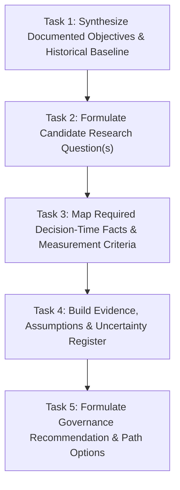

# Scope Proposal: Post-B.4 Research-Question And Measurement-Requirements Brief

Status: **APPROVED BY USER ON 2026-09-24 — PROCEEDING TO BRIEF DRAFTING**

Date: 2026-09-24  
Author: Planning and Implementation Developer  
Decision Owner: User / Human Reviewer (Approved with Section 6 directional guidance)  

---

## 1. Purpose And Decision To Support

### 1.1 Context and Planning Problem
Phase 10.6B.4 concluded on 2026-09-24 with the accepted outcome `NO_NEW_MEASUREMENT_PROTOCOL_JUSTIFIED` and liquidity necessity classified as `UNRESOLVED` ([Accepted B.4 Decision Memo](./research-reviews/phase10.6b.4-proposed-decision-memo.md)). B.4 established that creating a conditional measurement protocol draft in the abstract was premature and unjustified because the permitted documents reviewed contained no concrete future research question against which measurement necessity, semantic equivalence, or material alternatives could be evaluated.

The project currently has:
1. **No defensible strategy candidate**: Phase 10.6B (V2) closed with `NO_DEFENSIBLE_HYPOTHESIS` across multiple screening heuristics.
2. **Unconfirmed measurement capability**: Phase 10.6B.3 (V3) established that anchor-time liquidity availability (60.344828% Discovery / 63.157895% Validation) failed the frozen 90% gate in both partitions, while momentum passed only its specific measurement gates.
3. **Completed engineering hardening**: Packages H1–H4 completed containment, accounting identity, provider concurrency controls, read facades, and guarded verification (merged at `88921e9` / `b6c9e87`), but these engineering controls do not supply research evidence.

Before any successor measurement protocol, provider research, data collection, or validation study can be designed or justified, the project must resolve the missing upstream requirement: **formulating a concrete, falsifiable research question and establishing the exact decision-time measurement properties required to evaluate it**.

### 1.2 Decision This Scope Supports
This scope proposal supports a future human governance decision: **whether to authorize the preparation of a documentation-only Research-Question and Measurement-Requirements Brief**.

This proposal does not assume:
- the specific research question to be investigated;
- whether liquidity is ultimately `REQUIRED` or `NOT_REQUIRED` for that question;
- which measurement remedy or provider architecture is viable; or
- whether the future question will ultimately produce an evidence-supported trading candidate.

---

## 2. Questions The Future Brief Must Answer

The subsequent brief, if authorized, must answer the following bounded questions without asserting unevidenced conclusions:

### 2.1 Intended Research Question
1. **Hypothesis Formulation**: What precise, falsifiable market phenomenon, anomaly, or strategy mechanism is proposed for study?
2. **Target Population and Universe**: What is the defined asset population (e.g., token eligibility, DEX pools) and sampling unit?
3. **Decision-Time Scope**: What defines the exact evaluation anchor ($t_0$), and what information is strictly observable at or before $t_0$?
4. **Differentiation from Closed Studies**:
   - How does this question differ materially from Phase 10.6B (V2), which evaluated basic screening rules and found no defensible hypothesis?
   - How does it differ from Phase 10.6B.3 (V3), which was a pure measurement-capability study of three fixed facts rather than an evaluation of strategy behavior?

### 2.2 Decision-Time Facts and Causal Necessity
1. **Fact Inventory**: Which exact market facts (e.g., specific price momentum intervals, pool liquidity depth, trading volume, token metadata) are required at decision time?
2. **Mechanistic Rationale**: Why is each specific fact necessary for the validity of the question?
3. **Consequence of Omission**: What specific bias, selection distortion, or unexecutable condition arises if a given fact (such as liquidity) is omitted or unavailable? (This provides the formal basis for classifying necessity as `REQUIRED` vs. `NOT_REQUIRED`).

### 2.3 Measurement Fitness Criteria
1. **Measurement Semantics**: What exact mathematical quantity or definition corresponds to each required fact?
2. **Temporal Alignment and Freshness**: What is the maximum allowable latency between observation timestamp and decision anchor ($t_0$)?
3. **Outcome Blindness and Leakage Prevention**: How is the measurement strictly isolated from post-anchor market data ($t > t_0$), forward returns, or execution labels?
4. **Missingness Semantics**: How must unavailable observations, provider timeouts, or zero values be recorded to prevent survivorship or selection bias?
5. **Precision and Unit Consistency**: What units, decimal precision, and reconciliation rules apply?

> [!IMPORTANT]
> A proposed research question is a conceptual formulation for systematic empirical study; it is **not** an evidence-supported trading candidate. The brief must explicitly maintain this distinction.

---

## 3. Evidence And Authority Matrix

The brief must operate strictly within the following evidentiary and authorization boundaries:

| Category | Supported By Existing Documents | NOT Supported (Prohibited Claims) | Requires Separate Future Request & Approval |
| :--- | :--- | :--- | :--- |
| **Historical Outcomes** | • V2: `NO_DEFENSIBLE_HYPOTHESIS` • V3/B.3: `MEASUREMENT_CAPABILITY_NOT_CONFIRMED` (liquidity 60.34% / 63.16% vs. 90% gate; momentum passed V3 gates) • B.4: `NO_NEW_MEASUREMENT_PROTOCOL_JUSTIFIED`, necessity `UNRESOLVED` | • Claiming V3 momentum availability proves trading signal quality or profitability. • Claiming V3 proved liquidity is unnecessary. | None (historical baseline is closed and established). |
| **Measurement & Causality** | • V3 failed direct anchor-time `BEST_PAIR.liquidityUsd` availability. • V3 observed facts did not meet partition gates. | • Attributing V3 liquidity missingness to specific provider endpoints, routes, payloads, or market regimes. • Claiming any untested provider or retry policy will achieve $\ge 90\%$ availability. | Any causal investigation of historical raw payloads or provider behavior. |
| **Engineering Controls** | • H1–H4 completed containment, accounting identity, reader facades, and isolated test suites. | • Claiming engineering hardening retroactively upgrades historical B.3 research results or supplies missing research evidence. | Any new tooling, reader, parser, or production code modification. |
| **Future Research Design** | • Post-V3 Development Plan framework for future candidate-producing research gates (Section 4). | • Asserting that a candidate hypothesis already exists. • Inventing sample sizes, provider lists, or operational parameters without documentary evidence. | Authorizing a formal protocol draft, pre-registration, automated validation, or data collection. |
| **External & Archive Sources** | • Only the permitted source-controlled repository documents. | • Using unreviewed external claims, undocumented provider specs, or live network queries. | • Reviewing external provider/API documentation. • Any targeted Supplemental Archive Inspection. |

### Methodological Rule
Drafting a research hypothesis or specifying required measurement properties must be clearly distinguished from claiming observed empirical support. The brief must not require already-proven trading profitability merely to articulate a question, nor may it invent evidence to justify operational parameters.

---

## 4. Deliverables And Ordered Tasks For The Later Brief

If this scope is approved by the user, the resulting brief will execute the following ordered tasks and produce four source-controlled deliverables (suggested location: `docs/research-planning/post-b4-research-question-measurement-requirements-brief.md`):

### 4.1 Ordered Tasks
- **Task 1 (Baseline Synthesis)**: Extract documented trading mechanisms, constraints, and limitations from closed V2, V3, and B.4 reviews without reopening closed decisions.
- **Task 2 (Question Formulation)**: Articulate one or more candidate research questions, defining the target population, decision anchor, and specific differentiation from V2/V3.
- **Task 3 (Fact & Measurement Mapping)**: For each candidate question, identify every necessary decision-time fact, its causal rationale, omission risks, required semantics, freshness limits, and missingness rules.
- **Task 4 (Register Construction)**: Formally record all supporting documentary evidence, structural assumptions, and remaining uncertainties into a structured register.
- **Task 5 (Recommendation Formulation)**: Evaluate the findings against governance criteria and state an explicit recommendation for the next step.

### 4.2 Proposed Deliverables
1. **Deliverable 1 — Research-Question Statement**: Detailed description of candidate research question(s), target universe, decision timing, and material differentiation from past phases.
2. **Deliverable 2 — Decision-Time Fact and Measurement-Requirements Matrix**: Comprehensive specification of required facts, necessity classifications, mathematical definitions, temporal constraints, and measurement fitness criteria.
3. **Deliverable 3 — Evidence, Assumptions, and Uncertainty Register**: Line-item ledger separating observed facts, modeling assumptions, unverified hypotheses, and open uncertainties.
4. **Deliverable 4 — Governance Recommendation**: An explicit recommendation choosing one of three bounded paths:
   - **PATH A (STOP)**: Conclude that no defensible research question or viable measurement path can be stated from current evidence.
   - **PATH B (REQUEST SPECIFIC EVIDENCE)**: Submit a bounded request for external documentation (e.g., provider specifications) or targeted archive inspection if an essential gap prevents defining measurement fitness.
   - **PATH C (PROPOSE SEPARATELY REVIEWED DESIGN SCOPE)**: If a defensible question and complete measurement requirements are established, propose a bounded scope for drafting a successor protocol design.

> [!NOTE]
> These deliverables represent planning analysis only. They do not constitute an authorized protocol, an active study, or a commitment to proceed to collection.

---

## 5. Acceptance And Stop Criteria

### 5.1 Acceptance Criteria for the Brief
The subsequent brief must satisfy all of the following criteria to be accepted for review:
1. **Traceability**: Every referenced historical outcome, parameter, and constraint must cite specific source-controlled documents.
2. **Epistemological Separation**: Strict visual and structural separation between:
   - *Observed Facts* (empirically confirmed in closed phases);
   - *Working Assumptions* (structural or methodological choices); and
   - *Proposed Hypotheses* (statements to be tested in future studies).
3. **Uncertainty Preservation**: All existing uncertainties from B.4 (U-01 through U-06) must be explicitly addressed; none may be silently marked resolved without new, authorized evidence.
4. **Non-Negotiable Floors Preserved**: The frozen 90% availability floor, outcome blindness, zero analysis side-effects, and default-denial boundaries must remain strictly intact.
5. **No Manufactured Completeness**: If evidence is insufficient to justify a specific parameter or requirement, the brief must explicitly mark it `UNRESOLVED` rather than inventing operational values.

### 5.2 Stop Criteria
The brief drafting process must halt immediately, record the gap, and emit a `STOP` recommendation if:
1. Formulating the candidate research question requires assumptions that directly contradict documented V2/V3 findings or engineering constraints.
2. A required measurement property inherently violates outcome blindness (e.g., requiring forward-looking data at decision time).
3. No candidate research question can be formulated that is materially distinct from the closed V2 studies.

### 5.3 Clarification of Roadmap Entry Conditions
- **Roadmap Tension**: [Phase 9+ Roadmap](./ROADMAP_Phase9Plus.md) lists entry into Phase 10.6C as requiring "one materially distinct, evidence-supported hypothesis, a frozen versioned pre-registration, and separate validation-study authorization."
- **Clarification for Review**: The proposed brief is a preliminary planning and requirements document within the pre-10.6C research-design stage ([Post-V3 Development Plan](./Post-V3-Development-Plan.md), Section 4). It does **not** claim to produce an evidence-supported hypothesis or activate Phase 10.6C. It establishes the measurement requirements that any future protocol design must satisfy.

---

## 6. Questions For The User & Recorded Guidance
 
The following decisions and constraints were owned exclusively by the user and were resolved on 2026-09-24:

1. **Research Direction Priority**:
   - **Resolved**: Focus primarily on **momentum-driven screening mechanisms**, detailing clear material differentiation from Phase 10.6B (V2) and Phase 10.6B.3 (V3).
2. **Scope of Candidate Questions**:
   - **Resolved**: Evaluate **two bounded alternative formulations**:
     - *Formulation A*: Requiring anchor-time liquidity.
     - *Formulation B*: Designed to be strictly independent of liquidity.
     - Purpose: Provide a structured, empirical/conceptual basis for resolving liquidity necessity (`REQUIRED` vs. `NOT_REQUIRED`).
3. **External Reference Requests**:
   - **Resolved**: Restrict analysis **strictly to existing internal repository documentation**. Do not access external networks or provider documentation without a separately submitted and approved scope request.

---

## 7. Approval Boundary

Approval of this scope proposal authorizes **ONLY**:
- Drafting the documentation-only Research-Question and Measurement-Requirements Brief in accordance with Section 4; and
- Performing documentation-only formatting, link, and consistency checks.

Approval of this scope **DOES NOT AUTHORIZE**:
- Accessing or inspecting operational archives or databases;
- Rerunning the production analyzer;
- Writing, modifying, or testing production or reader tooling;
- Drafting or validating a formal protocol;
- Making provider queries, API calls, or network requests;
- Modifying collectors, configuring schedulers, or executing data collection;
- Activating Phase 10.6C, selecting candidates, or altering strategy logic; or
- Any PAPER trading, wallet access, cryptographic signing, order submission, or live execution.

Any activity beyond the documentation-only brief requires a separate, explicitly approved scope proposal.
