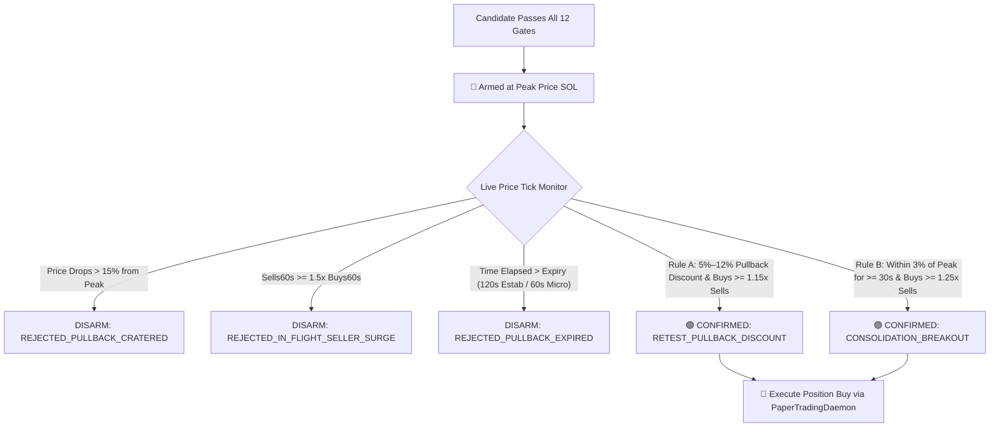

# Buy Gate Trigger Engine Architecture

**Component**: `BuyGateTriggerService`  
**Source Location**: `backend/src/candidate-scanner/BuyGateTriggerService.ts`  
**Active Phase**: Phase 11 & Phase 12 (Hardened through Sub-Phase 12.88)

---

## 1. Overview & Core Philosophy

The **Buy Gate Trigger Engine** enforces multi-stage fail-closed entry criteria across real-time scanned Solana meme coins.

Rather than chasing green candles at breakout tops, the engine combines:

1. **12 Deterministic Risk & Microstructure Gates**: Filtering wash-trading cabals, bundler sniper-rings, dev honeypots, and dead liquidity pools.
2. **Two-Stage Screening Decoupling**: In-memory pre-screening unblocks candidate established runners, followed by Stage 2 fail-closed verification against RugCheck and live spot order books.
3. **The Retest Pullback Gate**: Arming candidates at peak prices and requiring a proven **5% to 12% pullback discount with active buyer absorption** before authorizing entries.

---

## 2. The 12 Fail-Closed Buy Gates

Every candidate must pass all applicable gates. Any failure produces an immediate, auditable `rejectionReason`:

```
┌────┬──────────────────────────────────────┬────────────────────────────────────────────────────────┐
│ #  │ Gate Name                            │ Requirement & Cohort Rules                             │
├────┼──────────────────────────────────────┼────────────────────────────────────────────────────────┤
│ 1  │ MATURITY_WINDOW_GATE                 │ Estab: 1,800s – 7,200s (30m–2h)                        │
│    │                                      │ Micro: 300s – 900s (5m–15m, or 45m if vol >= $25k)     │
├────┼──────────────────────────────────────┼────────────────────────────────────────────────────────┤
│ 2  │ MIN_LIQUIDITY_GATE                   │ Live Spot Liquidity >= $20,000 (Hard Execution Floor)   │
├────┼──────────────────────────────────────┼────────────────────────────────────────────────────────┤
│ 3  │ DEPTH_BALANCE_GATE                   │ Estab: 3% <= L/MC <= 55% (Organic established depth)   │
│    │                                      │ Micro: 15% <= L/MC <= 55% (Anti-honeypot depth floor)  │
├────┼──────────────────────────────────────┼────────────────────────────────────────────────────────┤
│ 4  │ FLOW_ABSORPTION_GATE                 │ Buys >= 1.5x Sells (Relaxed to 1.25x if vol >= $15k,   │
│    │                                      │ 1.15x if vol >= $35k)                                  │
├────┼──────────────────────────────────────┼────────────────────────────────────────────────────────┤
│ 5  │ MIN_VOLUME_5M_GATE                   │ 5-Minute Volume >= $2,500                              │
├────┼──────────────────────────────────────┼────────────────────────────────────────────────────────┤
│ 6  │ SELL_CONGESTION_CEILING_GATE         │ Micro: Sells(5m) <= 100 (Uncapped for Established)     │
├────┼──────────────────────────────────────┼────────────────────────────────────────────────────────┤
│ 7  │ MOMENTUM_ALIGNMENT_GATE              │ 1-Minute Momentum >= 0 bps (Non-negative flow)          │
├────┼──────────────────────────────────────┼────────────────────────────────────────────────────────┤
│ 8  │ STALE_AGE_CEILING_GATE               │ Max Watchlist Age: 20m (Micro), 60m (High-Liq), 2h (Est)│
├────┼──────────────────────────────────────┼────────────────────────────────────────────────────────┤
│ 9  │ TRANSACTION_CHURN_GATE               │ Micro: Total Tx(5m) <= 300 (Anti-Bot Churn Shield)     │
├────┼──────────────────────────────────────┼────────────────────────────────────────────────────────┤
│ 10 │ ESTABLISHED_MACRO_TREND_GATE         │ Estab: 1h Price Change >= -15.0% (Anti-Dead-Cat Bounce)│
├────┼──────────────────────────────────────┼────────────────────────────────────────────────────────┤
│ 11 │ BUNDLER_CONCENTRATION_GATE           │ Micro: Bundler <= 50%, Top 10 <= 18%, Holders >= 100   │
│    │                                      │ Estab: Bundler <= 85%, Top 10 <= 18%, Holders >= 250   │
├────┼──────────────────────────────────────┼────────────────────────────────────────────────────────┤
│ 12 │ RUGCHECK_RISK_GATE                   │ Rug Score <= 700, Zero Danger Flags                    │
└────┴──────────────────────────────────────┴────────────────────────────────────────────────────────┘
```

---

## 3. Retest Pullback Gate Pipeline

Once a candidate passes the 12 Buy Gates, TopG **does not buy immediately**. Instead, it arms the candidate and awaits structural confirmation:



---

## 4. Candidate Established Pre-Screening Unblock (Sub-Phase 12.88)

To eliminate the "chicken-and-egg" deadlock where candidates older than 45 minutes were rejected before RugCheck could be queried:

1. **Stage 1 (In-Memory Preliminary Check)**:
   - When `marketContext.holdersCount === undefined` and `!requireVerifiedHolders`:
   - Candidates with $\ge \$50\text{k}$ liquidity and age between $1,800\text{s}$ and $7,200\text{s}$ qualify as **Candidate Established Runners**.
   - They use Established maturity windows ($7,200\text{s}$) and depth floors ($3\%$), passing preliminary screening to permit network queries.
2. **Stage 2 (RugCheck Holder Verification)**:
   - When `holdersCount` is fetched:
   - If `holdersCount < 250`: strictly rejected (`INSUFFICIENT_HOLDERS_COUNT_FAILED`), blocking dev traps like `SIC` ($86$ holders).
   - If `holdersCount >= 250` and bundlers $\le 50\%$: verified as Established (`SII` with $4,180$ holders, `SACC` with $4,600$ holders).
