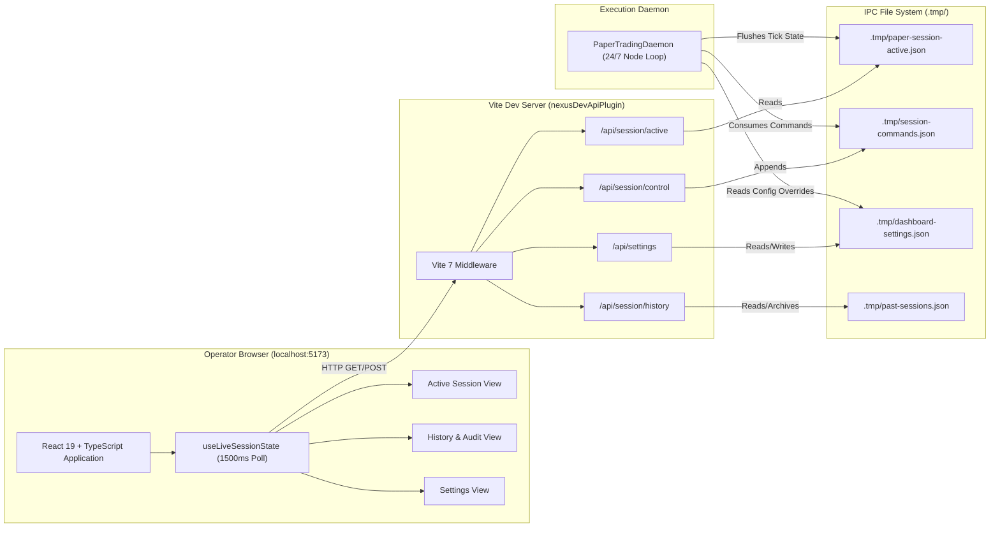

# Control Plane Dashboard Architecture

**Component**: Operator Control Plane & Web Dashboard  
**Source Location**: `frontend/src/`, `frontend/vite.config.ts`, `packages/shared/src/types/`  
**Active Phase**: Phase 11 & Phase 12 (Hardened through Sub-Phase 12.88)

---

## 1. Overview & System Role

The **Control Plane Dashboard** is TopG's primary operator interface. It provides real-time situational awareness, manual override capabilities, risk telemetry, and historical trade audits for the autonomous paper and hot wallet execution daemons.

### Core Philosophy

1. **Zero-Interference Decoupling**: The dashboard never blocks or slows the execution loop. All state synchronization is asynchronous via local file-based IPC or lightweight HTTP middleware.
2. **Sub-Second Telemetry Refresh**: Continuous polling (`1500ms` cycle) transforms background daemon snapshots into live UI metric updates, equity curve visualizations, and terminal activity streams.
3. **Operator Override Authority**: Operators can issue commands (`PAUSE`, `RESUME`, `START_EXITING`, `EMERGENCY_STOP`, manual position exits) without shell access.
4. **Offline & Dev-First Resilience**: If the backend daemon is temporarily offline or restarting, the dashboard degrades gracefully, maintaining local optimistic state and displaying historical data without UI crashes.

---

## 2. Architecture & Tech Stack

### Technology Matrix

- **Framework**: React 19 with Function Components and Hooks.
- **Build Tool & Dev Server**: Vite 7.
- **Language**: TypeScript (strict null checks, shared types).
- **Shared Schema**: `@nexustrade/shared` (`ActiveSessionTelemetry`, `DashboardSettings`, `HistoricalSessionSummary`, `SessionControlAction`).
- **Styling**: Cyberpunk/high-density financial terminal CSS with responsive grids and high-contrast status badges.
- **Charting**: SVG-based canvas/path components for equity curves (`EquityCurveChart.tsx`).

---

## 3. Communication & IPC Subsystem

Communication between the browser and the execution daemon is bridged via `nexusDevApiPlugin()` configured in `frontend/vite.config.ts`.

### A. Telemetry Ingestion (`/api/session/active`)

1. On each poll tick, Vite searches `.tmp/paper-session-active.json` across workspace search paths (`.tmp`, `backend/.tmp`, `frontend/.tmp`), picking the newest timestamp.
2. Vite parses `RawDaemonSnapshot` and normalizes:
   - Floating-point SOL balances (`initialPortfolioSol`, `currentPortfolioSol`, `netSessionPnlSol`).
   - Dynamic Ratchet position metadata (`activeTier`, `peakGainBps`, `currentStopFloorBps`).
   - Recent activity logs (trade entries, exits, gate rejections, whale dump warnings).
3. The browser receives a standardized `ActiveSessionTelemetry` payload.

### B. Command Dispatch (`/api/session/control`)

Operators can dispatch actions from the header bar:

- `PAUSE`: Halts new scanner buys; keeps open positions managed under Dynamic Ratchet rules.
- `RESUME`: Re-enables scanner buys.
- `START_EXITING`: Soft shutdown; stops new entries and allows open positions to exit naturally via ratchets or stops.
- `EMERGENCY_STOP`: Immediate liquidation; triggers immediate market sell on all open positions.
- `MANUAL_EXIT`: Closes a single specific token position immediately.

Commands are appended to `.tmp/session-commands.json` with an atomic timestamp (`issuedAt`). The daemon drains and executes this queue on every tick.

---

## 4. Operator Views & Capabilities

### Tab 1: Active Session View (`ActiveSessionView.tsx`)

- **Header KPI Cards**:
  - Live Wallet Balance & Session Gain/Loss (SOL and USD).
  - Open Position Count vs. Concurrency Cap (e.g. `0 / 5`).
  - Active Session Duration & Heartbeat Timer.
  - Win Rate % & Realized Trade Count.
- **Equity Curve (`EquityCurveChart.tsx`)**:
  - Real-time SVG equity curve tracking portfolio balance tick-by-tick across the session.
  - Visual baseline indicator showing starting capital (e.g., `10.000 SOL`).
- **Live Positions Grid (`LivePositionsGrid.tsx`)**:
  - Cards for each open trade showing Symbol, Entry Price, Spot Price, Unrealized PnL, and Holding Time.
  - Dynamic Ratchet Visualization: Visual progress bar indicating distances to Tier 1 (+20%), Tier 2 (+48.5%), and active Trailing Moonbag stop floors.
  - Per-position manual exit trigger button.
- **Live Activity Feed**:
  - Monospaced terminal stream logging every daemon event: Buy triggers, Gate rejections (e.g., Retest pullback shallow discount, Wash trading block), Dynamic Ratchet stop updates, and Scaled Exits.
- **Scanner Radar Table (`ScannerRadarTable.tsx`)**:
  - Real-time view of candidate tokens currently passing volume and liquidity filters and undergoing Retest Pullback evaluation.

### Tab 2: Historical Sessions & Audit (`HistoryView.tsx`)

- **Session Ledger**:
  - Chronological list of completed sessions with start time, duration, trade count, realized PnL, and ROI.
- **Deep-Dive Trade Inspector (`TradeHistoryTable.tsx`)**:
  - Granular post-mortem table showing every executed trade.
  - Columns: Token, Entry Time/Price, Exit Time/Price, Realized PnL SOL/Bps, Hold Duration, and Exit Reason (e.g. `RATCHET_TIER_1_SCALE`, `RATCHET_TIER_2_BREACH`, `WHALE_DEV_DUMP_CLIFF_CUT`, `SCRATCH_EXIT`).
- **Performance Metrics Breakdown**:
  - Profit Factor, Win/Loss Ratio, Average Winner vs. Average Loser, Max Peak-to-Trough Drawdown.

### Tab 3: Configuration & Risk Settings (`SettingsView.tsx`)

- **Trading Parameters**:
  - Base Position Size (`positionSizeSol`).
  - Max Concurrent Open Positions (`maxPositions`).
  - Stop Loss Bps & Take Profit Tiers.
- **Buy Gate Thresholds**:
  - Min Liquidity ($USD), Min 24h Volume ($USD), Min Holder Count floor (250).
  - Retest Pullback Gate parameters (Min Discount 5%, Max Discount 12%).
- **Safety & Infrastructure**:
  - Gas Reserve buffer (`gasReserveSol`).
  - RPC endpoint overrides and slippage tolerance.
- **Sync Button**:
  - Instantly flushes updated parameters to `.tmp/dashboard-settings.json`, hot-reloading daemon configurations without restarting the process.

---

## 5. Resilience & Guardrails

1. **State Isolation**: UI state never writes to SQLite databases; all persistence is mediated through clean IPC channels.
2. **Network Decoupling**: If network disconnects or daemon sleeps, the frontend displays an unobtrusive status pill (`RECONNECTING...` or `OFFLINE`) and retains last-known valid telemetry.
3. **Safety Confirmations**: High-impact actions like `EMERGENCY_STOP` require explicit UI confirmation or visual caution banners to prevent accidental liquidations.
4. **Memory Management**: The activity log maintains a sliding window buffer (capped at 500 events) to prevent DOM memory bloat during multi-day stress sessions.
