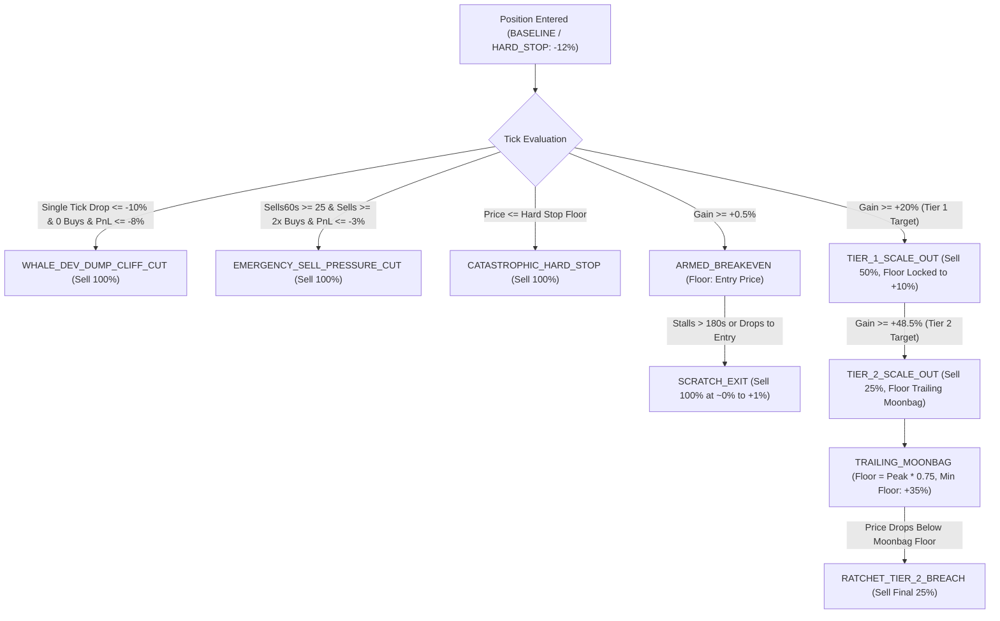

# Dynamic Ratchet Exit Engine Architecture

**Component**: `DynamicRatchetService`  
**Source Location**: `backend/src/exits/DynamicRatchetService.ts`, `backend/src/exits/DynamicRatchetTypes.ts`  
**Active Phase**: Phase 11 & Phase 12 (Hardened through Sub-Phase 12.87)

---

## 1. Overview & Core Philosophy

The **Dynamic Ratchet Exit Engine** is TopG's autonomous position management system. Unlike static stop-loss or fixed take-profit systems, the Dynamic Ratchet treats open trades as asymmetric volatility options:

1. **Strict Asymmetric Downside Protection**: Cut stalling or dumping trades with minimal loss (-2.9% cuts, +1% scratch exits).
2. **Multi-Tier Profit Harvesting**: Lock in realized SOL gains early (50% at +20%, 25% at +48.5%) to guarantee green trade outcomes.
3. **Uncapped Trailing Moonbag**: Trail the final 25% position size with a dynamic volatility buffer, extracting massive tail runs (+72% on `BANDIT`, +84% on `SACC`).
4. **Instant Emergency Dump Shields**: Cut dev/whale rug dumps in a single tick before they reach catastrophic hard stops.

---

## 2. Dynamic Ratchet State Machine

---

## 3. Cohort Ratchet Configurations

The engine applies specialized parameters based on the token's structural classification:

| Parameter                       | Established Runners ($50k+ Liq, 30m–2h, $\ge 250$ Holders) | Micro-Cap Probes ($20k–$50k Liq, $\ge 100$ Holders) |
| :------------------------------ | :--------------------------------------------------------- | :-------------------------------------------------- |
| **Initial Stop Floor**          | `-12.0%` (`-1200 bps`)                                     | `-10.0%` (`-1000 bps`)                              |
| **Breakeven Armed Gain**        | `+0.5%` (`+50 bps`)                                        | `+0.5%` (`+50 bps`)                                 |
| **Tier 1 Profit Target**        | `+20.0%` (`+2000 bps`)                                     | `+15.0%` (`+1500 bps`)                              |
| **Tier 1 Scale-Out Size**       | **50% of tokens held**                                     | **50% of tokens held**                              |
| **Tier 1 Stop Lock**            | Locked to `+10.0%` (`+1000 bps`)                           | Locked to `+5.0%` (`+500 bps`)                      |
| **Tier 2 Profit Target**        | `+48.5%` (`+4850 bps`)                                     | `+48.5%` (`+4850 bps`)                              |
| **Tier 2 Scale-Out Size**       | **25% of tokens held**                                     | **25% of tokens held**                              |
| **Tier 2 Stop Lock**            | Locked to `+35.0%` (`+3500 bps`)                           | Locked to `+35.0%` (`+3500 bps`)                    |
| **Trailing Moonbag Buffer**     | **25% Trailing Distance** from Peak                        | **25% Trailing Distance** from Peak                 |
| **Stagnant Inactivity Timeout** | `300 seconds` (5 minutes zero-volume cut)                  | `180 seconds` (3 minutes zero-volume cut)           |

---

## 4. Emergency Circuit Breakers

### A. Single-Tick Whale/Dev Dump Circuit Breaker (`WHALE_DEV_DUMP_CLIFF_CUT`)

- **Problem**: A developer or insider whale executes a massive single transaction that dumps pool liquidity by -40% in seconds without triggering high-frequency transaction alerts.
- **Trigger Conditions**:
  $$\text{currentPnlBps} \le -800 \quad (-8.0\%) \quad \land \quad \text{recentBuys60s} = 0 \quad \land \quad \text{singleTickDropBps} \le -1000 \quad (-10.0\%)$$
- **Action**: Immediate full market liquidation (`SELL_ALL`), cutting the position at -8% to -10% before it crashes into a -99% liquidity void.

### B. In-Trade Avalanche Sell-Pressure Cut (`EMERGENCY_SELL_PRESSURE_CUT`)

- **Problem**: A botnet executes a swarm of sell transactions against a micro-cap pool.
- **Trigger Conditions**:
  $$\text{recentSells60s} \ge 25 \quad \land \quad \text{recentSells60s} \ge 2.0 \times \text{recentBuys60s} \quad \land \quad \text{currentPnlBps} \le -300 \quad (-3.0\%)$$
- **Action**: Immediate full market liquidation (`SELL_ALL`), preventing slow bleed.

---

## 5. In-Memory Store & Architecture Isolation

- **Zero Disk Latency**: State is stored in an in-memory map (`Map<string, PositionRatchetState>`), providing sub-microsecond evaluation per price tick.
- **Pure Evaluation**: `DynamicRatchetService.evaluate(state, context, config)` is a pure, side-effect-free evaluation function returning a `RatchetEvaluationResult` with deterministic action codes (`HOLD`, `SCALE_OUT`, `SELL_ALL`).
