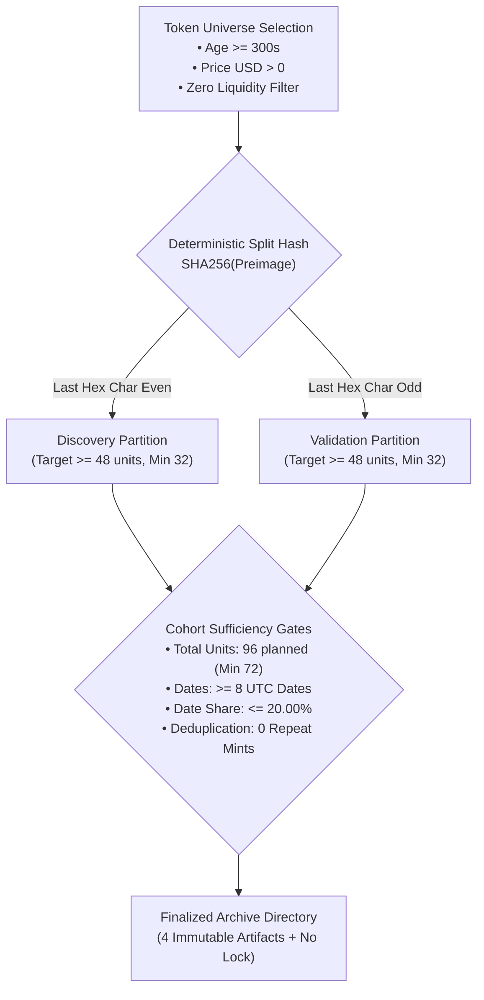
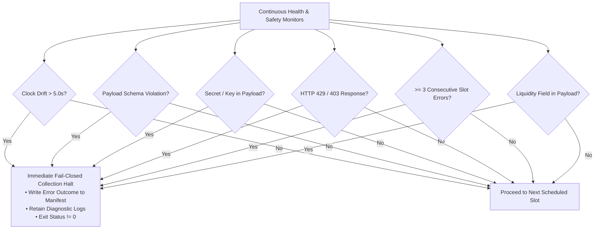
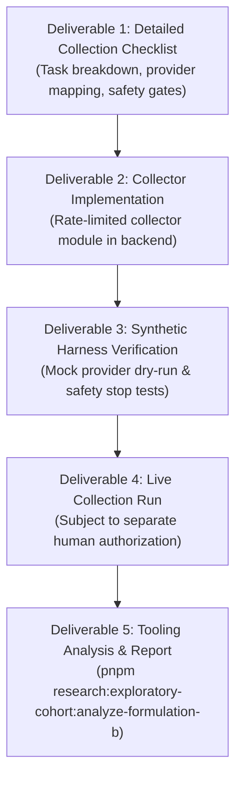

# Scope Proposal: Formulation B Exploratory Data Collection

Status: **PROPOSED — NOT APPROVED**

Date: 2026-09-24  
Author: Planning and Implementation Developer  
Decision Owner: User / Human Reviewer  
Governing Protocol: [Approved Formulation B Protocol Design](../research-protocols/formulation-b-exploratory-protocol-design.md)  
Pinned Protocol Specification: [Phase 10.6A Formulation B Protocol JSON](../research-protocols/phase10.6a-exploratory-cohort.formulation-b.v1.json)  
Verified Tooling Baseline: [Phase 10.6B Formulation B Tooling Verification Record](../Phase-10.6B-Formulation-B-Tooling-Verification.md)

---

## 1. Purpose And Decision To Support

### 1.1 Context and Background

On 2026-09-24, the formal protocol design for **Formulation B (Liquidity-Independent Momentum Acceleration)** was approved and pinned ([`docs/research-protocols/phase10.6a-exploratory-cohort.formulation-b.v1.json`](file:///u:/Projects/TopG/docs/research-protocols/phase10.6a-exploratory-cohort.formulation-b.v1.json)), and its protocol validator and analysis tooling were implemented, synthetically verified across 8 fixtures, and passed under the isolated test harness (`node scripts/verify-isolated.mjs`).

With the tooling and validator verified, the project reaches the boundary where an empirical data collection run may be scoped to evaluate Formulation B in practice.

### 1.2 Decision This Scope Proposal Supports

This scope proposal supports a human governance decision: **whether to authorize the implementation and execution of an automated, rate-budgeted, and safety-monitored Exploratory Data Collection run for Formulation B**.

### 1.3 Strict Operational Boundaries of This Proposal

In accordance with strict project boundaries:

- This document is a **planning and scope proposal only**;
- It does **NOT** authorize initiating data collection, enabling background schedulers, making live network/provider requests, or modifying production collector code;
- All PAPER, wallet, signing, and trading surfaces remain strictly disabled under default denial; and
- Any subsequent collection execution requires a separate, explicit approval decision from the user.

---

## 2. Target Cohort Parameters & Statistical Sampling Design

The data collection run must strictly satisfy all cohort sufficiency, diversity, and balance criteria pre-registered in the frozen Formulation B protocol:



### 2.1 Parameter Matrix

| Parameter                      | Specification                                                      | Pre-Registered Requirement / Floor                                                       | Rationale & Safety Enforcement                 |
| :----------------------------- | :----------------------------------------------------------------- | :--------------------------------------------------------------------------------------- | :--------------------------------------------- |
| **Planned Slot Count**         | 96 planned slots                                                   | Exactly 96 collection slots attempted                                                    | Full cohort statistical power                  |
| **Minimum Valid Units**        | $\ge 72$ valid units                                               | Primary sufficiency gate: `MINIMUM_VALID_UNITS`                                          | Ensures statistical validity of quantile split |
| **Partition Allocation**       | 50% Discovery / 50% Validation                                     | $\ge 32$ valid units in each partition                                                   | Balanced two-sample comparison                 |
| **Partition Split Preimage**   | `formulation-b-exploratory-protocol.v1\|<canonicalMint>\|<slotId>` | Last hex character of SHA-256 digest: `0,2,4,6,8,a,c,e` $\to$ Discovery, else Validation | Deterministic, outcome-blind assignment        |
| **Temporal Span**              | $\ge 8$ distinct UTC dates                                         | Primary diversity gate: `MINIMUM_TOTAL_DATES`                                            | Prevents single-day market regime bias         |
| **Partition Date Diversity**   | $\ge 4$ distinct UTC dates / partition                             | Primary gate: `MINIMUM_PARTITION_DATES`                                                  | Cross-day statistical stability                |
| **Maximum Date Share**         | $\le 20.00\%$ of total valid units                                 | Concentration gate: `MAXIMUM_DATE_SHARE`                                                 | Caps single-date dominance to $\le 19$ units   |
| **Token Deduplication**        | 1:1 slot-to-mint uniqueness                                        | Exactly 0 duplicate canonical mints across cohort                                        | Prevents repeated asset autocorrelation        |
| **Decision-Time Features**     | Price USD, 5m momentum, 15m momentum, acceleration                 | Momentum availability $\ge 90.00\%$ per partition                                        | Frozen data quality floor                      |
| **Liquidity Prohibition**      | Zero liquidity metrics in decision inputs                          | `liquidityUsd`, `quoteImpactBps`, `poolReserveUsd` prohibited                            | Pure liquidity-independent formulation         |
| **Primary Evaluation Horizon** | Forward 60-minute return ($\text{return}_{60m} > 0$)               | Usable label coverage $\ge 90.00\%$ per partition                                        | Primary hypothesis evaluation                  |
| **Descriptive Horizons**       | Forward 3m, 5m, 15m returns                                        | Descriptive capture only                                                                 | Structural path characterization               |

---

## 3. Provider Call Architecture & Rate Budgets

To protect provider infrastructure, avoid IP/account throttling, eliminate runaway loops, and operate with zero cost risk, data collection will enforce strict serialization and hard budgeting:

### 3.1 Rate Limits & Concurrency Constraints

- **Concurrency**: Strictly serialized ($\text{concurrency} = 1$). No concurrent or parallel outbound HTTP requests.
- **Request Pacing**: Maximum **1 request per second** ($1.0\text{ req/s}$) enforced by a deterministic token-bucket rate limiter.
- **Per-Request Timeout**: Hard timeout of **5,000 ms** ($5.0\text{ s}$) on all network sockets. Any request exceeding 5s fails immediately.
- **Retry & Backoff Policy**: Maximum **2 retries** per failed request using exponential backoff with randomized jitter ($1000\text{ms} \to 2000\text{ms}$).
- **Rate-Limit Trigger**: Any HTTP `429 Too Many Requests` or `403 Forbidden` response immediately triggers a fail-closed collection halt.

### 3.2 Provider Call Budget Table

| Level / Entity          | Hard Budget Cap                     | Purpose & Scope                                                                            |
| :---------------------- | :---------------------------------- | :----------------------------------------------------------------------------------------- |
| **Per Collection Slot** | Max 6 HTTP requests                 | 1 Discovery/Metadata + 1 Anchor Price/Momenta + 4 Forward Return Checks (3m, 5m, 15m, 60m) |
| **Per UTC Date**        | Max 120 HTTP requests               | Accommodates maximum daily slot quota with retry allowances                                |
| **Total Cohort Run**    | Max 600 HTTP requests               | Absolute ceiling for entire 96-slot collection run                                         |
| **Cost Budget**         | \$0.00 USD (Free-tier / Public RPC) | Zero operational expenditure; public RPC & allowlisted endpoints only                      |

---

## 4. Safety Stops, Circuit Breakers & Health Monitors

The data collector will operate under strict fail-closed safety stops. If any threshold is breached, the collector immediately halts, records an error state in the manifest, retains all diagnostic telemetry, and exits with a non-zero code without writing partial or corrupt units:



### 4.1 Monitored Stop Conditions

1. **Clock Drift Monitor**: System clock compared against network time headers on every response. If drift exceeds **$\pm 5.0\text{ seconds}$**, collection halts immediately (`CLOCK_DRIFT_STOP`).
2. **Payload Schema Validator**: Every inbound JSON payload from provider APIs is strictly validated via Zod schemas. Any missing, malformed, or out-of-range field halts the slot and, if unrecoverable, stops collection (`SCHEMA_INTEGRITY_STOP`).
3. **Secret & Credential Leakage Scanner**: Outbound headers and inbound responses are inspected in memory for private key patterns, authorization tokens, or sensitive strings. Any detected leak triggers an emergency shutdown (`SECRET_LEAKAGE_STOP`).
4. **Rate-Limit / Throttling Response**: Any HTTP 429 or provider throttle signal immediately halts execution (`RATE_LIMIT_STOP`).
5. **Consecutive Slot Failure Threshold**: If $\ge 3$ consecutive collection slots fail due to provider unresponsiveness or invalid data, collection halts (`CONSECUTIVE_ERROR_STOP`).
6. **Forbidden Liquidity Leakage Detection**: Decision-time payload parsers explicitly reject any fields containing `liquidity`, `reserve`, `impact`, or `depth` (`LIQUIDITY_PROHIBITION_STOP`).

---

## 5. Artifact Contracts, Storage Isolation & Lock Protocol

All collection outputs will be written exclusively to a dedicated, isolated, and source-controlled archive directory:

### 5.1 Archive Directory Path Convention

```text
data/archive/phase10.6a/exploratory-cohort-formulation-b-<YYYYMMDD-HHMMZ>/
```

Example: `data/archive/phase10.6a/exploratory-cohort-formulation-b-20260925-1400Z/`

### 5.2 Active Lock Lifecycle

1. **Initiation**: Before any network request is issued, the collector creates `collection.lock` in the target archive directory containing JSON metadata: `{ pid, startedAt, protocolSha256, targetSlots: 96 }`.
2. **Collection In Progress**: While collection runs, `collection.lock` prevents any analyzer or downstream process from treating the directory as a finalized archive.
3. **Completion & Release**: Only after all 96 slots are processed, all 4 immutable artifacts are generated, and all SHA-256 hashes are verified against the manifest, `collection.lock` is atomically unlinked.
4. **Abnormal Termination**: If the collector crashes or encounters a safety stop, `collection.lock` is intentionally preserved, causing `FormulationBArchiveLoader` to fail closed with `FORMULATION_B_ARCHIVE_NOT_FINAL`.

### 5.3 Four Immutable Archive Artifacts

| Artifact Filename                | Format | Purpose & Schema Contents                                                                                                                                                                                                                                                            |
| :------------------------------- | :----- | :----------------------------------------------------------------------------------------------------------------------------------------------------------------------------------------------------------------------------------------------------------------------------------- |
| **`cohort-manifest.v1.json`**    | JSON   | Protocol ID, protocol path, protocol SHA-256, final outcome (`COHORT_COMPLETE` or error code), attempted slot count, valid unit count, distinct mint count, SHA-256 hashes of the other 3 artifacts, safety counters (all 0), execution flags (all false).                           |
| **`units.v1.ndjson`**            | NDJSON | 1 line per valid unit: unit ID, canonical mint, slot ID, anchor timestamp, anchor date, deterministic partition (`DISCOVERY` \| `VALIDATION`), decision-time evidence (price, 5m mom, 15m mom, acceleration), forward outcome labels (60m return, primary label, 3m/5m/15m returns). |
| **`source-inventory.v1.json`**   | JSON   | Complete ledger of all provider interactions: UTC timestamp, provider capability (`DISCOVER_TOKENS`, `FETCH_CANDIDATE_MOMENTUM`, `FETCH_FORWARD_RETURNS`), response outcome code (`OK`, `TIMEOUT`, `ERROR`), latency bucket (`LT_100MS`, `LT_500MS`, `LT_2S`, `GTE_2S`).             |
| **`collection-summary.v1.json`** | JSON   | High-level summary metrics: total attempted slots, valid units, date span, partition unit counts, momentum availability percentages, label coverage percentages.                                                                                                                     |

### 5.4 Filesystem Isolation Guarantee

The collector will use Node's strict filesystem APIs to ensure write access is **100% confined to the target archive directory**. No temporary files, sqlite databases, cache entries, or logs will be created outside `data/archive/phase10.6a/`.

---

## 6. Proposed Deliverables & Phased Implementation Roadmap

If approved by the user, the Formulation B data collection phase will proceed through 4 ordered deliverables:



1. **Deliverable 1: Detailed Collection Checklist & Architecture Spec**:
   - Create `docs/NeXusTrade-Phase-10.6B-Formulation-B-Collection-Detailed-Checklist.md` detailing step-by-step implementation, provider endpoint mappings, and safety tripwires.
2. **Deliverable 2: Collector Module Implementation**:
   - Implement `backend/src/research-formulation-b-collection/` adhering to H1–H4 standards, containing pure rate-limited fetchers, schema validators, lock managers, and artifact writers.
3. **Deliverable 3: Synthetic Collector Verification**:
   - Implement mock provider tests verifying all 6 safety stops, lock lifecycle, and artifact integrity under `node scripts/verify-isolated.mjs`.
4. **Deliverable 4: Live Data Collection Execution** _(Contingent on separate human approval)_:
   - Execute the 96-slot collection run spanning $\ge 8$ UTC dates with real-time rate pacing ($\le 1\text{ req/s}$) and safety monitoring.
5. **Deliverable 5: Final Tooling Analysis Execution & Verification Record**:
   - Run `pnpm research:exploratory-cohort:analyze-formulation-b -- --archive-root=<final-dir>` to produce the definitive evaluation report and record the outcome in `docs/Phase-10.6B-Formulation-B-Collection-Verification.md`.

---

## 7. Directional Guidance & User Alignment Options

To ensure complete alignment before drafting the collection checklist and code, the user is invited to review and provide directional guidance on the following operational preferences:

### Decision Area 1: Provider Endpoint Selection Strategy

- **Option A (Recommended — Multi-Source Fallback)**: Use standard Solana RPC for mint discovery / age validation, with redundant price/momentum fetchers across public endpoints, failing closed if momentum cannot be derived with $< 10\text{s}$ freshness.
- **Option B (Single Primary Provider)**: Restrict all queries to a single primary provider endpoint to ensure maximum measurement homogeneity.

### Decision Area 2: Collection Slot Pacing Model

- **Option A (Recommended — Distributed Sampling Across 8+ Days)**: Execute 12 collection slots per day at uniform intervals across 8 consecutive UTC dates (12.5% daily concentration, comfortably below the 20% cap).
- **Option B (Event-Driven Burst Sampling)**: Collect slots as eligible tokens appear, capped at 18 slots/day with a hard daily shutdown.

### Decision Area 3: Forward Outcome Capture Strategy

- **Option A (Recommended — Delayed Re-Evaluation Queue)**: Anchor decision time at slot execution, queue token for exact forward timestamps ($+3\text{m}, +5\text{m}, +15\text{m}, +60\text{m}$), and fetch spot prices at those exact elapsed times.
- **Option B (Post-Hoc Historical Candle Lookup)**: Capture decision-time facts immediately, then after 60+ minutes query the 1-minute historical OHLCV series for the elapsed window.

---

## 8. Summary of Operating Boundaries

| Surface / Action                               | Status Under This Proposal                 | Authority Required to Change    |
| :--------------------------------------------- | :----------------------------------------- | :------------------------------ |
| **Writing Scope Proposal Document**            | **Authorized** by User Request             | Current Phase                   |
| **Writing Detailed Collection Checklist**      | **Pending** User Approval of this Proposal | Subsequent User Approval        |
| **Collector Implementation & Synthetic Tests** | **Pending** User Approval of Checklist     | Subsequent User Approval        |
| **Live Network / Provider Execution**          | **Prohibited**                             | Separate Explicit User Approval |
| **Creation of Operational Archive Root**       | **Prohibited**                             | Separate Explicit User Approval |
| **PAPER Trading / Session Execution**          | **Strictly Prohibited (Default Denial)**   | Out of Scope                    |
| **Wallet Loading / Transaction Signing**       | **Strictly Prohibited (Default Denial)**   | Out of Scope                    |
