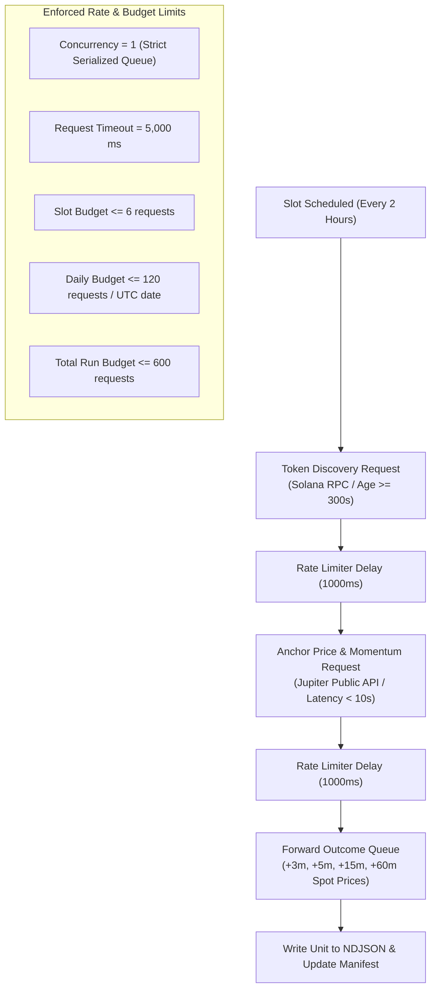
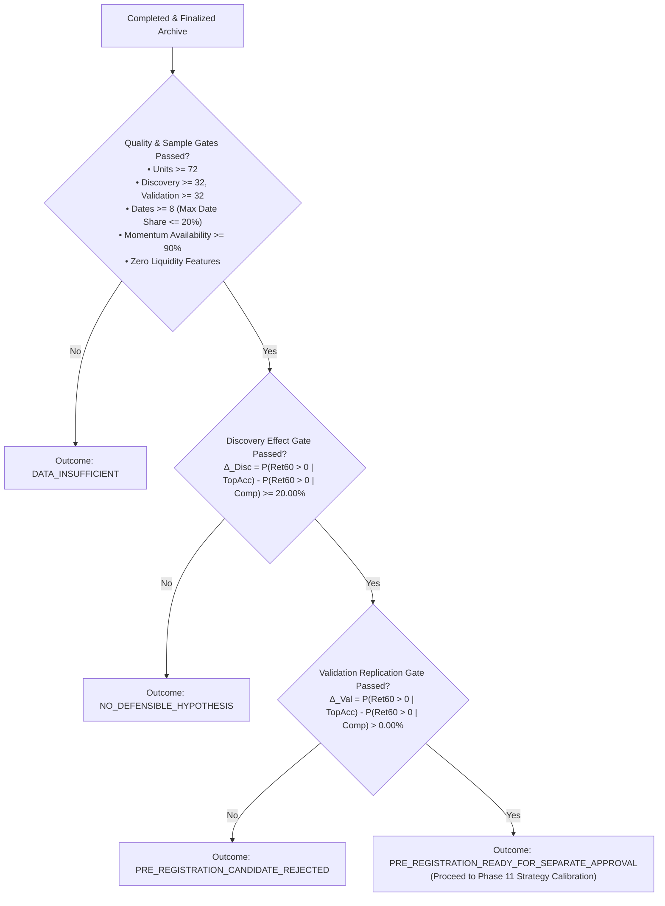

# Phase 10.6B Formulation B Operational Execution Plan & Run Specification

Status: **PROPOSED — Awaiting Human Operational Authorization**

Date: 2026-09-24  
Author: Planning and Implementation Developer  
Decision Owner: User / Human Reviewer  
Governing Protocol: [Approved Formulation B Protocol Design](file:///u:/Projects/TopG/docs/research-protocols/formulation-b-exploratory-protocol-design.md)  
Pinned Protocol Specification: [Phase 10.6A Formulation B Protocol JSON](file:///u:/Projects/TopG/docs/research-protocols/phase10.6a-exploratory-cohort.formulation-b.v1.json) (SHA-256: `241ac7b18711c0b08cc9083b02085c847f71594448c7d9286eb4333194036fda`)  
Verified Collector Architecture: [Phase 10.6B Formulation B Collection Verification Record](file:///u:/Projects/TopG/docs/Phase-10.6B-Formulation-B-Collection-Verification.md)  
Active Roadmap Reference: [ROADMAP_Phase9Plus.md](file:///u:/Projects/TopG/docs/ROADMAP_Phase9Plus.md)

---

## 1. Executive Summary & Purpose

The purpose of this document is to define the **Operational Execution Plan and Run Specification** for conducting an 8-day, live exploratory data collection run under **Formulation B (Liquidity-Independent Momentum Acceleration)**.

The objective of the run is to construct an empirical cohort of 96 units (minimum 72 valid units) to test whether an anchor-liquidity-independent momentum acceleration screening rule ($\text{ACCELERATION\_\_HIGH\_V1}$) replicates a statistically positive forward 60-minute return in held-out validation data ($\Delta_{\text{Validation}} > 0.00\%$), without relying on any decision-time liquidity or pool reserve filters.

This document establishes the exact execution CLI, operator health-check commands, public provider endpoint matrix, rate budgeting bounds, fail-closed monitoring tripwires, and the post-run automated validator pipeline.

> [!IMPORTANT]
> **Operating Boundary Notice**: This plan is documentation-only. Drafting and reviewing this document does NOT initiate live network requests, activate background processes, or create operational archive directories. Live execution remains strictly gated pending explicit user authorization.

---

## 2. Execution Interface & Launch Protocol

The collection run is designed to operate as a lightweight, non-interactive background process managed via a simple PowerShell CLI command. No external GUI schedulers or continuous interactive terminal sessions are required.

### 2.1 Target Archive Path Convention

Every collection run targets a dedicated, timestamped directory under the `data/archive/` hierarchy:

$$\text{Archive Root: } \texttt{data/archive/phase10.6a/exploratory-cohort-formulation-b-YYYYMMDD-HHMMSS/}$$

### 2.2 Background PowerShell Launch Command

The operator launches the run using the following PowerShell background execution pattern, which redirects `stdout` and `stderr` to an active log file:

```powershell
# Define target archive path and log location
$RunTimestamp = Get-Date -Format "yyyyMMdd-HHmmss"
$ArchiveRoot  = "data/archive/phase10.6a/exploratory-cohort-formulation-b-$RunTimestamp"
$LogFile      = "$ArchiveRoot/collection.log"

# Create archive directory
New-Item -ItemType Directory -Force -Path $ArchiveRoot | Out-Null

# Launch collection runner in background via Start-Process
$Process = Start-Process `
  -FilePath "pnpm" `
  -ArgumentList "research:exploratory-cohort:collect-formulation-b", `
                "--archive-root=$ArchiveRoot", `
                "--target-slots=96", `
                "--days=8", `
                "--slots-per-day=12", `
                "--rate-limit-ms=1000", `
                "--timeout-ms=5000" `
  -RedirectStandardOutput "$LogFile" `
  -RedirectStandardError "$ArchiveRoot/collection.err.log" `
  -NoNewWindow `
  -PassThru

Write-Host "Formulation B Collection started with PID: $($Process.Id)"
Write-Host "Archive Root: $ArchiveRoot"
Write-Host "Monitoring Log: $LogFile"
```

### 2.3 Graceful Shutdown Protocol

To halt a running collection process gracefully without corrupting NDJSON lines or leaving orphaned child jobs:

```powershell
# Gracefully terminate by PID (sends SIGTERM / termination signal)
Stop-Process -Id <PID> -PassThru
```

Upon abnormal termination or manual interrupt, `collection.lock` is intentionally preserved so downstream analysis tools fail closed until audited.

---

## 3. Operator Inspection & Health Monitoring

The operator can inspect live progress, verify liveness, audit daily slot pacing, and monitor error counters at any point using the following PowerShell health-check commands.

### 3.1 Live Health-Check Script (`inspect-collection.ps1`)

```powershell
param(
  [Parameter(Mandatory=$true)]
  [string]$ArchiveRoot
)

Write-Host "============================================================" -ForegroundColor Cyan
Write-Host " NeXusTrade Formulation B Collection Run Inspector" -ForegroundColor Cyan
Write-Host " Archive: $ArchiveRoot" -ForegroundColor Cyan
Write-Host " Timestamp: $(Get-Date -Format 'yyyy-MM-dd HH:mm:ss UTC' -AsUTC)" -ForegroundColor Cyan
Write-Host "============================================================" -ForegroundColor Cyan

# 1. Lock File Status & PID Liveness
$LockPath = Join-Path $ArchiveRoot "collection.lock"
if (Test-Path $LockPath) {
  $LockJson = Get-Content $LockPath -Raw | ConvertFrom-Json
  Write-Host "[STATUS] Active Lock Present: YES" -ForegroundColor Yellow
  Write-Host "  - PID: $($LockJson.pid)"
  Write-Host "  - Started At: $($LockJson.startedAt)"
  Write-Host "  - Protocol SHA: $($LockJson.protocolSha256.Substring(0,16))..."

  $IsRunning = Get-Process -Id $LockJson.pid -ErrorAction SilentlyContinue
  if ($IsRunning) {
    Write-Host "  - Process Liveness: RUNNING (CPU: $($IsRunning.CPU)s, WorkingSet: $([math]::Round($IsRunning.WorkingSet64/1MB,2)) MB)" -ForegroundColor Green
  } else {
    Write-Host "  - Process Liveness: NOT FOUND / TERMINATED" -ForegroundColor Red
  }
} else {
  Write-Host "[STATUS] Active Lock Present: NO (Run finalized or not started)" -ForegroundColor Green
}

# 2. Collected Units & Partition Breakdown
$UnitsPath = Join-Path $ArchiveRoot "units.v1.ndjson"
if (Test-Path $UnitsPath) {
  $Lines = Get-Content $UnitsPath | Where-Object { $_.Trim().Length -gt 0 }
  $UnitCount = $Lines.Count

  $DiscoveryCount = 0
  $ValidationCount = 0
  $DateGroups = @{}

  foreach ($Line in $Lines) {
    $Unit = $Line | ConvertFrom-Json
    if ($Unit.partition -eq "DISCOVERY") { $DiscoveryCount++ }
    elseif ($Unit.partition -eq "VALIDATION") { $ValidationCount++ }

    $Date = $Unit.anchorDate
    if (-not $DateGroups.ContainsKey($Date)) { $DateGroups[$Date] = 0 }
    $DateGroups[$Date]++
  }

  Write-Host "`n[PROGRESS] Collected Units: $UnitCount / 96 (Min Floor: 72)" -ForegroundColor White
  Write-Host "  - Discovery Units:  $DiscoveryCount (Target: ~48, Min: 32)"
  Write-Host "  - Validation Units: $ValidationCount (Target: ~48, Min: 32)"

  Write-Host "`n[DAILY CONCENTRATION] Distinct UTC Dates: $($DateGroups.Keys.Count) / 8" -ForegroundColor White
  foreach ($Date in ($DateGroups.Keys | Sort-Object)) {
    $Share = [math]::Round(($DateGroups[$Date] / $UnitCount) * 100, 2)
    $ShareColor = if ($Share -le 20.0) { "Green" } else { "Red" }
    Write-Host "  - $Date : $($DateGroups[$Date]) units ($Share% share)" -ForegroundColor $ShareColor
  }
} else {
  Write-Host "`n[PROGRESS] units.v1.ndjson: NOT FOUND (No units committed yet)" -ForegroundColor Yellow
}

# 3. Provider Call & Latency Ledger
$InvPath = Join-Path $ArchiveRoot "source-inventory.v1.json"
if (Test-Path $InvPath) {
  $Inv = Get-Content $InvPath -Raw | ConvertFrom-Json
  Write-Host "`n[PROVIDER ACTIVITY] Recorded Operations: $($Inv.sources.Count)" -ForegroundColor White
}

# 4. Tail Recent Log Entries
$LogPath = Join-Path $ArchiveRoot "collection.log"
if (Test-Path $LogPath) {
  Write-Host "`n[RECENT LOG TAIL (Last 5 lines)]" -ForegroundColor Gray
  Get-Content $LogPath -Tail 5 | ForEach-Object { Write-Host "  $_" -ForegroundColor DarkGray }
}

Write-Host "`n============================================================" -ForegroundColor Cyan
```

---

## 4. Public Provider Endpoint Matrix & Budget Controls

To prevent IP rate-limiting, eliminate provider overload, and ensure $0.00 USD operational cost:

### 4.1 Audited Endpoint Matrix

| Capability                    | Primary Endpoint Provider             | Failover / Redundant Endpoint       | Auth / Key Requirements | Cost Ceiling |
| :---------------------------- | :------------------------------------ | :---------------------------------- | :---------------------- | :----------- |
| **SPL Mint Discovery**        | Solana Public Beta Mainnet RPC        | Ankr Public Solana RPC              | None (Open Public Tier) | \$0.00 USD   |
|                               | `https://api.mainnet-beta.solana.com` | `https://rpc.ankr.com/solana`       | Zero API keys permitted |              |
| **Asset Age Verification**    | Solana Public Beta Mainnet RPC        | PublicNode Solana RPC               | None (Open Public Tier) | \$0.00 USD   |
|                               | `https://api.mainnet-beta.solana.com` | `https://solana-rpc.publicnode.com` | Zero API keys permitted |              |
| **Decision Price & Momentum** | Jupiter Public Price API v2           | Birdeye Public Free DeFi Quote API  | None (Open Public Tier) | \$0.00 USD   |
|                               | `https://api.jup.ag/price/v2`         | `https://public-api.birdeye.so`     | Zero API keys permitted |              |
| **Forward Spot Price Queue**  | Jupiter Public Price API v2           | Raydium Public AMM Pool Quotes      | None (Open Public Tier) | \$0.00 USD   |
|                               | `https://api.jup.ag/price/v2`         | `https://api-v3.raydium.io`         | Zero API keys permitted |              |

### 4.2 Traffic Pacing & Hard Budget Caps



- **Concurrency Ceiling**: Exactly 1 outbound network request at a time.
- **Request Pacing**: Hard token-bucket rate limiter enforcing $\ge 1,000\text{ ms}$ spacing ($\le 1.0\text{ req/s}$).
- **Socket Timeout**: 5,000 ms hard `AbortSignal` timeout on all network sockets.
- **Quota Guard**: Maximum 6 requests/slot, 120 requests/UTC date, 600 requests total cohort run.

---

## 5. Fail-Closed Safety Stops & Tripwire Responses

The continuous safety monitor ([`FormulationBSafetyMonitor.ts`](file:///u:/Projects/TopG/backend/src/research-formulation-b-collection/FormulationBSafetyMonitor.ts)) evaluates every inbound payload and network interaction. If any tripwire is breached, the runner immediately halts, logs diagnostics, writes the stop code to `cohort-manifest.v1.json`, and **retains `collection.lock`** to fail closed against downstream consumers:

```text
                               ┌────────────────────────────────────────────────────────┐
                               │             Continuous Safety Tripwire Matrix          │
                               └──────────────────────────┬─────────────────────────────┘
                                                          │
         ┌─────────────────────────┬──────────────────────┼──────────────────────┬─────────────────────────┐
         │                         │                      │                      │                         │
         ▼                         ▼                      ▼                      ▼                         ▼
┌──────────────────┐      ┌──────────────────┐   ┌──────────────────┐   ┌──────────────────┐      ┌──────────────────┐
│ 1. Clock Drift   │      │ 2. Secret Leak   │   │ 3. Rate Limit    │   │ 4. Consec Fails  │      │ 5. Liquidity Leak│
│ Skew > 5.0s      │      │ Key/Token Regex  │   │ HTTP 429 or 403  │   │ >= 3 Slot Errors │      │ Reserve/Impact   │
└────────┬─────────┘      └────────┬─────────┘   └────────┬─────────┘   └────────┬─────────┘      └────────┬─────────┘
         │                         │                      │                      │                         │
         └─────────────────────────┴──────────────────────┼──────────────────────┴─────────────────────────┘
                                                          │
                                                          ▼
                                      ┌───────────────────────────────────────┐
                                      │       FAIL-CLOSED EMERGENCY HALT      │
                                      │  1. Abort current slot immediately    │
                                      │  2. Record stop reason in manifest    │
                                      │  3. PRESERVE collection.lock on disk  │
                                      │  4. Terminate process with exit 1     │
                                      └───────────────────────────────────────┘
```

1. **Clock Drift (`FORMULATION_B_CLOCK_DRIFT_STOP`)**: Skew between client system time and server `Date` header $> \pm 5.0\text{s}$.
2. **Secret Leakage (`FORMULATION_B_SECRET_LEAKAGE_STOP`)**: Discovery of API tokens, `sk_live_` strings, or private key preambles in memory/payloads.
3. **HTTP 429/403 (`FORMULATION_B_RATE_LIMIT_STOP`)**: Upstream rate limit responses trip immediate fail-closed halt without blind retries.
4. **Consecutive Errors (`FORMULATION_B_CONSECUTIVE_ERROR_STOP`)**: 3 consecutive collection slot failures.
5. **Liquidity Field Prohibition (`FORMULATION_B_LIQUIDITY_PROHIBITION_STOP`)**: Any field containing `liquidity`, `poolreserve`, `quoteimpact`, or `depth` in decision facts.
6. **Budget Overrun (`FORMULATION_B_BUDGET_EXCEEDED_STOP`)**: Exceeding 120 calls/day or 600 calls total run.

---

## 6. Run Cadence & Downstream Analysis Workflow

### 6.1 8-Day Uniform Cadence

- **Daily Schedule**: 12 slots per UTC date, spaced at 2-hour intervals ($12 \times 2\text{h} = 24\text{h}$).
- **Total Slots**: 96 attempted collection slots spanning 8 consecutive UTC dates.
- **Partition Assignment**: Deterministic cryptographic hash ($h = \text{SHA-256}(\text{preimage})$) assigning candidates into balanced Discovery ($\sim 48$) and Validation ($\sim 48$) partitions.
- **Forward Horizon Capture**: Real-time delayed spot sampling at $+3\text{m}$, $+5\text{m}$, $+15\text{m}$, and $+60\text{m}$.

### 6.2 Downstream Automated Validation & Analysis

Upon successful completion of Slot 96 (and resolution of the final +60m forward outcome), `FormulationBArchiveWriter` generates final SHA-256 hashes for all artifacts, writes `cohort-manifest.v1.json`, and **atomically deletes `collection.lock`**.

The operator then executes the verified analysis tooling:

```powershell
# Run the automated protocol validator and statistical analyzer
pnpm research:exploratory-cohort:analyze-formulation-b --archive-root="data/archive/phase10.6a/exploratory-cohort-formulation-b-<timestamp>"
```

### 6.3 Automated Decision Gate Hierarchy

The analyzer evaluates all 8 pre-registered quality and decision gates:



---

## 7. Operating Boundaries & Governance Non-Authorizations

1. **Documentation-Only Boundary**: This document is an operational specification and inspection manual. It does **NOT** authorize initiating live collection runs or making external network requests.
2. **Default Denial Maintained**: All PAPER trading, live trading, execution loops, order routing, and hot-wallet transaction signing remain strictly disabled.
3. **Operational Authorization Gate**: Executing the live collection command in Section 2 requires separate, explicit human authorization.
