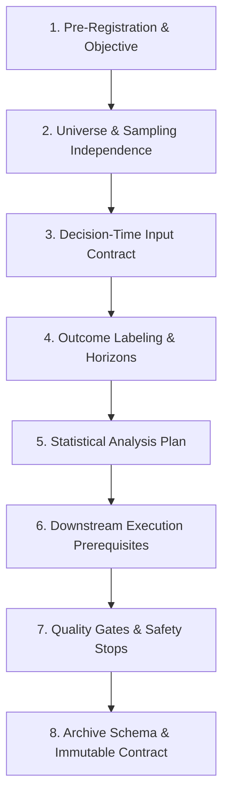

# Scope Proposal: Protocol Design For Formulation B (Liquidity-Independent Momentum Acceleration)

Status: **APPROVED BY USER ON 2026-09-24 — PROCEEDING TO PROTOCOL DRAFTING**

Date: 2026-09-24  
Author: Planning and Implementation Developer  
Decision Owner: User / Human Reviewer (Approved with Section 6 alignment decisions)  
Reference Brief: [Accepted Research-Question and Measurement-Requirements Brief](./post-b4-research-question-measurement-requirements-brief.md)

---

## 1. Purpose And Decision To Support

### 1.1 Context and Planning Problem

On 2026-09-24, the user reviewed and accepted the [Research-Question and Measurement-Requirements Brief](./post-b4-research-question-measurement-requirements-brief.md), selecting **Option 1: Proceed with Formulation B (Liquidity-Independent Momentum Acceleration)**.

Formulation B establishes a candidate research hypothesis based on kinematic price acceleration ($\Delta_{\text{velocity}} = \text{momentum}_{5m} - \text{momentum}_{15m} > 0$) as an indicator of persistent buying pressure in early-stage Solana DEX tokens, intentionally omitting decision-time liquidity pool depth from the selection predicate.

Following the [Post-V3 Development Plan §4](../Post-V3-Development-Plan.md), a candidate-producing exploratory research study requires a complete, pre-registered, and frozen protocol design before any collector tooling, data collection, or statistical analysis can be authorized.

### 1.2 Decision This Scope Supports

This scope proposal supports a future human governance decision: **whether to authorize the drafting of the formal, pre-registered Protocol Design Document for Formulation B**.

This scope proposal:

- Does **not** assume that Formulation B will yield an evidence-supported trading candidate;
- Does **not** authorize data collection, scheduler configuration, or provider queries; and
- Explicitly establishes the boundary between decision-time signal generation and downstream execution-feasibility modeling.

---

## 2. Scope And Structure Of The Future Protocol Design Document

If authorized, the resulting Protocol Design Document (suggested location: `docs/research-protocols/formulation-b-exploratory-protocol-design.md`) will specify the following eight core sections:



### 2.1 Formal Pre-Registration and Objective

- **Research Question**: Formal statement of whether tokens with positive price acceleration ($\text{momentum}_{5m} > \text{momentum}_{15m}$) exhibit statistically significant positive price continuation over a forward 60-minute window relative to non-accelerating tokens.
- **Candidate Selection Predicate**: Mathematical formulation of the candidate rule (e.g., discovery quantile threshold vs. fixed acceleration threshold).
- **Outcome Classification**: Pre-registered mapping of possible study outcomes (`NO_DEFENSIBLE_HYPOTHESIS`, `PRE_REGISTRATION_CANDIDATE_REJECTED`, `PRE_REGISTRATION_READY_FOR_SEPARATE_APPROVAL`, `DATA_INSUFFICIENT`).

### 2.2 Population, Universe, and Sampling Independence

- **Discovery Universe**: Canonical Solana DEX discovery stream at slot anchor $t_0$.
- **Sampling Rule**: Outcome-blind enrollment of distinct token mints per slot; deduplication of repeat mints within the cohort.
- **Partitioning Rule**: Deterministic partition hashing:
  $$\text{Partition} = \begin{cases} \text{DISCOVERY} & \text{if } \text{last\_hex\_digit}(\text{SHA256}(\text{seed} \parallel \text{mint} \parallel \text{slot})) \text{ is even} \\ \text{VALIDATION} & \text{if } \text{last\_hex\_digit}(\text{SHA256}(\text{seed} \parallel \text{mint} \parallel \text{slot})) \text{ is odd} \end{cases}$$
- **Independence & Concentration Controls**: Minimum 32 units per partition across $\ge 4$ UTC dates; maximum date share $\le 20\%$ of all units; zero mint overlap across partitions.

### 2.3 Decision-Time Input Contract

- **Allowlisted Facts**:
  - `market.priceUsd_anchor`: Finite USD price at $t_0$.
  - `market.momentum5mPct`: 5-minute price percentage change relative to $t_0$.
  - `market.momentum15mPct`: 15-minute price percentage change relative to $t_0$.
  - `market.momentumAccelerationPct`: Deterministic calculation ($\text{momentum5mPct} - \text{momentum15mPct}$).
  - `market.assetAgeSeconds`: Descriptive token age at $t_0$.
- **Temporal Freshness**: Observation timestamp $t_{obs} \le t_0$ with maximum allowable age $\Delta t \le 60\text{s}$.
- **Exclusion of Liquidity**: Explicit prohibition of liquidity facts as decision-time candidate inputs.

### 2.4 Outcome Labeling and Forward Horizons

- **Primary Label Horizon**: Forward 60-minute return:
  $$\text{return}_{60m} = \frac{P(t_0 + 3600\text{s}) - P(t_0)}{P(t_0)} \times 100$$
- **Primary Binary Classification**:
  - $\text{POSITIVE\_60M}$: Usable label with $\text{return}_{60m} > 0$.
  - $\text{NON\_POSITIVE\_60M}$: Usable label with $\text{return}_{60m} \le 0$.
  - $\text{UNUSABLE\_60M}$: Missing, late, or invalid observation (explicit missingness).
- **Secondary Descriptive Horizons**: 3m, 5m, and 15m return observations recorded for trajectory quality analysis only (strictly excluded from candidate selection).
- **Outcome Blindness**: Strict temporal isolation ensuring zero forward-looking data ($t > t_0$) leaks into decision-time feature vectors.

### 2.5 Statistical Analysis Plan and Selection Gates

- **Discovery Selection Gate**: Pre-registered requirement that the candidate acceleration rule in the Discovery partition must satisfy:
  - Minimum rule support: $\ge 8$ usable units;
  - Minimum comparison support: $\ge 24$ usable units;
  - Span $\ge 4$ UTC dates with no single date $> 35\%$ of rule support;
  - Effect size threshold: $\text{PositiveRate}(\text{Rule}) - \text{PositiveRate}(\text{Comparison}) \ge 0.20$.
- **Validation Replication Gate**: The exact winning rule from Discovery must replicate in the held Validation partition:
  - Minimum validation support: $\ge 8$ units;
  - Statistically non-negative effect: $\text{PositiveRate}_{\text{val}}(\text{Rule}) > \text{PositiveRate}_{\text{val}}(\text{Comparison})$.

### 2.6 Downstream Execution-Modeling Prerequisites

Because Formulation B omits liquidity from decision-time screening, the protocol design must establish formal prerequisites for how execution feasibility will be evaluated in subsequent roadmap phases:

- **Phase 10.7A (Paper Protocol)**: Must incorporate explicit order-routing, simulated quote latency, fill-probability models, and liquidity-depth slippage formulas.
- **Phase 10.8B (Paper Pilot)**: Must measure realized simulated execution slippage and compare fill prices against $t_0$ anchor marks.
- **Isolation Rule**: Execution constraints belong strictly to downstream execution simulation; they must not contaminate the Phase 10.6 exploratory signal protocol.

### 2.7 Quality Gates, Safety Stops, and Missingness

- **Preserved Availability Floor**: Frozen $\ge 90\%$ availability gate for required momentum facts in both partitions.
- **Safety Stops**: Clock drift stops ($> 5\text{s}$), schema validation stops, credential-content stops, and provider budget stops.
- **Zero Side Effects**: Zero filesystem writes, zero provider network calls during analysis, and zero database mutations.

### 2.8 Archive Schema and Immutable Contract

- Standard four immutable artifacts (`cohort-manifest.v1.json`, `units.v1.ndjson`, `source-inventory.v1.json`, `collection-summary.v1.json`).
- Whole-file and record-level SHA-256 integrity verification.

---

## 3. Evidence, Baseline, And Authority Matrix

| Component                  | Supported By Existing Baseline                                                                                             | NOT Supported (Prohibited Claims)                                                    | Requires Separate Future Scope & Approval                                     |
| :------------------------- | :------------------------------------------------------------------------------------------------------------------------- | :----------------------------------------------------------------------------------- | :---------------------------------------------------------------------------- |
| **Momentum Measurement**   | • V3/B.3 verified 5m and 15m momentum passed all availability ($\ge 90\%$), freshness, date-support, and provenance gates. | • Claiming V3 momentum passes prove strategy profitability or execution viability.   | None (measurement baseline is empirically confirmed).                         |
| **Liquidity Independence** | • Accepted Brief established Formulation B as mathematically independent of pool liquidity depth.                          | • Claiming real-world trades can execute without liquidity.                          | Downstream execution modeling in Phase 10.7A / 10.8B.                         |
| **Protocol Design**        | • Post-V3 Development Plan framework for candidate-producing protocol design.                                              | • Treating the design document as an active study or pre-registering without review. | Human review and approval of the completed Protocol Design Document.          |
| **Tooling & Validation**   | • H1–H4 engineering baseline and synthetic verification standards (`scripts/verify-isolated.mjs`).                         | • Modifying production collectors, parsers, or analyzers without approval.           | Scoping and implementing protocol validator tooling (post-protocol approval). |
| **Operational Actions**    | • Default denial of all execution, scheduling, and collection surfaces.                                                    | • Initiating data collection, scheduling tasks, or accessing live/paper wallets.     | Phase 10.6A collection authorization (separate future phase).                 |

---

## 4. Deliverables And Ordered Tasks

If this scope proposal is approved, the developer will execute the following ordered tasks to produce the formal Protocol Design Document:

```text
Task 1: Draft Formal Pre-Registration & Mathematical Selection Predicates
Task 2: Specify Population Sampling, Partitioning, and Independence Controls
Task 3: Define Outcome Labeling Horizons, Missingness Schemas, and Statistical Gates
Task 4: Specify Downstream Execution-Modeling Interface & Constraints
Task 5: Complete Archive Schema, Frozen Floors, and Safety Stop Specifications
```

- **Core Deliverable**: `docs/research-protocols/formulation-b-exploratory-protocol-design.md` (planned target file)
  - Marked **DRAFT PROTOCOL DESIGN FOR REVIEW — NOT APPROVED FOR COLLECTION**.
  - Complete, reviewable, and non-authorizing.

---

## 5. Acceptance And Stop Criteria

### 5.1 Acceptance Criteria

1. **Mathematical Completeness**: Every formula (velocity, acceleration, forward return, quantile split, positive rate difference) is explicitly defined without ambiguity.
2. **Preservation of Non-Negotiable Floors**: The frozen 90% partition availability gate, zero side-effect boundary, and strict outcome blindness are fully preserved.
3. **Execution-Layer Separation**: Explicit and unambiguous boundary separating decision-time signal generation from downstream paper execution modeling.
4. **Traceability**: All citations, historical references, and engineering constraints trace directly to repository documentation.

### 5.2 Stop Criteria

The protocol drafting process must halt immediately, record the blocking gap, and seek user clarification if:

1. Mathematical specification of momentum acceleration reveals an unavoidable dependency on unmeasured external data.
2. Outcome labeling rules cannot guarantee complete temporal isolation from decision-time feature inputs.
3. Any required parameter cannot be specified without violating frozen protection floors.

---

## 6. Questions For User Review & Recorded Governance Decisions

The following alignment parameters were submitted for user decision and were formally approved on 2026-09-24:

1. **Candidate Predicate Structure**:
   - **Resolved**: Proceed with **Option A (Quantile-Based)**: the candidate predicate selects units in the top quartile of Discovery acceleration ($\text{momentumAccelerationPct} \ge Q_3(\text{Discovery})$) relative to the comparison population, preserving the non-parametric methodology established in Phase 10.6B.

2. **Primary Evaluation Horizon**:
   - **Resolved**: Confirmed. Forward **60-minute return ($\text{return}_{60m} > 0$)** is the sole primary candidate-evaluation horizon; shorter horizons (3m, 5m, 15m) are recorded strictly for descriptive trajectory analysis.

3. **Planned Cohort Size**:
   - **Resolved**: Confirmed. Planning parameters are fixed at **96 planned units**, minimum **72 valid units**, minimum **32 units per partition** across $\ge 8$ total UTC dates ($\ge 4$ dates per partition), with a $\le 20\%$ date concentration cap.

---

## 7. Approval Boundary

Approval of this scope proposal authorizes **ONLY**:

- Drafting the formal documentation-only Protocol Design Document for Formulation B; and
- Performing documentation-only consistency, link, and formatting checks.

Approval of this scope **DOES NOT AUTHORIZE**:

- Accessing operational archives or databases;
- Rerunning the production analyzer;
- Writing, modifying, or testing production collector/analyzer code;
- Implementing automated protocol validator software;
- Making provider API calls or network requests;
- Scheduling or executing data collection;
- Activating Phase 10.6C or altering live/paper strategy logic; or
- Any PAPER trading, wallet loading, signing, order submission, or live execution.

Any activity beyond drafting the protocol design document requires separate, explicit user approval.
