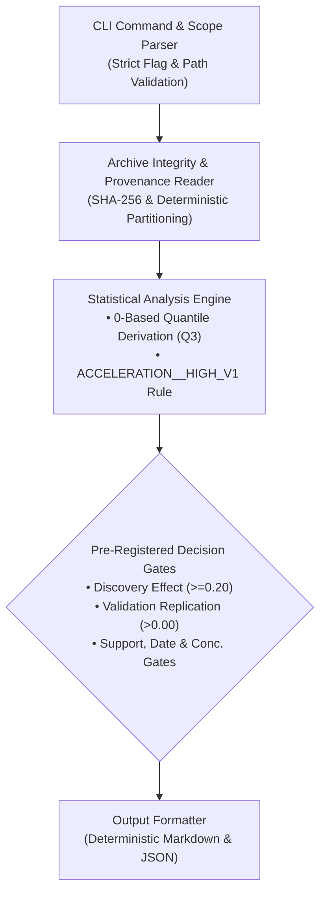
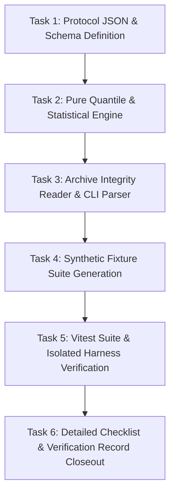

# Scope Proposal: Formulation B Protocol Validator And Analysis Tooling Implementation

Status: **PROPOSED — NOT APPROVED**

Date: 2026-09-24  
Author: Planning and Implementation Developer  
Decision Owner: User / Human Reviewer  
Governing Protocol: [Approved Formulation B Protocol Design](../research-protocols/formulation-b-exploratory-protocol-design.md)  
Reference Brief: [Accepted Research-Question and Measurement-Requirements Brief](./post-b4-research-question-measurement-requirements-brief.md)

---

## 1. Purpose And Decision To Support

### 1.1 Context and Engineering Objective

On 2026-09-24, the user reviewed and approved the [Formulation B Protocol Design Document](../research-protocols/formulation-b-exploratory-protocol-design.md) as the frozen exploratory protocol design.

Before any future data collection, scheduler activation, or empirical study can even be considered, the codebase must possess an automated, self-contained, and synthetically verified protocol validator and cohort analysis tool that implements the exact mathematical, statistical, and safety specifications of Formulation B.

### 1.2 Decision This Scope Supports

This scope proposal supports a future human governance decision: **whether to authorize the implementation and synthetic verification of the Formulation B Protocol Validator and Analysis Tooling under the H1–H4 isolation test harness**.

### 1.3 Strict Synthetic Boundary

In accordance with established project boundaries:

- Implementation and verification will be conducted **100% using synthetic test fixtures**;
- No production analyzer will be rerun;
- No operational archives will be accessed or created; and
- Zero live network queries, provider calls, or execution actions will occur.

---

## 2. Tooling Architecture And Component Specifications



The tooling package will implement five modular, pure TypeScript components adhering to H1–H4 architecture standards:

### 2.1 Protocol JSON Definition and Schema Validator

- **Protocol Source**: `docs/research-protocols/phase10.6a-exploratory-cohort.formulation-b.v1.json`.
- **JSON Schema**: Strict schema definition validating protocol metadata, universe parameters, allowlisted fields, exclusion of liquidity, and pre-registered gate thresholds.
- **Protocol Validator**: Automated static check verifying that the frozen protocol file matches its canonical SHA-256 hash.

### 2.2 CLI Command and Strict Scope Parser

- **CLI Entrypoint**:
  ```bash
  pnpm research:exploratory-cohort:analyze-formulation-b -- \
    --archive-root=<path-to-finalized-archive> \
    [--format=markdown|json]
  ```
- **Scope Parsing Rules**:
  - Requires exactly one repository-contained `--archive-root` argument;
  - Supports `--format=markdown|json` (default `markdown`);
  - Rejects traversal characters (`..`), absolute paths outside repository, URL-shaped strings, glob patterns, multi-root arguments, and unauthorized flags;
  - Fails closed with bounded error codes: `FORMULATION_B_INVALID_SCOPE`, `FORMULATION_B_UNSUPPORTED_ARCHIVE`, `FORMULATION_B_SOURCE_INCONSISTENCY`, `FORMULATION_B_ARCHIVE_NOT_FINAL`.

### 2.3 Archive Integrity and Provenance Reader

- **Read Facade Integration**: Operates strictly through the H4 analytics read facade without direct database or uncontained filesystem access.
- **Integrity Checks**:
  1. Verifies that the archive contains exactly the four required artifacts (`cohort-manifest.v1.json`, `units.v1.ndjson`, `source-inventory.v1.json`, `collection-summary.v1.json`) and no `collection.lock`;
  2. Matches raw artifact SHA-256 hashes against manifest `finalFileHashes` and protocol SHA-256;
  3. Recomputes deterministic partition hashes for every unit:
     $$\text{SHA256}("formulation-b-exploratory-protocol.v1" \parallel \text{canonicalMint} \parallel \text{slotId})$$
  4. Verifies safety counters $= 0$ and execution/wallet flags $= \text{false}$.
  5. Fails closed if any forbidden liquidity field (`market.liquidityUsd`, quote impact, reserve depths) appears in decision-time candidate inputs.

### 2.4 Quantile Derivation Engine (0-Based Indexing Specification)

In accordance with user requirements, the mathematical derivation of the third quartile ($Q_3$) from valid Discovery partition units is strictly specified using 0-based array indexing:

```text
Algorithm: Non-Parametric Q3 Derivation (0-Based Indexing)
Inputs:
  - Vector of valid Discovery units: D = [u_0, u_1, ..., u_{m-1}]
  - Extraction function: extractAcceleration(u) -> finite float

Steps:
  1. Filter D to retain only units with finite available market.momentumAccelerationPct facts.
  2. Extract values into array: A = [a_0, a_1, ..., a_{n-1}] where n is the count of available values.
  3. Sort array A in ascending numerical order:
       A_sorted = [v_0, v_1, ..., v_{n-1}]  such that v_0 <= v_1 <= ... <= v_{n-1}
  4. If n < 8, fail closed with DATA_INSUFFICIENT (insufficient Discovery feature support).
  5. Calculate 0-based index:
       k = Math.ceil(0.75 * (n - 1))
     Constraint check: 0 <= k <= n - 1.
  6. Return Q3 = A_sorted[k].
```

- **Zero Ambiguity**: No linear interpolation, no floating-point rounding of values, and no label-informed adjustments.

### 2.5 Statistical Analysis Engine and Selection Gate Evaluator

- Evaluates candidate predicate `ACCELERATION__HIGH_V1` ($\text{market.momentumAccelerationPct} \ge Q_3(\text{Discovery})$).
- Evaluates Discovery Gates:
  - Feature coverage $\ge 90.0\%$;
  - Rule support $\ge 8$ usable units, comparison support $\ge 24$ usable units;
  - $\ge 4$ distinct UTC dates, max date share $\le 35.0\%$;
  - Discovery Effect Gate: $\Delta_{\text{rate, disc}} = \text{PositiveRate}_{\text{disc}}(\text{Rule}) - \text{PositiveRate}_{\text{disc}}(\text{Comp}) \ge 0.20$.
- Evaluates Validation Gates:
  - Applies $Q_3(\text{Discovery})$ threshold directly to held Validation units;
  - Validation rule support $\ge 8$ usable units;
  - $\ge 4$ distinct UTC dates, max date share $\le 35.0\%$;
  - Replication Gate: $\Delta_{\text{rate, val}} = \text{PositiveRate}_{\text{val}}(\text{Rule}) - \text{PositiveRate}_{\text{val}}(\text{Comp}) > 0.00$.
- Emits deterministic outcome classification:
  - `PRE_REGISTRATION_READY_FOR_SEPARATE_APPROVAL`
  - `PRE_REGISTRATION_CANDIDATE_REJECTED`
  - `NO_DEFENSIBLE_HYPOTHESIS`
  - `DATA_INSUFFICIENT`

---

## 3. Synthetic Test Fixtures And Isolated Verification Suite

To verify the tooling without operational data, the implementation will build a dedicated synthetic fixture suite:

```text
backend/test/fixtures/synthetic/formulation-b/
├── fixture-01-passing-replication/
├── fixture-02-validation-rejected/
├── fixture-03-no-defensible-hypothesis/
├── fixture-04-insufficient-momentum-availability/
├── fixture-05-insufficient-cohort-size/
├── fixture-06-date-concentration-breach/
├── fixture-07-tampered-manifest-hash/
└── fixture-08-liquidity-leakage-detection/
```

### 3.1 Synthetic Fixture Matrix

| Fixture ID     | Injected Synthetic Condition                                                          | Expected Decision Outcome / Error              | Verification Target                                                         |
| :------------- | :------------------------------------------------------------------------------------ | :--------------------------------------------- | :-------------------------------------------------------------------------- |
| **Fixture 01** | Discovery effect $\ge 0.20$, Validation effect $> 0.00$, all quality/date gates pass. | `PRE_REGISTRATION_READY_FOR_SEPARATE_APPROVAL` | End-to-end happy path; verified quantile calculation and replication logic. |
| **Fixture 02** | Discovery effect $\ge 0.20$, but Validation effect $\le 0.00$.                        | `PRE_REGISTRATION_CANDIDATE_REJECTED`          | Validation replication failure handling.                                    |
| **Fixture 03** | Discovery effect $< 0.20$ (e.g., $+0.12$).                                            | `NO_DEFENSIBLE_HYPOTHESIS`                     | Discovery effect size gate enforcement.                                     |
| **Fixture 04** | Momentum availability $= 82.5\%$ ($< 90.0\%$ gate floor).                             | `DATA_INSUFFICIENT`                            | Enforcement of frozen 90% availability floor.                               |
| **Fixture 05** | Total valid units $= 64$ ($< 72$ minimum).                                            | `DATA_INSUFFICIENT`                            | Minimum valid unit count enforcement.                                       |
| **Fixture 06** | Single UTC date contains $25.0\%$ of valid units ($> 20.0\%$ cap).                    | `DATA_INSUFFICIENT`                            | Date concentration ceiling enforcement.                                     |
| **Fixture 07** | Altered byte in `units.v1.ndjson` causing hash mismatch with manifest.                | `FORMULATION_B_SOURCE_INCONSISTENCY`           | SHA-256 archive integrity fail-closed behavior.                             |
| **Fixture 08** | Injected `market.liquidityUsd` field in decision-time input object.                   | `FORMULATION_B_SOURCE_INCONSISTENCY`           | Strict exclusion of liquidity feature inputs.                               |

### 3.2 Isolated Test Harness Integration

- All tests will be implemented in Vitest and configured under `backend/vitest.measurement-analysis.config.ts` (or dedicated `backend/vitest.formulation-b.config.ts`).
- Verification entrypoint: Must execute cleanly via `node scripts/verify-isolated.mjs` with zero dependencies on live network or external state.

---

## 4. Evidence, Baseline, And Authority Matrix

| Component             | Supported By Existing Baseline                                                                        | NOT Supported (Prohibited Claims)                                                     | Requires Separate Future Scope & Approval                                |
| :-------------------- | :---------------------------------------------------------------------------------------------------- | :------------------------------------------------------------------------------------ | :----------------------------------------------------------------------- |
| **Tooling & Code**    | • H1–H4 engineering baseline, read facades, and isolated test runner (`scripts/verify-isolated.mjs`). | • Modifying production collector/analyzer code without scope approval.                | Drafting the detailed implementation checklist and writing tooling code. |
| **Synthetic Testing** | • Pure in-memory synthetic fixture generation for all 8 test cases.                                   | • Reading production archives or re-executing historical runs during testing.         | None (synthetic testing is fully contained).                             |
| **Operational State** | • Default denial of all operational collection and trading surfaces.                                  | • Creating live archive roots, enabling schedulers, or making network provider calls. | Future Phase 10.6A collection authorization (separate human decision).   |

---

## 5. Deliverables And Ordered Tasks

If this scope proposal is approved, the developer will execute the following ordered tasks:



### 5.1 Ordered Tasks

- **Task 1**: Create `docs/research-protocols/phase10.6a-exploratory-cohort.formulation-b.v1.json` and its JSON schema validator.
- **Task 2**: Implement the pure domain mathematical engine with 0-based index quantile calculation and gate evaluators.
- **Task 3**: Implement the archive integrity reader and CLI command with strict fail-closed argument parsing.
- **Task 4**: Construct the 8 synthetic test fixtures covering all pass, reject, insufficient, and error states.
- **Task 5**: Implement the Vitest test suite and integrate it into `scripts/verify-isolated.mjs`.
- **Task 6**: Produce the detailed implementation checklist (`docs/NeXusTrade-Phase-10.6B-Formulation-B-Tooling-Detailed-Checklist.md`) and verification record (`docs/Phase-10.6B-Formulation-B-Tooling-Verification.md`).

### 5.2 Planned Deliverables

1. **Protocol Definition**: `docs/research-protocols/phase10.6a-exploratory-cohort.formulation-b.v1.json`
2. **Tooling Implementation**: TypeScript sources under `backend/src/research-exploratory-cohort/` and `backend/src/research-exploratory-analysis/`
3. **Synthetic Fixtures & Tests**: Test suite in `backend/test/`
4. **Implementation Checklist**: `docs/NeXusTrade-Phase-10.6B-Formulation-B-Tooling-Detailed-Checklist.md`
5. **Verification Record**: `docs/Phase-10.6B-Formulation-B-Tooling-Verification.md`

---

## 6. Acceptance And Stop Criteria

### 6.1 Acceptance Criteria

1. **Isolated Verification**: `node scripts/verify-isolated.mjs` executes and passes all static, lint, typecheck, and test suites with zero failures.
2. **100% Synthetic Coverage**: All 8 synthetic test fixtures execute and produce the exact expected deterministic outcome states.
3. **0-Based Quantile Integrity**: Mathematical tests verify boundary conditions ($n=8$, odd/even lengths, identical values, extreme outliers) for the 0-based $Q_3$ derivation algorithm.
4. **Zero Production Contamination**: Zero reads/writes to operational archives, zero network calls, zero wallet/trading surface touches.

### 6.2 Stop Criteria

The implementation process must halt immediately, record the blocking defect, and seek user clarification if:

1. Implementation requires modifying code outside the designated research analysis module or weakens H1–H4 read facade containment.
2. Synthetic fixture execution produces indeterminate or non-reproducible outcome states.
3. Any test step requires live network or unisolated operational dependencies.

---

## 7. Approval Boundary

Approval of this scope proposal authorizes **ONLY**:

- Drafting the detailed implementation checklist;
- Implementing the protocol JSON file, schema validator, analysis engine, CLI command, and synthetic test fixtures; and
- Executing isolated synthetic verification via `node scripts/verify-isolated.mjs`.

Approval of this scope **DOES NOT AUTHORIZE**:

- Accessing or creating operational archive roots;
- Running the production analyzer;
- Querying live network providers or RPC endpoints;
- Configuring or activating collection schedulers;
- Initiating data collection;
- Activating Phase 10.6C shadow validation; or
- Any PAPER trading, wallet access, signing, order submission, or live execution.

Any operational or collection activity requires a subsequent, separately reviewed and approved scope proposal.
