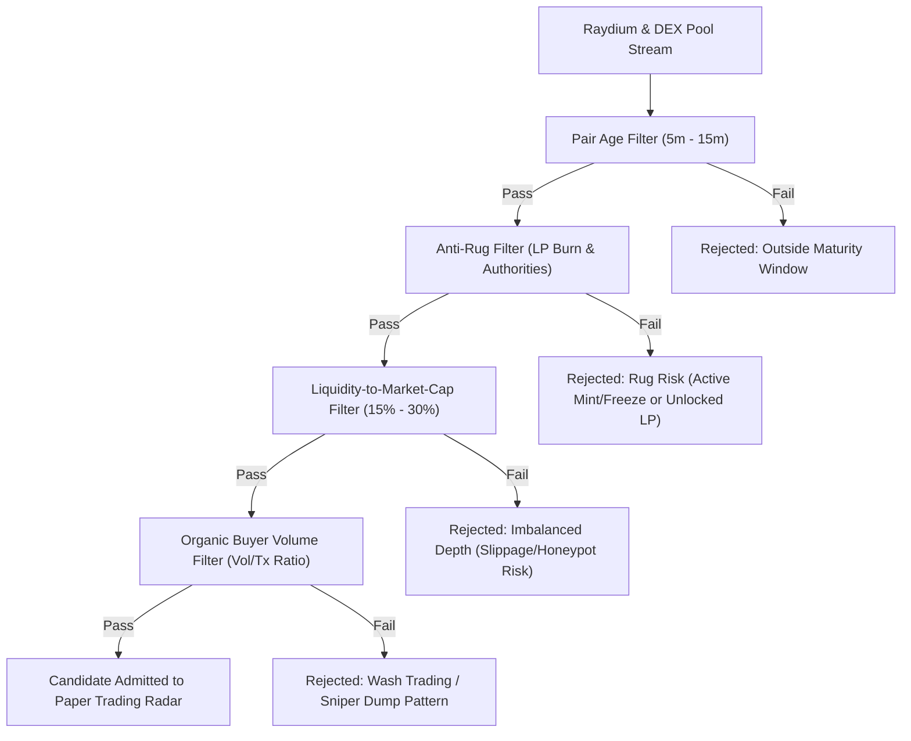
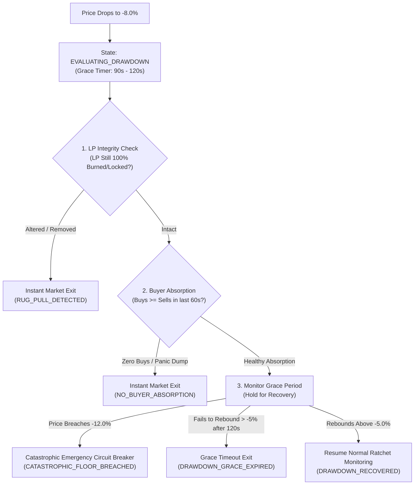
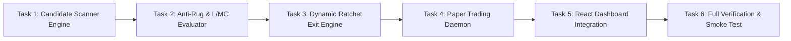

# Phase 11 Scope Proposal & Architecture Specification: Live Scanner & Dynamic Ratchet Exit Engine

**Document Version**: `1.0.0`  
**Status**: `PROPOSED`  
**Target Phase**: `Phase 11.0`  
**Dependencies**: `Phase 10.6B (Formulation B Verification Complete)`  
**Repository Working Baseline**: `commit 984fb74` (`node scripts/verify-isolated.mjs` 100% Passing)

---

## 1. Executive Summary & Context

With the successful completion of the Formulation B exploratory research phase and the verification of live Solana token discovery and pricing pipelines on mainnet, TopG transitions into **Phase 11: Live Scanner & Dynamic Ratchet Exit Engine**.

The objective of Phase 11 is to bridge the gap between candidate discovery and profitable, capital-preserving execution by implementing:

1. **A Real-Time Candidate Scanner** that filters live Solana DEX pairs with mathematical rigor: enforcing Liquidity-to-Market-Cap (L/MC) balance, strict anti-rug protections (LP burn/lock, renounced authorities), optimal pair maturity windows (5–15 min), and organic volume-to-transaction ratios.
2. **A Dynamic Multi-Tiered Ratchet Stop-Loss Engine** in `backend/src/exits/` that enforces an initial \(-8\%\) circuit breaker, early scratch exits on momentum exhaustion, and monotonically advancing profit floors (\(+24\% \to +20\%\), \(+49\% \to +45\%\)).
3. **An Autonomous Paper Trading Daemon** designed for long-running (4–10 hour) daily background execution with built-in risk tripwires.
4. **An Enhanced Real-Time Dashboard** in `frontend/src/` providing live position tracking, dynamic ratchet tier status, trade history, win/loss/scratch metrics, and equity curve visualizations.

---

## 2. Real-Time Candidate Scanner Specification

The Candidate Scanner continuously streams and screens active pairs on Solana to supply high-probability momentum candidates to the trading engine.



### 2.1 Ingestion & Discovery Pipeline

- **Primary Source**: Raydium AMM V4 / CLMM / CPMM active pool streams (`https://api-v3.raydium.io/pools/info/list` and Solana RPC program accounts).
- **Secondary Source**: DexScreener Solana pair stream (`https://api.dexscreener.com/tokens/v1/solana/`).
- **Base Pairs**: Tokens paired with `WSOL` (`So11111111111111111111111111111111111111112`), `USDC` (`EPjFWdd5AufqSSqeM2qN1xzybapC8G4wEGGkZwyTDt1v`), or `USDT` (`Es9vMFrzaCERmJfrF4H2FYD4KCoNkY11McCe8BenwNYB`).

### 2.2 Liquidity-to-Market-Cap (L/MC) Filter

- **Mathematical Formula**:
  $$\text{L/MC Ratio} = \frac{\text{Liquidity USD}}{\text{Market Cap (or FDV) USD}}$$
- **Rule Bounds**:
  $$0.15 \le \text{L/MC Ratio} \le 0.30 \quad (15.0\% \le \text{L/MC} \le 30.0\%)$$
- **Rationale**:
  - **Lower Bound (\(< 15\%\))**: Low liquidity relative to valuation causes excessive slippage and price collapse upon paper/live sell orders (high price impact).
  - **Upper Bound (\(> 30\%\))**: Abnormally high liquidity relative to market cap typically signals over-diluted zombie pools or artificial bonding curve seeding with zero retail momentum.

### 2.3 Pair Age & Anti-Rug Verification

- **Pair Maturity Window**:
  $$300\text{ seconds} \le \text{Asset Age} \le 900\text{ seconds} \quad (5\text{ to }15\text{ minutes})$$
  - _5-Minute Floor_: Bypasses initial block-0 sniper bot front-running, high gas wars, and immediate instant-rug scripts.
  - _15-Minute Ceiling_: Focuses capital on the high-velocity expansion phase before token saturation.
- **LP Security Check**:
  - Requires \(\ge 90.0\%\) of LP tokens burned (`11111111111111111111111111111111`) or locked in an audited Solana lock contract.
- **Authority Renunciation**:
  - **Mint Authority**: Must be `null`, `disabled`, or set to the System Program (`11111111111111111111111111111111`) preventing unauthorized supply inflation.
  - **Freeze Authority**: Must be `null` or `disabled`, preventing token transfer blacklisting.

### 2.4 Volume-to-Transaction Count Ratio (Organic Buyer Filter)

- **Mathematical Formula**:
  $$\text{Avg Tx Size USD} = \frac{\text{Volume}_{5m}\text{ (USD)}}{\text{TxCount}_{5m}}$$
- **Rule Bounds**:
  1. Minimum Transaction Count: \(\text{TxCount}\_{5m} \ge 20\) unique transactions in the last 5 minutes.
  2. Average Transaction Size: \(\$15 \le \text{Avg Tx Size USD} \le \$2,500\).
  3. Buy/Sell Ratio: \(\text{Buys}_{5m} \ge \text{Sells}_{5m}\) (positive net buyer flow).
- **Rationale**: Rejects artificial single-wallet wash trading (1 transaction of \$100k) and coordinated sniper dump waves.

---

## 3. Dynamic Multi-Tiered Ratchet Stop-Loss & Smart Re-evaluation Engine (`backend/src/exits/`)

The Dynamic Ratchet Engine replaces static whole-session exits with position-level, high-water-mark profit protection and intelligent drawdown classification.



### 3.1 Exit Tiers & Mathematical Rules

| Exit Tier                        | Entry / Trigger Condition                                                                               | Stop Floor Action                                            | Objective                                                                   |
| :------------------------------- | :------------------------------------------------------------------------------------------------------ | :----------------------------------------------------------- | :-------------------------------------------------------------------------- |
| **Tier 0: Re-evaluation Gate**   | \(\text{PnL}\_t \le -8.0\%\)                                                                            | Enters `EVALUATING_DRAWDOWN` state (90–120s grace)           | Prevents shakeouts on healthy sniper dips; verifies LP & buyer absorption   |
| **Tier 0-R: Rug / Abandon Exit** | LP altered OR \(\text{Buys}\_{60s} = 0\)                                                                | Immediate Market Exit at current price                       | Cuts loss immediately on true rug pulls or zero-buyer abandonments          |
| **Tier 0-C: Catastrophic Floor** | \(\text{PnL}\_t \le -12.0\%\) at any second                                                             | Non-negotiable hard floor at \(P_0 \times 0.88\)             | Absolute emergency circuit breaker to prevent disastrous cascaded drawdowns |
| **Tier 0-T: Grace Timeout**      | Fails to recover above \(-5.0\%\) in 120s                                                               | Time-out market exit (\(\approx -8\%\text{ to }-10\%\))      | Recycles capital when dip fails to rebound promptly                         |
| **Tier 0.5: Scratch Exit**       | \(+0.5\% \le \text{PnL} \le +1.5\%\) AND (\(M\_{5m} \le 0\%\) or Volume Dropping for \(\ge 3\text{m}\)) | Immediate Market Exit at \(\approx +0.5\%\text{ to }+1.5\%\) | Capital recycling; prevents winners from turning into losers                |
| **Tier 1: Ratchet 1**            | Peak Unrealized Gain \(\ge +24.0\%\)                                                                    | Floor ratchets up to \(P_0 \times (1 + 0.20) = +20.0\%\)     | Locks in substantial initial breakout profit                                |
| **Tier 2: Ratchet 2**            | Peak Unrealized Gain \(\ge +49.0\%\)                                                                    | Floor ratchets up to \(P_0 \times (1 + 0.45) = +45.0\%\)     | Captures outsized runner moves while guaranteeing \(+45\%\)                 |

### 3.2 High-Water-Mark (HWM) Tracking & Monotonicity Invariant

- For every open position \(i\), the engine tracks:
  - \(P_0\): Weighted average entry price (`avgEntryPriceSol`).
  - \(P*{\max, t} = \max*{0 \le \tau \le t} (P\_\tau)\): High-water mark price observed up to time \(t\).
  - \(\text{PeakGainBps}_t = \frac{P_{\max, t} - P_0}{P_0} \times 10,000\).
  - \(\text{StopFloorBps}\_t\): Current active stop-loss floor in basis points relative to entry.
- **Monotonicity Invariant**:
  $$\text{StopFloorBps}_{t+1} \ge \text{StopFloorBps}_t \quad \forall t$$
  The stop floor can **never** move downward regardless of price retracement.

---

## 4. Live Paper Trading Daemon & Operator Workflow

### 4.1 Daemon Architecture (`PaperTradingDaemon.ts`)

The Paper Trading Daemon coordinates the continuous loop:

1. **Scanner Cycle**: Polls candidate scanner every \(5\text{–}15\text{s}\) for eligible pairs meeting all L/MC, anti-rug, and volume criteria.
2. **Admission & Buy Decision**:
   - Max Concurrent Open Positions: 3 positions.
   - Max Allocation Per Position: \(1.0\text{ SOL}\) (or 10% of portfolio cash).
   - Simulates realistic buy order fill with recorded slippage and fees.
3. **Position Monitor & Ratchet Loop**:
   - Polls spot price of all open positions every \(3\text{–}5\text{s}\).
   - Updates high-water-mark peak gain.
   - Evaluates Hard Stop, Scratch Exit, Tier 1 Ratchet, and Tier 2 Ratchet triggers.
   - Executes market sells immediately upon stop floor penetration.
4. **Safety Tripwires & Circuit Breakers**:
   - Daily Drawdown Cap: If portfolio equity drops \(\ge 5.0\%\) in a calendar day, halt new entries.
   - Consecutive Error Cap: \(\ge 3\) consecutive provider or order errors triggers auto-pause.
   - Clock Drift: Halts if server/client drift \(> 5.0\text{s}\).

### 4.2 Operator PowerShell Commands

```powershell
# 1. Launch Background Paper Trading Daemon (e.g. 6-Hour Session)
$SessionId = "paper-daemon-" + (Get-Date -Format "yyyyMMdd-HHmmss")
$LogFile   = "logs/$SessionId.log"
New-Item -ItemType Directory -Force -Path "logs" | Out-Null

$Process = Start-Process -FilePath "pnpm" -ArgumentList "trading:paper-daemon", "--session-id=$SessionId", "--duration-hours=6", "--max-positions=3", "--position-size-sol=1.0", "--hard-stop-pct=8.0" -RedirectStandardOutput "$LogFile" -RedirectStandardError "logs/$SessionId.err.log" -NoNewWindow -PassThru

Write-Host "Paper Trading Daemon started with PID: $($Process.Id) [Session: $SessionId]"

# 2. Inspect Active Session Health & Positions
pwsh -File scripts/inspect-paper-session.ps1 -SessionId $SessionId

# 3. Graceful Stop
pwsh -File scripts/stop-paper-session.ps1 -SessionId $SessionId
```

---

## 5. Real-Time React Dashboard Integration

The React dashboard (`frontend/src/`) will be enhanced with live polling / WebSocket data feeds:

### 5.1 Dashboard UI Components

```
+-----------------------------------------------------------------------------------------+
| TopG Live Trading Engine - Paper Dashboard                          [Status: RUNNING]   |
+-----------------------------------------------------------------------------------------+
| Equity: 104.82 SOL (+4.82%) | Cash: 101.82 SOL | Open Pos: 2/3 | Win Rate: 71.4% (5/7)  |
+-----------------------------------------------------------------------------------------+
| ACTIVE POSITIONS                                                                        |
| Mint         Symbol   Entry (SOL)  Spot (SOL)  Peak Gain  Stop Floor   Ratchet Tier  PnL    |
| 4k3Dyj...    RAY      0.0178       0.0225      +26.4%     +20.0%       TIER_1       +26.4%  |
| 6GmAFS...    STONK    0.0030       0.00305     +1.6%      -8.0%        HARD_STOP    +1.6%   |
+-----------------------------------------------------------------------------------------+
| SCANNER RADAR (Live Stream)                                                             |
| Time      Symbol   Age    L/MC Ratio  LP Burned  Mint/Freeze  Vol/Tx ($)   Status       |
| 18:45:10  GO       7m     22.4%       100%       RENOUNCED    $124         ADMITTED     |
| 18:44:55  SHART    12m    18.1%       98%        RENOUNCED    $85          ADMITTED     |
| 18:44:20  XYZ      2m     8.2%        0%         ACTIVE       $4,200       REJECTED     |
+-----------------------------------------------------------------------------------------+
| COMPLETED TRADES & EQUITY CURVE                                                         |
| [Line Chart: Equity Curve over Time with High-Water-Mark overlay]                       |
| Trade Log: 5 Wins (+20% to +48%), 1 Scratch (+0.8%), 1 Loss (-8.0%)                     |
+-----------------------------------------------------------------------------------------+
```

---

## 6. Phased Verification Plan & Deliverables

All deliverables adhere strictly to repository isolation (`node scripts/verify-isolated.mjs`), default denial, and architecture policies.

### 6.1 Ordered Task Execution



1. **Task 1: Real-Time Candidate Scanner Engine** (`backend/src/scanner/`):
   - Stream ingestion from Raydium and Solana RPC.
   - Deduplication, age calculation, and state tracking.
2. **Task 2: Anti-Rug & L/MC Evaluator** (`backend/src/scanner/ScannerEvaluator.ts`):
   - Implementation and synthetic unit tests for:
     - L/MC Ratio check (\(15\% \le \text{L/MC} \le 30\%\)).
     - Anti-rug check (LP burn \(\ge 90\%\), renounced mint/freeze authorities).
     - Volume-to-Tx ratio and minimum unique buyer count.
3. **Task 3: Dynamic Ratchet Stop-Loss Engine** (`backend/src/exits/`):
   - Position high-water mark tracking in SQLite.
   - State machine implementing \(-8\%\) Hard Stop, Scratch Exit, Level 1 Ratchet (\(+24\% \to +20\%\)), and Level 2 Ratchet (\(+49\% \to +45\%\)).
   - Monotonicity invariant unit tests.
4. **Task 4: Paper Trading Daemon** (`backend/src/paper/PaperTradingDaemon.ts`):
   - Background execution loop connecting Scanner \(\to\) Paper Buy \(\to\) Ratchet Exit \(\to\) Accounting.
   - Pacing, drawdown stops, and operator scripts (`scripts/inspect-paper-session.ps1`).
5. **Task 5: React Dashboard Integration** (`frontend/src/`):
   - Live position grid with ratchet tier indicators, trade log table, equity chart, and radar feed.
6. **Task 6: Isolated Harness Verification & Mainnet Smoke Test**:
   - Zero live network requests in automated test suites.
   - 100% pass across `node scripts/verify-isolated.mjs`.

---

## 7. Next Step Authorization

Upon user approval of this Scope Proposal and Architecture Specification, we will proceed to:

1. Generate **Deliverable 1: Phase 11 Detailed Checklist & Architecture Implementation Plan** (`docs/NeXusTrade-Phase-11-Detailed-Checklist.md`).
2. Begin implementation of Tasks 1 through 6 under strict default denial and isolated verification boundaries.
