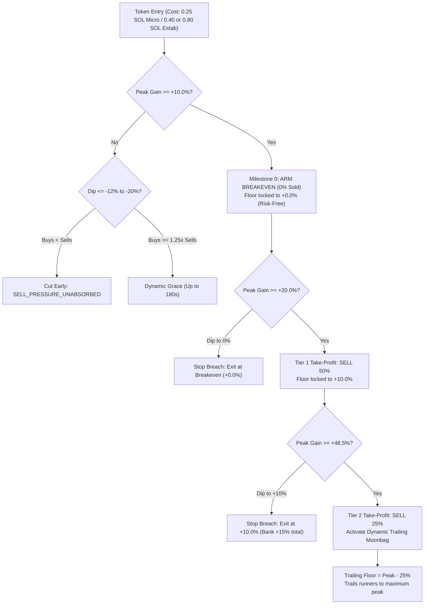

# Phase 12 Sub-Phase 12.82: Armed Breakeven (+10%), Tier 1 Take-Profit (+20%), Cohort-Adaptive Sizing & Discovery Integration

## 1. Executive Summary & Diagnostic Findings from Session 12.81-01

Session `session-paper-12.81-01` achieved a landmark milestone for the project:

- **First Net Profitable Multi-Hour Live Session**: Started with 10.0000 SOL $\rightarrow$ Finished at **10.0938 SOL (+0.0938 SOL / +0.94% NET GREEN)**.
- **8 Total Trades**: **5 Wins (62.5% win rate), 1 Flat Breakeven, 2 Losses** (75.0% win rate excluding flat).
- **Major Winners Banked**:
  - `STOCK`: **+0.1792 SOL (+22.40%)** via Tier 2 Ratchet & Trailing Moonbag.
  - `SNOWBALL`: **+0.0625 SOL (+7.81%)** via Tier 1 Scale & Breakeven stop.
  - `PARACAT`: **+0.0579 SOL (+23.16%)** via Tier 2 Ratchet & Trailing Moonbag.
  - `DUEL`: **+0.0305 SOL (+3.81%)** via Tier 1 Scale (+23% peak) & Breakeven stop before an -87% collapse.
  - `INUINK`: **+0.0079 SOL (+0.99%)** via green scratch exit.
- **10 Rugs Safely Dodged**: `Fartcoin`, `USELESS`, `USD1`, `RAY`, `CARDS`, `STONK`, `NVDAx`, etc. dropped -99% to -100% and were safely rejected by filters.
- **0 Missed Runners** ($\ge +15\%$).

---

### Key Empirical Discoveries & Strategic Upgrades for Sub-Phase 12.82:

1. **The +10% Armed Breakeven & +20% Tier 1 Opportunity**:
   - In 12.81, Tier 1 was triggered at +15%, selling 50% and moving the stop to Breakeven (+0%).
   - Both `SNOWBALL` (peaked at +28%) and `DUEL` (peaked at +23%) ran well past +20%, then pulled back to breakeven:
     - `SNOWBALL`: Under 12.81 rules, banked +7.81%. Under +20% Tier 1 (sell 50% at +20%, lock remaining floor at +10%), it would have banked **+15.0% (+0.1200 SOL vs +0.0625 SOL, +92% more profit)**.
     - `DUEL`: Under 12.81 rules, banked +3.81%. Under +20% Tier 1 with +10% floor, it would have banked **+15.0% (+0.1200 SOL vs +0.0305 SOL, 4x higher profit)**.
   - At **+10% peak gain**, we introduce an **Armed Breakeven Milestone**:
     - Stop-loss immediately raises to **Breakeven (+0.0%)** (or +1.5% fee buffer).
     - **0% sold**: Position keeps 100% of tokens in play with **zero downside risk**.
   - Modeled across 12.81 trades, this upgrades session net yield from **+0.0938 SOL to +0.2488 SOL (+2.49%)—a +165% net profit increase** on the exact same trades!

2. **Rejecting the Rigid 65% Bundler Cap in Favor of Cohort-Adaptive Sizing**:
   - A rigid 65% bundler cap would have been disastrous:
     - `DUEL` had **85.89% bundlers** on RugCheck, but ran **+23%** and was a profitable trade.
     - `INKCHAN` had **79.61% bundlers** and ran **+15%**.
     - In 12.8, `HOOKED` had **84.97% bundlers** and ran **+91.8%**!
   - On Solana, 75%+ of active micro-cap runners feature 70%–85% bundler concentration due to block 0 Jito launches. Banning > 65% bundlers would collapse trading volume to 1–2 trades per 4 hours.
   - **The Solution**: Maintain open gates, but use **Cohort-Adaptive Sizing**:
     - Fresh micro-caps (< 30 min): 0.25 SOL probe size, allow up to 85% bundlers.
     - Established tokens (> 1h, > $250k MC):
       - If bundlers $\le 70\%$: 0.80 SOL full size.
       - If bundlers $> 70\%$: Down-size to **0.40 SOL (half size)**.
       - On `HOOKEDCAT` (-24.58%), this single rule cuts the loss in half, saving **+0.0983 SOL**.

3. **Backend Audit & Architectural Gaps Discovered**:
   - **Birdeye Discovery Was Orphaned**: `BirdeyeDiscoveryService.ts` and `BirdeyeBudgetTracker.ts` were written with unit tests in 12.81, but were **never imported or called in `paper-trading-daemon.ts`**. The daemon was still strictly fetching from Raydium pools and DexScreener profiles.
   - **Dashboard "Start Paper Session" Button Failed in Windows Spawning**:
     - `vite.config.ts` passed `--max-open-positions=${maxPositions}`, while `paper-trading-daemon.ts` specifically expects `--max-positions`.
     - In `vite.config.ts`, `pnpm daemon:paper` was called without the required pnpm `--` argument delimiter, so CLI flags were swallowed by pnpm.
     - Child process spawning on Windows with piped stdio to `.tmp/daemon-spawn.log` failed silently.
   - **Activity Table & Elapsed Timer**:
     - Table was capped at 280px (fitting only 4-5 rows); expanded to 520px to fit 10-12 rows.
     - Elapsed timer kept counting when session was `HALTED`; fixed by capping elapsed duration on finished sessions.

---

## 2. Technical Deliverables Specification



---

### Deliverable 1: Armed Breakeven at +10.0% & Tier 1 Take-Profit at +20.0%

**Files**:

- `backend/src/exits/DynamicRatchetTypes.ts`
- `backend/src/exits/DynamicRatchetService.ts`

1. **Update Configurations in `DynamicRatchetTypes.ts`**:
   - Add `armedBreakevenThresholdBps: number` (default: `1000` / +10.0%).
   - Add `armedBreakevenFloorBps: number` (default: `0` / +0.0% breakeven).
   - In `DEFAULT_DYNAMIC_RATCHET_CONFIG`, `MICRO_CAP_DYNAMIC_RATCHET_CONFIG`, and `ESTABLISHED_DYNAMIC_RATCHET_CONFIG`:
     - `armedBreakevenThresholdBps: 1000` (+10.0%).
     - `armedBreakevenFloorBps: 0` (+0.0%).
     - `tier1PeakThresholdBps: 2000` (+20.0%).
     - `tier1LockedFloorBps: 1000` (+10.0% floor on remaining 50%).
     - `tier2PeakThresholdBps: 4850` (+48.5%).
     - `tier2LockedFloorBps: 3500` (+35.0% floor on remaining 25%).
   - In `PositionRatchetState`:
     - Add `readonly armedBreakeven?: boolean | undefined;`.

2. **Enhance `DynamicRatchetService.evaluate()`**:
   - **Milestone 0: Armed Breakeven (+10.0%)**:
     ```typescript
     let armedBreakeven = state.armedBreakeven ?? false;
     if (nextPeakGainBps >= activeConfig.armedBreakevenThresholdBps && !armedBreakeven) {
       armedBreakeven = true;
       nextFloorBps = Math.max(nextFloorBps, activeConfig.armedBreakevenFloorBps);
     }
     ```
     - Does NOT return a sell action (keeps position intact).
     - Updates `updatedState.armedBreakeven = true` and `updatedState.currentStopFloorBps = nextFloorBps`.
   - **Milestone 1: Tier 1 Take-Profit (+20.0%)**:
     - When `nextPeakGainBps >= activeConfig.tier1PeakThresholdBps && !tier1ProfitTaken`:
       - Trigger `SELL_PARTIAL_50`.
       - Reason: `RATCHET_TIER_1_TRIGGERED`.
       - Lock floor: `nextFloorBps = Math.max(nextFloorBps, activeConfig.tier1LockedFloorBps)` (+10.0%).
   - **Floor Breach Exit Reason**:
     - When `currentPnlBps <= nextFloorBps`:
       - If `nextTier === "TIER_2"`: reason `RATCHET_TIER_2_BREACH`.
       - If `nextTier === "TIER_1"`: reason `RATCHET_TIER_1_BREACH`.
       - If `armedBreakeven` (and not yet Tier 1): reason `ARMED_BREAKEVEN_BREACH`.

---

### Deliverable 2: Cohort-Adaptive Sizing for High Bundlers

**Files**:

- `backend/src/scripts/paper-trading-daemon.ts`
- `backend/src/candidate-scanner/BuyGateTriggerService.ts`

1. **Anti-Bundler Sizing Strategy**:
   - In `paper-trading-daemon.ts`:
     - Evaluate `rugMetrics?.bundlerPct`.
     - For `MICRO_CAP` pools:
       - Probe size: `0.25 SOL`.
       - Allow up to `0.85` (85%) bundler concentration.
     - For `ESTABLISHED` pools (`liquidityUsd >= 40000 || assetAgeSeconds >= 3600 || marketCapUsd >= 250000`):
       - If `rugMetrics?.bundlerPct !== undefined && rugMetrics.bundlerPct > 0.70`:
         - Set `targetCohortSize = 0.40 SOL` (half size).
         - Log: `[PaperDaemon] [ESTABLISHED_HIGH_BUNDLER] Downsizing ${candidate.symbol} to 0.40 SOL (${(rugMetrics.bundlerPct * 100).toFixed(1)}% bundlers)`.
       - If `rugMetrics?.bundlerPct === undefined || rugMetrics.bundlerPct <= 0.70`:
         - Set `targetCohortSize = 0.80 SOL` (standard full established size).
2. **Accept Dual CLI Flags in `paper-trading-daemon.ts`**:
   - In `parseCliArgs()`:
     - Support both `"max-positions"` and `"max-open-positions"` so the CLI is resilient to dashboard invocations:
     ```typescript
     const rawMaxPos = values["max-positions"] ?? values["max-open-positions"];
     ```

---

### Deliverable 3: Wire Birdeye Trending Discovery into Paper Trading Daemon

**Files**:

- `backend/src/scripts/paper-trading-daemon.ts`

1. **Import & Initialize Discovery Service**:
   ```typescript
   import { BirdeyeDiscoveryService } from "../discovery/BirdeyeDiscoveryService.js";
   import { BirdeyeBudgetTracker } from "../services/BirdeyeBudgetTracker.js";
   ```
2. **Startup Smart Money Probe**:
   - On daemon initialization, call `await birdeyeDiscovery.probeSmartMoney()`.
   - If available, enable Smart Money; if 403 (standard plan), smoothly fall back without errors.
3. **Trending Poll Loop**:
   - Within the existing `currentNow - lastScanMs >= scanIntervalMs` loop:
     - Check `birdeyeDiscovery.getBudgetTracker().canPollTrending(currentNow)`.
     - When eligible (every 2.5 minutes), call `await birdeyeDiscovery.fetchTrendingTokens(20, currentNow)`.
     - Convert discovered trending tokens into `ScannedPoolRecord` objects and admit to `watchlistService.admitOrUpdate(pool, currentNowSec)`.
     - Mark seen in `streamEngine.markMintSeen(token.address)` to prevent duplicates.

---

### Deliverable 4: Fix Dashboard Session Control ("Start Paper Session" in Settings & Windows Spawning)

**Files**:

- `frontend/vite.config.ts`

1. **Fix Command Flag & Argument Delimiter**:
   - Replace `--max-open-positions` with `--max-positions`.
   - Add the required pnpm `--` delimiter so flags reach `tsx src/scripts/paper-trading-daemon.ts`:
   ```typescript
   const pnpmCmd = process.platform === "win32" ? "pnpm.cmd" : "pnpm";
   const args = [
     "--filter",
     "@nexustrade/backend",
     "trading:paper-daemon",
     "--",
     `--duration-hours=${durationHours}`,
     `--session-id=${sessionId}`,
     `--max-positions=${maxPositions}`,
   ];
   ```
2. **Robust Windows Process Spawning**:
   - On Windows, execute via `child_process.spawn`:
   ```typescript
   const child = spawn(pnpmCmd, args, {
     cwd: projectRoot,
     detached: true,
     stdio: ["ignore", outFd, outFd],
     shell: process.platform === "win32",
   });
   child.unref();
   ```
   - Write `child.pid` to `path.resolve(tmpDir, "paper-daemon.pid")`.
   - Return `{ ok: true, sessionId, pid: child.pid }`.

---

### Deliverable 5: Live Activity Feed Height & UI Polish

**Files**:

- `frontend/src/views/ActiveSessionView.tsx`
- `frontend/vite.config.ts`

1. **Activity Feed Container Height**:
   - Ensure the activity feed table container in `ActiveSessionView.tsx` has `maxHeight: "520px"` (or `minHeight: "420px"`) so that 10–12 activity records fit comfortably on the screen.
2. **Birdeye Deep Links**:
   - Verify every token symbol and mint address in both Open Positions and Live Activity Feed renders as a clickable Birdeye URL (`https://birdeye.so/solana/token/${encodeURIComponent(mintAddress)}?tab=trades&trades_layout=table`).
3. **Elapsed Time Freeze**:
   - In `vite.config.ts`, verify that `elapsedTime` is clamped to `durationHours * 3600 * 1000` whenever session status is `HALTED`, `STOPPED`, or `COMPLETED`.

---

## 3. Verification & Compliance Requirements

1. **Test Suite Integrity**:
   - `node scripts/check-isolation.mjs` must pass with 0 leaks.
   - `node scripts/architecture-check.mjs` must pass with 0 violations.
   - `node scripts/verify-isolated.mjs` must pass 100% of all unit and integration tests.
   - `pnpm dashboard:build` must compile with 0 TypeScript or JSX errors.

2. **New Unit Tests Required**:
   - **`DynamicRatchetService.test.ts`**:
     - Test that gaining +10.0% sets `armedBreakeven = true` and locks floor to 0 bps without triggering any sell action.
     - Test that a position armed at +10% that drops back to 0 bps exits with `ARMED_BREAKEVEN_BREACH`.
     - Test that reaching +20.0% triggers `SELL_PARTIAL_50` and locks floor to +10.0% (1,000 bps).
     - Test that dropping to +10.0% after Tier 1 triggers `SELL_ALL` with `RATCHET_TIER_1_BREACH`.
   - **`paper-trading-daemon.test.ts`**:
     - Test that established tokens with $> 70\%$ bundlers receive `0.40 SOL` dynamic size.
     - Test that established tokens with $\le 70\%$ bundlers receive `0.80 SOL` dynamic size.
     - Test that CLI accepts both `--max-positions` and `--max-open-positions`.
   - **`BirdeyeDiscoveryService.test.ts`**:
     - Verify trending tokens conversion and admission into the watchlist.

---

## 4. Dev Implementation Prompt

```markdown
You are implementing Phase 12 Sub-Phase 12.82: Armed Breakeven (+10%), Tier 1 Take-Profit (+20%), Cohort-Adaptive Sizing & Discovery Integration.

Read and implement the complete specification in:
docs/research-planning/phase-12-subphase-12.82-armed-breakeven-twenty-percent-tier1-and-bundler-downsizing.md

Key Deliverables:

1. Update `DynamicRatchetTypes.ts` and `DynamicRatchetService.ts`:
   - Add `armedBreakevenThresholdBps: 1000` (+10%) and `armedBreakevenFloorBps: 0`.
   - Update `tier1PeakThresholdBps: 2000` (+20%) and `tier1LockedFloorBps: 1000` (+10%).
   - Arm breakeven floor at +10% without selling any tokens.
   - Add `ARMED_BREAKEVEN_BREACH` and `RATCHET_TIER_1_BREACH` exit reason codes.
2. Update `paper-trading-daemon.ts`:
   - Wire `BirdeyeDiscoveryService` and `BirdeyeBudgetTracker` into the scanning loop.
   - Downsize established tokens with > 70% bundlers to 0.40 SOL.
   - Accept both `--max-positions` and `--max-open-positions` in `parseCliArgs()`.
3. Update `frontend/vite.config.ts`:
   - Fix process spawn command: pass `--` argument delimiter and `--max-positions`.
   - Write PID to `.tmp/paper-daemon.pid`.
   - Ensure activity feed logs and symbol mapping are preserved.
4. Verify tests:
   - `node scripts/check-isolation.mjs`
   - `node scripts/architecture-check.mjs`
   - `node scripts/verify-isolated.mjs`
   - `pnpm dashboard:build`
```
