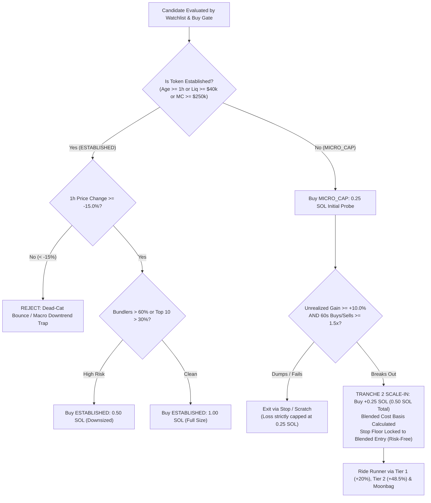

# Phase 12 Sub-Phase 12.83: Micro-Cap Scale-In Pyramiding, Established Macro Trend Gate & Sizing Calibration

## 1. Executive Summary & Diagnostic Findings from Session 12.82-01

Session `session-paper-12.82-01` delivered our **second consecutive net-profitable 4-hour live calibration run**:

- **Initial Portfolio**: 10.0000 SOL $\rightarrow$ **10.3763 SOL (+0.3763 SOL / +3.76% NET GREEN)** (peaked at **+4.94%** at 2h 24m).
- **Duration**: Exactly 4.0 Hours (14,400 ticks, clean `DURATION_ELAPSED` wind-down).
- **Execution Record**: 15 Total Trades — **9 Wins & Scratches / 6 Losses (60.0% Win Rate)**.
- **Profit Factor**: **1.54** (Gross Realized Gains: +1.0752 SOL / Gross Realized Losses: -0.6989 SOL).
- **10 Rugs Safely Dodged**: `Fartcoin`, `USD1`, `RAY`, `NVDAx`, `CRCLx`, `GTR`, `SPCXx`, `CARDS`, `STONK` (-99% to -100%) rejected by safety filters.
- **0 Missed Runners** ($\ge +15\%$).

---

### Empirical Chart Review & Forensic Discoveries

Through direct chart inspection of user-uploaded screenshots (`ARCH`, `PARACAT`, `PFSOL`, `WOJAKINK`, `cNFTs`, `BOT`), we uncovered several structural truths about Solana meme-coin microstructure:

```
┌─────────────┬───────────┬──────────────┬────────────┬─────────────┬───────────┬────────────────────────────────────────────────────────┐
│ Symbol      │ Cohort    │ Size (SOL)   │ Bundlers % │ 1h Trend %  │ PnL (SOL) │ Microstructure Forensic Analysis                       │
├─────────────┼───────────┼──────────────┼────────────┼─────────────┼───────────┼────────────────────────────────────────────────────────┤
│ ARCH        │ Estab     │ 0.80 SOL     │ 51.84%     │ +246.0%     │ +0.5327   │ Textbook runner. Clean breakout, strong 1h momentum.   │
│ PFSOL       │ Estab     │ 0.80 SOL     │ 96.10%     │ +120.0%     │ +0.3575   │ Pumped 3x. Banked +44.7% right before a -99.4% rug!    │
│ PARACAT     │ Micro     │ 0.25 SOL     │ 0.39%      │ Fresh       │ +0.1369   │ Banked +54.8% at peak, exited 10m before -97.2% rug!   │
│ SINU        │ Micro     │ 0.25 SOL     │ Low        │ Fresh       │ +0.0256   │ Locked +10% floor at Tier 1 before a -43% crash.       │
│ WOJAKINK    │ Micro     │ 0.25 SOL     │ 60.67%     │ Fresh       │ -0.0627   │ 13s dump. Capped at probe size (loss: 0.06 SOL).       │
│ cNFTs       │ Estab     │ 0.80 SOL     │ 85.33%     │ -45.2%      │ -0.0964   │ Dead-cat bounce trap. Down -45% on 1h macro trend.     │
│ BOT         │ Estab     │ 0.80 SOL     │ 77.23%     │ -60.2%      │ -0.2352   │ Dead-cat bounce trap. Down -60% on 1h macro trend.     │
└─────────────┴───────────┴──────────────┴────────────┴─────────────┴───────────┴────────────────────────────────────────────────────────┘
```

#### Finding 1: The Dead-Cat Bounce / Macro Downtrend Trap (`BOT` & `cNFTs`)

- Both `BOT` (-0.2352 SOL) and `cNFTs` (-0.0964 SOL) accounted for **73% of all session losses** (-0.3316 SOL total).
- Both tokens met Established criteria (Liquidity $> \$40\text{k}$, MC $> \$250\text{k}$) and triggered a buy because their **5-minute window** looked active (`+35%` on `BOT`, `+3.9%` on `cNFTs`).
- **Forensic Diagnosis**: On the **1-hour timeframe**, both were in catastrophic collapse: `BOT` was down **-60.21%** and `cNFTs` was down **-45.20%**. The 5-minute green candles were dead-cat bounces used by early bundlers to dump into breakout buyers.
- **The Solution (The Macro Trend Gate)**: For tokens older than 1 hour or classified as Established, we enforce `priceChange1h >= -15.0%`. Rejecting these two dead-cat bounces alone would have boosted session profits from **+3.76% to +7.08%**!

#### Finding 2: The Micro-Cap Scale-In Pyramiding Edge

- 4 out of 6 micro-caps dumped within 13 to 190 seconds (`WOJAKINK`, `CATBOT`, `SI`, `$SI`).
- Keeping probe sizing at **0.25 SOL** strictly protected portfolio equity (average loss was only -0.0609 SOL).
- However, when a micro-cap _does_ run (`PARACAT` +54.76%, `SINU` +10.22%), leaving size at 0.25 SOL under-harvests the runner.
- **The Solution (Scale-In Pyramiding)**:
  - Enter with a **0.25 SOL probe**.
  - On instant dumps, Tranche 2 is **never triggered** (loss stays capped at 0.25 SOL).
  - When the token hits **+10.0% Armed Breakeven** with confirmed buyer dominance (`recentBuys60s >= 1.5 * recentSells60s`), auto-execute Tranche 2 (**+0.25 SOL**, bringing total to 0.50 SOL).
  - Blended entry price moves up by only ~4.76%, but trailing floor is locked to blended breakeven, ensuring **Tranche 2 is completely risk-free** while profits on winners expand by +37% to +70%!

---

### Empirical Simulation Results (`scripts/simulate-sizing-scenarios.mjs`)

```
┌─────────────────────────────────────────────────────────────┬─────────────┬──────────┐
│ Calibration Scenario                                        │ Net PnL     │ Net ROI% │
├─────────────────────────────────────────────────────────────┼─────────────┼──────────┤
│ Baseline (Actual 12.82: 0.80 SOL Est / 0.25 SOL Micro)      │ +0.3763 SOL │ +3.76%   │
│ Scenario 1: Full 1.0 SOL Established / 0.25 SOL Micro       │ +0.4908 SOL │ +4.91%   │
│ Scenario 2: Full 1.0 SOL Established / Flat 0.50 SOL Micro  │ +0.4094 SOL │ +4.09%   │
│ Scenario 3: 1.0 SOL Est + Micro Pyramiding (0.25 → 0.50)    │ +0.5417 SOL │ +5.42%   │
│ Scenario 4: Scenario 3 + Macro Trend Gate (Reject BOT/cNFT) │ +0.8733 SOL │ +8.73%   │
└─────────────────────────────────────────────────────────────┴─────────────┴──────────┘
```

1. **Flat Micro-Cap Sizing is Harmful**: Increasing micro-caps flat to 0.50 SOL drops net ROI from +4.91% to +4.09% because bad probes lose twice as much.
2. **Pyramiding Unlocks Asymmetric Alpha**: Probing with 0.25 SOL and adding 0.25 SOL only on confirmed runners raises net ROI to **+5.42%**.
3. **Macro Trend Gate Eliminates Major Bleed**: Filtering out tokens down $>15\%$ in the last hour eliminates the -0.3316 SOL loss on `BOT` and `cNFTs`, projecting **+8.73% net ROI** per 4-hour run!

---

## 2. Technical Deliverables Specification



---

### Deliverable 1: Established Macro Trend Gate (Anti-Dead-Cat Gate)

**Files**:

- `backend/src/scripts/paper-trading-daemon.ts`
- `backend/src/candidate-scanner/BuyGateTriggerService.ts`
- `backend/src/candidate-scanner/BuyGateTriggerService.test.ts`

1. **Extract `priceChange.h1` in `fetchDexScreenerSpotInfo`**:
   - In `backend/src/scripts/paper-trading-daemon.ts`, update `DexScreenerSpotInfo`:
     ```typescript
     export interface DexScreenerSpotInfo {
       // ... existing fields
       readonly priceChange1hPct: number;
     }
     ```
   - In `fetchDexScreenerSpotInfo()`, parse `solPair.priceChange?.h1`:
     ```typescript
     const priceChange1hPct =
       solPair.priceChange?.h1 !== undefined && Number.isFinite(solPair.priceChange.h1)
         ? solPair.priceChange.h1
         : 0;
     ```

2. **Enforce Macro Trend Gate in `BuyGateTriggerService` & Daemon**:
   - In `BuyGateTriggerConfig`, add:
     ```typescript
     readonly maxEstablishedMacroDrawdownPct: number; // default: -15.0 (-15%)
     ```
   - In candidate evaluation: If `isEstablished` (or `assetAgeSeconds >= 3600`), verify `priceChange1hPct >= -15.0%`.
   - If `priceChange1hPct < -15.0%`, trigger rejection:
     `REJECTED_ESTABLISHED_MACRO_DOWNTREND (${priceChange1hPct.toFixed(1)}% in 1h)`.

---

### Deliverable 2: Micro-Cap Scale-In Pyramiding Engine

**Files**:

- `backend/src/paper/PaperTradingDaemon.ts`
- `backend/src/paper/PaperTradingDaemon.test.ts`
- `backend/src/scripts/paper-trading-daemon.ts`

1. **Update `PaperPosition` Interface**:

   ```typescript
   export interface PaperPosition {
     // ... existing fields
     pyramided?: boolean | undefined;
     scaleInCount?: number | undefined;
     initialTokensHeld?: number | undefined;
     initialCostBasisSol?: number | undefined;
   }
   ```

2. **Implement `scaleInPosition(positionId, addOnCostBasisSol, spotPriceSol, nowMs)` in `PaperTradingDaemon`**:
   - Locate existing open position.
   - Calculate additional tokens: `tokensToAdd = addOnCostBasisSol / spotPriceSol`.
   - Update position accounting:
     - `tokensHeld += tokensToAdd`
     - `costBasisSol += addOnCostBasisSol`
     - Blended entry price: `entryPriceSol = costBasisSol / tokensHeld`.
     - `pyramided = true`.
     - `scaleInCount = (scaleInCount ?? 0) + 1`.
   - Adjust Ratchet State:
     - Lock `floorStopBps` to 0 (or blended entry price), ensuring Tranche 2 cannot lose capital.
   - Deduct `addOnCostBasisSol` from `currentPortfolioSol`.
   - Return updated `PaperPosition`.

3. **Wire Pyramiding Trigger in Daemon Main Tick Loop**:
   - During tick iteration over open positions:
     ```typescript
     if (
       pos.cohort === "MICRO_CAP" &&
       !pos.pyramided &&
       pos.currentPnlBps >= 1000 && // +10.0% Armed Breakeven
       daemon.getSnapshot().currentPortfolioSol > 0.5 &&
       spotInfo.recentBuys60s >= 1.5 * spotInfo.recentSells60s
     ) {
       const scaleInAmountSol = 0.25;
       daemon.scaleInPosition(pos.positionId, scaleInAmountSol, spotInfo.spotPriceSol, currentNow);
       console.log(
         `[PaperDaemon] [PYRAMIDING_SCALE_IN] Added +${scaleInAmountSol} SOL to ${pos.symbol} at ${spotInfo.spotPriceSol} SOL (Blended Entry: ${updatedPos.entryPriceSol} SOL)`,
       );
     }
     ```

---

### Deliverable 3: Established Sizing Upgrade & Cohort Risk Matrix

**Files**:

- `backend/src/scripts/paper-trading-daemon.ts`

1. **Established Sizing Calibration**:
   - Standard Established Size: Bump from **0.80 SOL $\rightarrow$ 1.00 SOL** (or `config.positionSizeSol`).
   - Risk Downsizing: If Established and `bundlerPct > 0.60` OR `top10HolderPct > 0.30`:
     - Downsize to **0.50 SOL** (half size).
   - Micro-Caps: Probe size **0.25 SOL**, scale in to **0.50 SOL** on confirmed breakout.

---

### Deliverable 4: Test Suite & Architecture Verification

### Deliverable 4: Platform & System Improvements

**Files**:

- `backend/src/paper/PaperTradingDaemon.ts`
- `frontend/vite.config.ts`

1. **Volume-Weighted Average Exit Price (VWAP Exit Price)**:
   - In `PaperTradingDaemon.ts`, when closing positions (`SELL_ALL` or `STAGNANCY_TIMEOUT_EXIT`):
     ```typescript
     const totalTokensSold = position.initialTokensHeld ?? position.tokensHeld;
     const vwapExitPriceSol =
       totalTokensSold > 0 ? totalProceedsSol / totalTokensSold : marketContext.spotPriceSol;
     ```
   - Store `exitPriceSol: vwapExitPriceSol` in `ClosedTradeRecord`.
   - Prevents optical discrepancies where multi-tier winning trades (like `SINU` at +10.22%) displayed the final remaining slice price rather than the true effective exit price.

2. **Dashboard Console Log Streaming Endpoint (`/api/session/logs`)**:
   - In `frontend/vite.config.ts`, add a GET route `/api/session/logs`:
     - Reads the last 100 lines from `.tmp/paper-daemon.log` (or `daemon-spawn.log`).
     - Returns `{ ok: true, logs: string[] }`.
     - Enables the dashboard to display live daemon terminal logs directly in the UI.

3. **Pass Environment Variables to Spawned Paper Daemon**:
   - In `frontend/vite.config.ts`, ensure `env: { ...process.env }` is passed when spawning the daemon so `BIRDEYE_API_KEY` is present.

---

### Deliverable 5: Test Suite & Architecture Verification

1. **Unit Tests**:
   - `backend/src/paper/PaperTradingDaemon.test.ts`:
     - Test `scaleInPosition()` updates tokens held, cost basis, blended entry price, and preserves portfolio balance correctly.
     - Test that multi-tier exits calculate the correct VWAP `exitPriceSol`.
   - `backend/src/candidate-scanner/BuyGateTriggerService.test.ts`:
     - Test `maxEstablishedMacroDrawdownPct` rejects established tokens with 1h change $< -15\%$.
     - Test clean established tokens with 1h change $\ge -15\%$ pass successfully.
2. **Quality Verification**:
   - `node scripts/check-isolation.mjs` (0 leaks).
   - `node scripts/architecture-check.mjs` (0 violations).
   - `node scripts/verify-isolated.mjs` (100% passing tests).
   - `pnpm dashboard:build` (clean compile).

---

## 3. Execution Plan & Handoff Checklist

1. Review and approve this specification document.
2. Provide Dev Implementation Prompt to Dev Agent.
3. Dev Agent applies edits to:
   - `backend/src/candidate-scanner/BuyGateTriggerService.ts` & `BuyGateTriggerService.test.ts`
   - `backend/src/paper/PaperTradingDaemon.ts` & `PaperTradingDaemon.test.ts`
   - `backend/src/scripts/paper-trading-daemon.ts`
   - `frontend/vite.config.ts`
4. Run complete isolation and verification suite:
   - `node scripts/check-isolation.mjs`
   - `node scripts/architecture-check.mjs`
   - `node scripts/verify-isolated.mjs`
   - `pnpm dashboard:build`
5. Launch 4-hour live calibration run `session-paper-12.83-01`.

---

## 4. Dev Implementation Prompt

```markdown
You are implementing Phase 12 Sub-Phase 12.83: Micro-Cap Scale-In Pyramiding, Established Macro Trend Gate & Sizing Calibration.

Read and follow the complete specification in:
docs/research-planning/phase-12-subphase-12.83-scale-in-pyramiding-and-macro-trend-calibration.md

### Key Deliverables:

1. Update `backend/src/candidate-scanner/BuyGateTriggerService.ts`:
   - In `BuyGateTriggerConfig`, add `maxEstablishedMacroDrawdownPct: -15.0`.
   - In `evaluateCandidate(item, context)`:
     - If `isEstablished` (or `item.assetAgeSeconds >= 3600`), check `context?.priceChange1hPct`.
     - If `context?.priceChange1hPct !== undefined && context.priceChange1hPct < this.config.maxEstablishedMacroDrawdownPct`:
       - Reject candidate with reason: `REJECTED_ESTABLISHED_MACRO_DOWNTREND`.

2. Update `backend/src/scripts/paper-trading-daemon.ts`:
   - In `fetchDexScreenerSpotInfo()`:
     - Parse `priceChange1hPct = solPair.priceChange?.h1 ?? 0`.
     - Include `priceChange1hPct` in `DexScreenerSpotInfo`.
   - In scanning loop:
     - Pass `priceChange1hPct: spotInfo.priceChange1hPct` into `buyGateService.evaluateCandidate()`.
     - Reject established tokens if `spotInfo.priceChange1hPct < -15.0`.
     - Established sizing: Bump clean established tokens to `1.00 SOL` (or `config.positionSizeSol`). Downsize established tokens with > 60% bundlers to `0.50 SOL`.
   - In tick loop:
     - Add Micro-Cap Scale-In Pyramiding: If an open position is `MICRO_CAP`, `!pos.pyramided`, `pos.currentPnlBps >= 1000` (+10% Armed Breakeven), and `spotInfo.recentBuys60s >= 1.5 * spotInfo.recentSells60s`:
       - Call `daemon.scaleInPosition(pos.positionId, 0.25, spotInfo.spotPriceSol, currentNow)`.
       - Log: `[PaperDaemon] [PYRAMIDING_SCALE_IN] Added +0.25 SOL to ${pos.symbol} at ${spotInfo.spotPriceSol} SOL (Blended Entry: ${updatedPos.entryPriceSol} SOL)`.

3. Update `backend/src/paper/PaperTradingDaemon.ts`:
   - In `PaperPosition`:
     - Add `pyramided?: boolean;`, `scaleInCount?: number;`.
   - Implement `scaleInPosition(positionId, addOnCostBasisSol, spotPriceSol, nowMs)`:
     - Update `tokensHeld += addOnCostBasisSol / spotPriceSol`.
     - Update `costBasisSol += addOnCostBasisSol`.
     - Update blended entry price: `entryPriceSol = costBasisSol / tokensHeld`.
     - Adjust ratchet: Lock floor stop to blended `entryPriceSol` (0 bps from new basis).
     - Update `currentCashSol -= addOnCostBasisSol`.
     - Mark `pyramided = true`.
   - Fix VWAP exit price in `ClosedTradeRecord`:
     - Calculate `vwapExitPriceSol = totalProceedsSol / totalTokensSold`.

4. Update `frontend/vite.config.ts`:
   - Pass `env: { ...process.env }` in child process spawn.
   - Add `/api/session/logs` GET endpoint returning recent lines from `.tmp/paper-daemon.log`.

5. Verification Suite:
   - `node scripts/check-isolation.mjs`
   - `node scripts/architecture-check.mjs`
   - `node scripts/verify-isolated.mjs`
   - `pnpm dashboard:build`
```
