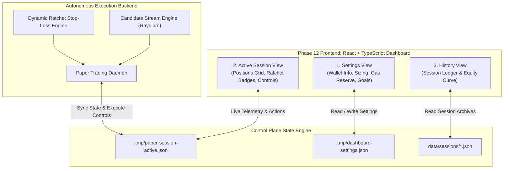
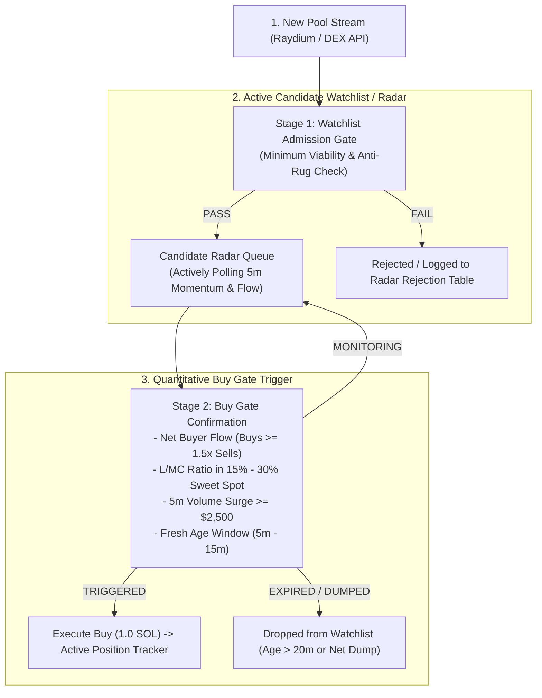
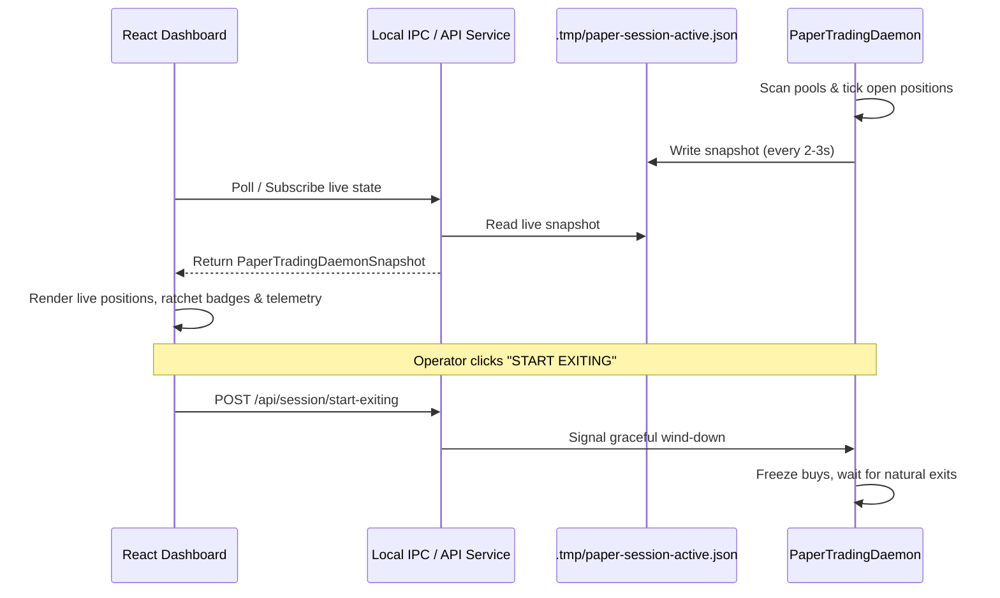

# NeXusTrade Phase 12: Interactive Trading Dashboard & Control Plane Scope Specification

**Status**: APPROVED FOR IMPLEMENTATION  
**Date**: 2026-09-24  
**Author**: Architecture & Planning Team  
**Governing Documents**:

- [Phase 11 Scope Proposal](file:///u:/Projects/TopG/docs/research-planning/phase-11-live-scanner-and-ratchet-engine-scope.md)
- [Phase 11 Conclusion & Baseline Report](file:///u:/Projects/TopG/docs/Phase-11-Conclusion-And-Baseline-Verification.md)

---

## 1. Executive Summary & Purpose

Phase 12 transforms NeXusTrade from terminal-driven scripts into an **interactive visual Trading Dashboard and Control Plane**. The operator gains real-time visibility into the autonomous scanning and dynamic ratchet execution stack, with immediate manual intervention controls, capital allocation guardrails, and historical performance tracking.

The dashboard architecture consists of three dedicated views:

1. **Settings View**: Configures session defaults, performs live wallet balance audits, reserves transaction gas buffers, and configures target profit goals.
2. **Active Session View**: Real-time cockpit displaying mark-to-market P/L, open positions with ratchet tier badges and stop-loss distance meters, 5-stat performance counters, activity logs, and session controls (including the graceful **"Start Exiting"** wind-down mode).
3. **Past Sessions / History View**: Historical ledger of completed trading sessions with metrics and an interactive cumulative equity curve chart.

---

## 2. Detailed View Specifications

### 2.1 Page 1: Settings View (`SettingsView.tsx`)

The Settings view provides the master control interface for defining trading parameters before or during sessions:

1. **Refresh Wallet Info**:
   - **SOL Balance Query**: Calls Solana RPC (`getBalance`) using the operator's configured public key.
   - **SPL Token Audit**: Calls `getTokenAccountsByOwner` to parse all non-SOL tokens held in the wallet, showing mint address, symbol, and token amount.
   - **Connection & Signature Readiness**: Validates that the wallet address is properly formatted and verifies keypair accessibility (read-only verification in paper mode; signature test in live mode).
2. **Position Sizing & Concurrency**:
   - **Max Concurrent Positions**: Interactive slider and numeric input bounded between `1` and `10` (default: `3`).
   - **Position Size**: Numeric input specifying SOL allocation per open position (default: `1.0 SOL`).
3. **Gas / Transaction Fee Reserve**:
   - **Fee Reserve Buffer**: Configurable SOL allocation dedicated to transaction fees and priority fees (e.g., `0.05 SOL` or `0.1 SOL`).
   - **Deployable Capital Calculation**:
     $$\text{Deployable SOL} = \max(0, \text{Total SOL} - \text{Gas Reserve})$$
   - Real-time indicator displaying maximum possible positions given deployable capital:
     $$\text{Capacity} = \left\lfloor \frac{\text{Deployable SOL}}{\text{Position Size (SOL)}} \right\rfloor$$
4. **Target Goal Setting (With Mode Toggle)**:
   - **Mode A: Portfolio % Gain Goal**: Operator sets a target session percentage (e.g., $+10.0\%$, $+15.0\%$).
   - **Mode B: Final Wallet SOL Target**: Operator sets an absolute equity target (e.g., $12.50\text{ SOL}$).
   - **Auto-Trigger Action**: When the session portfolio hits the configured target goal, the control plane automatically transitions the session into **`START EXITING`** graceful wind-down mode.

---

### 2.2 Page 2: Active Session View (`ActiveSessionView.tsx`)

The Active Session view is the real-time operational cockpit for the trading bot:

1. **Live Status Header**:
   - Status badge: `IDLE` (no active session), `RUNNING` (active scanning and trading), `PAUSED` (holds current positions, scanner frozen), `EXITING` (graceful wind-down), `COMPLETED` (duration reached or all trades closed).
   - Session elapsed timer and configured duration countdown.
2. **P/L Telemetry Banner**:
   - **Unrealized P/L**: Mark-to-market net change across all currently held positions ($SOL$ and `bps`/`%`).
   - **Realized P/L**: Total booked profit/loss from all closed positions in the current session ($SOL$ and `bps`/`%`).
   - **Total Session P/L**: $\text{Realized P/L} + \text{Unrealized P/L}$.
   - Portfolio equity: $\text{Current Cash (SOL)} + \sum \text{Open Position Values (SOL)}$.
3. **5-Stat Performance Counter Grid**:
   - **Open Positions**: e.g., `2 / 3` active.
   - **Closed Positions**: Total closed trade count for the session.
   - **Wins**: Trades closed with $\text{Realized PnL} \ge +1.0\%$ ($+100\text{ bps}$).
   - **Losses**: Trades closed with $\text{Realized PnL} < -1.0\%$ ($-100\text{ bps}$).
   - **Scratches**: Trades closed between $-1.0\%$ and $+1.0\%$ (break-even / momentum stall exits).
4. **Active Positions Grid / Cards**:
   For each held token:
   - Token symbol and truncated mint address (with link to Solscan/DexScreener).
   - Entry Price ($SOL$) and Current Spot Price ($SOL$).
   - Live PnL ($SOL$ and `bps`/`%`).
   - **Dynamic Ratchet Tier Badge**:
     - `ENTRY` (Initial stop-loss active at $-12.0\%$).
     - `SCRATCH ARMED` ($+0.5\%$ gain threshold crossed; armed to exit on stalled flow).
     - `SMART HOLD` ($-8.0\%$ dip detected; grace period active while buyers absorb).
     - `TIER 1 LOCKED` ($+24.0\%$ peak gain hit; $+20.0\%$ profit floor locked).
     - `TIER 2 LOCKED` ($+49.0\%$ peak gain hit; $+45.0\%$ profit floor locked).
   - **Stop-Loss Trigger Distance**:
     - Exact stop price floor in SOL.
     - Percentage distance from current price to trigger (e.g., `-4.2% away from stop`).
   - **Emergency / Manual Exit Button**: One-click market exit per position with confirmation dialog.
5. **Session Control Suite**:
   - **`PAUSE SESSION`**: Freezes candidate scanner (no new buys admitted); leaves the Dynamic Ratchet Engine running to manage existing open positions.
   - **`RESUME SESSION`**: Unfreezes scanner, allowing new buys up to concurrency capacity.
   - **`START EXITING` (Graceful Wind-Down)**:
     - Freezes all new buys.
     - **Does NOT market-dump open positions at a loss.**
     - Allows open positions to ride until they hit their natural scratch exit ($+0.5\%\text{ to }+1.5\%$) or higher locked profit targets ($+20\%$, $+45\%$).
     - Automatically terminates the session once all positions have closed organically.
   - **`EMERGENCY STOP`**: Kill-switch that market-closes all positions immediately and halts the daemon.
6. **Activity Log Stream**:
   - Real-time scrollable feed of candidate admissions, buy orders, ratchet floor advancements, and sell executions with reason codes.

---

### 2.3 Page 3: Past Sessions View (`HistoryView.tsx`)

The Past Sessions view provides retrospective analytics and performance attribution:

1. **Historical Session Ledger**:
   - Table of all historical trading sessions.
   - Columns: Session ID, Date/Time, Duration, Final Equity, Net PnL ($SOL$ & `bps`), Win Rate (%), Total Trades, Win / Loss / Scratch Breakdown, Max Drawdown.
2. **Cumulative Equity Curve**:
   - Interactive chart displaying account equity over time across sessions.
   - Benchmarked against starting capital to visualize geometric compounding and drawdown recovery.

---

## 3. Quantitative Strategy & Two-Stage Funnel: Watchlist Radar vs. Buy Gate Trigger (Phase 12B)

A critical architectural enhancement is decoupling **Watchlist Candidate Discovery** from **Immediate Buy Execution**. Instead of an all-or-nothing single check, NeXusTrade employs a two-tier screening pipeline:

### 3.1 Stage 1: Watchlist Radar Admission Criteria

To make it onto the operator's **Watchlist / Candidate Radar**, a newly discovered pool must satisfy basic viability filters:

1. **Initial Liquidity**: $\ge \$2,500\text{ USD}$ (filters out micro-dust pools).
2. **LP Security**: $\ge 90.0\%$ LP burn or permanent lock.
3. **Authorities**: Mint authority disabled/renounced; Freeze authority disabled/renounced.
4. **Active Trading**: At least 10 unique transactions recorded since pool open.

- _Visual Output_: Admitted candidates appear in the **Candidate Watchlist / Radar Table** on the Active Session Dashboard with live momentum indicators.

### 3.2 Stage 2: Buy Gate Trigger Criteria

A token on the Watchlist is only promoted to an **Active Buy Order** when strict momentum and balance conditions confirm buyer dominance:

1. **Maturity Sweet Spot**: $300\text{s} \le \text{Age} \le 900\text{s}$ (5–15 minutes old).
2. **Balanced Liquidity Depth**: $0.15 \le \text{L/MC} \le 0.30$ (15%–30% ratio prevents illiquid slippage and overvalued dilution).
3. **Net Buyer Dominance**: $\text{Buys}_{5m} \ge 1.5 \times \text{Sells}_{5m}$ (organic buyer absorption).
4. **Volume Acceleration**: $\text{Volume}_{5m} \ge \$2,500\text{ USD}$ with average transaction size $\ge \$25$.
5. **No Dev Dump**: Net inflow remains positive with no single seller disposing $> 5\%$ of liquidity.

### 3.3 Configurable Thresholds on the Settings Page

Operators can view and adjust these thresholds directly in `SettingsView.tsx`:

- Min / Max L/MC Ratio sliders (default: $15\% - 30\%$).
- Min Buy/Sell volume ratio (default: $1.5\times$).
- Min 5m Volume (default: $\$2,500$).
- Watchlist max capacity (e.g. track up to 20 candidates concurrently).

---

## 4. Technical Architecture & State Synchronization

1. **State Persistence**:
   - Daemon persists live snapshot to `.tmp/paper-session-active.json` on each tick.
   - Dashboard settings saved to `.tmp/dashboard-settings.json`.
   - Completed sessions archived to `data/sessions/{sessionId}.json`.
2. **IPC & Communication**:
   - Local REST / SSE endpoints or file-watcher polling ensures < 1s latency between daemon events and visual UI updates.
3. **Platform Compatibility**:
   - Runs natively on Windows without external dependencies.
   - Accessible via local web browser (`http://localhost:5173`).
