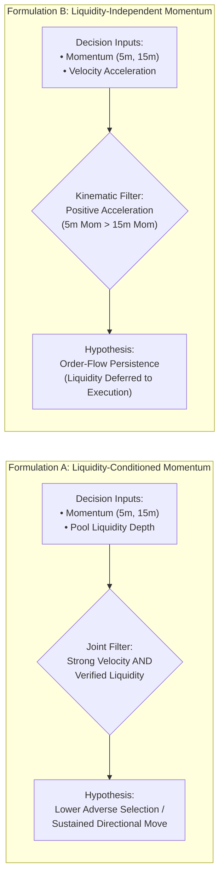
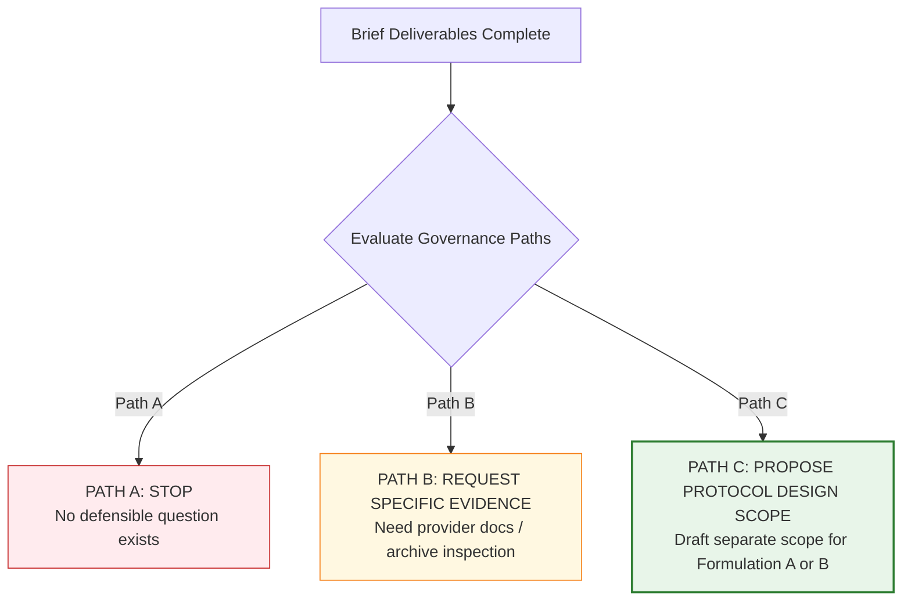

# Research-Question And Measurement-Requirements Brief

Status: **ACCEPTED BY USER ON 2026-09-24 — OPTION 1 SELECTED**

Date: 2026-09-24  
Author: Planning and Implementation Developer  
Decision Owner: User / Human Reviewer (Accepted with Option 1: Formulation B)  
Reference Scope: [Approved Post-B.4 Scope Proposal](../Post-B4-Research-Question-And-Measurement-Requirements-Scope.md)  

---

## Executive Summary and Governance Baseline

### 1. Context and Baseline Facts
This brief implements the authorized documentation-only work approved in [`docs/Post-B4-Research-Question-And-Measurement-Requirements-Scope.md`](../Post-B4-Research-Question-And-Measurement-Requirements-Scope.md). It operates strictly within existing internal repository documentation and maintains all established governance and safety boundaries.

The current project baseline is anchored by the following verified historical facts:
1. **No Existing Strategy Candidate**: Phase 10.6B (V2) closed with `NO_DEFENSIBLE_HYPOTHESIS` after evaluating 14 single-feature quartile screening rules on 60-minute binary return labels ([Closed V2 Checklist](../NeXusTrade-Phase-10.6B-Detailed-Checklist.md)).
2. **Unconfirmed Liquidity Measurement Capability**: Phase 10.6B.3 (V3) established that anchor-time liquidity availability was 60.344828% (Discovery) and 63.157895% (Validation), failing the frozen 90% availability gate in both partitions. Momentum facts passed only their specific V3 measurement gates ([Closed B.3 Checklist](../NeXusTrade-Phase-10.6B.3-Detailed-Checklist.md); [Integration Record](../Phase-10.6H-Main-Isolation-Integration.md)).
3. **B.4 Negative Decision and Unresolved Necessity**: Phase 10.6B.4 closed on 2026-09-24 with `NO_NEW_MEASUREMENT_PROTOCOL_JUSTIFIED` and liquidity necessity `UNRESOLVED` because no concrete future research question existed against which necessity, semantic equivalence, or material alternatives could be evaluated ([Accepted B.4 Decision Memo](../research-reviews/phase10.6b.4-proposed-decision-memo.md)).
4. **Engineering Baseline**: Packages H1–H4 completed analyzer integrity, accounting identity, provider concurrency controls, read facades, and guarded verification (merged at `88921e9` / `b6c9e87`). These controls supply execution and analysis safety, but do not provide research evidence or alter historical results ([H4 Verification Record](../Phase-10.6H-H4-Verification.md)).

### 2. Purpose of This Brief
Following user directional guidance, this brief:
- Formulates two bounded, momentum-driven candidate research questions (**Formulation A** requiring anchor-time liquidity, and **Formulation B** designed to be strictly independent of liquidity);
- Details their material differentiation from closed studies (V2 and V3);
- Establishes a comprehensive Decision-Time Fact and Measurement-Requirements Matrix;
- Constructs an Evidence, Assumptions, and Uncertainty Register addressing uncertainties U-01 through U-06; and
- Delivers a comparative Governance Recommendation evaluating next-step paths.

---

## Deliverable 1: Research-Question Formulation Statement



### 1. Formulation A: Liquidity-Conditioned Momentum Velocity

#### 1.1 Hypothesis Formulation
> **Hypothesis A**: Early-stage tokens exhibiting strong short-term upward price velocity ($\text{momentum}_{5m} > 0$ and $\text{momentum}_{15m} > 0$) *conditioned on a verified minimum anchor-time liquidity pool depth* ($\text{liquidityUsd} \ge L_{min}$) are significantly more likely to sustain positive forward 60-minute price continuation ($\text{return}_{60m} > 0$) than tokens exhibiting comparable price velocity with low, unverified, or missing liquidity.

#### 1.2 Target Population and Universe
- **Universe**: Canonical Solana decentralized exchange (DEX) discovery pool at slot anchor $t_0$.
- **Enrollment Unit**: Distinct token mint appearing in the discovery stream, sampled outcome-blind with deterministic partition assignment (Discovery vs. Validation).
- **Decision Anchor ($t_0$)**: The exact slot timestamp at token discovery enrollment.

#### 1.3 Role of Liquidity and Necessity Rationale
- **Role**: Serves as a mandatory decision-time conditioning and feasibility filter.
- **Causal / Mechanistic Logic**:
  1. *Adverse Selection Prevention*: In ultra-low-liquidity micro-cap tokens, sharp upward price momentum can be manufactured by trivial buy volume from single actors. Conditioning on verified liquidity depth filters out artificial price spikes.
  2. *Executable Capacity*: Signals occurring in pools with negligible depth cannot support execution without catastrophic slippage, rendering price continuation uncapturable.
- **Necessity Classification under Formulation A**: `REQUIRED`. The hypothesis explicitly tests the *interaction* between price velocity and pool depth; omission of liquidity invalidates the core predicate.

---

### 2. Formulation B: Liquidity-Independent Momentum Velocity & Acceleration

#### 2.1 Hypothesis Formulation
> **Hypothesis B**: Early-stage tokens exhibiting strong multi-interval upward price acceleration (where 5-minute price velocity substantially exceeds 15-minute price velocity, $\Delta_{\text{velocity}} = \text{momentum}_{5m} - \text{momentum}_{15m} > 0$, indicating expanding buying pressure) exhibit directional price continuation over a forward 60-minute window ($\text{return}_{60m} > 0$) driven purely by observable order-flow dynamics, *independent of decision-time pool liquidity quotes*.

#### 2.2 Target Population and Universe
- **Universe**: Identical canonical Solana DEX discovery stream at slot anchor $t_0$.
- **Enrollment Unit**: Distinct token mint appearing in the discovery stream, sampled outcome-blind with deterministic partition assignment.
- **Decision Anchor ($t_0$)**: The exact slot timestamp at token discovery enrollment.

#### 2.3 Rationale for Liquidity Independence
- **Role**: Liquidity is explicitly omitted from decision-time screening and selection.
- **Mechanistic Logic**:
  1. *Pure Kinematic Signal*: Formulation B isolates the question of whether observable price-series kinetics (velocity + acceleration) contain predictive signal independent of pool characteristics.
  2. *Separation of Selection from Execution*: Treats liquidity depth not as an informational input for alpha generation, but as an execution-layer constraint to be evaluated during downstream order-routing and fill simulation (e.g., in Phase 10.7A / 10.8B paper modeling).
  3. *Elimination of Provider Failure Surface*: Avoids conditioning signal validity on DEX-pool liquidity metadata, bypassing the exact measurement failure that disabled V3.
- **Necessity Classification under Formulation B**: `NOT_REQUIRED`. The research question focuses exclusively on price-action time series; liquidity is intentionally absent from the decision predicate.

---

### 3. Material Differentiation from Closed Studies

The table below demonstrates how both formulations materially differ from Phase 10.6B (V2) and Phase 10.6B.3 (V3):

| Dimension | Phase 10.6B (V2) Baseline | Phase 10.6B.3 (V3) Baseline | Formulation A (Proposed) | Formulation B (Proposed) |
| :--- | :--- | :--- | :--- | :--- |
| **Primary Focus** | Exploratory screening of 14 isolated, single-feature quartile rules. | Pure measurement-capability evaluation of 3 fixed facts. | Joint momentum-liquidity interaction hypothesis. | Kinematic price acceleration (multi-interval velocity delta) hypothesis. |
| **Mathematical Structure** | Single-variable quantiles: `MOMENTUM_5M__HIGH_V1` or `LIQUIDITY__HIGH_V1` independently. | Isolated availability counters for 3 independent facts. | Compound rule: Joint requirement ($\text{Mom}_{5m} > \theta_1 \land \text{Liq} \ge \theta_2$). | Differential rule: Relative rate of change ($\text{Mom}_{5m} - \text{Mom}_{15m} > \delta$). |
| **Role of Liquidity** | Single univariate quartile filter (tested in isolation; failed validation). | Mandatory measurement objective (failed availability gate at 60.34% / 63.16%). | Mandatory interaction filter to test adverse-selection suppression. | Explicitly omitted from decision-time selection; deferred to execution modeling. |
| **Research Output** | Tested hypothesis on 60m labels; produced `NO_DEFENSIBLE_HYPOTHESIS`. | Verified data collection capability; produced `MEASUREMENT_CAPABILITY_NOT_CONFIRMED`. | Candidate research question for future protocol design. | Candidate research question for future protocol design. |
| **Risk Profile** | Vulnerable to univariate over-simplification. | High measurement risk on external liquidity endpoints. | High measurement risk; requires solving liquidity availability. | Zero liquidity measurement risk; relies on proven momentum measurement. |

> [!IMPORTANT]
> **Epistemological Boundary**: Formulations A and B are candidate research hypotheses formulated for structured future study. Neither formulation constitutes an evidence-supported trading candidate or an authorized trading strategy.

---

## Deliverable 2: Decision-Time Fact and Measurement-Requirements Matrix

The matrix below defines every market fact required across both formulations, its mathematical definition, temporal freshness, measurement fitness criteria, and missingness semantics:

| Fact Identifier | Formulations | Necessity Class | Mathematical Semantics | Temporal & Freshness Constraint | Measurement Fitness & Quality Criteria | Missingness Semantics & Protocol Action |
| :--- | :--- | :--- | :--- | :--- | :--- | :--- |
| `market.priceUsd_anchor` | Both | `REQUIRED` | Finite non-negative USD price per token at anchor: $P(t_0) \in \mathbb{R}^+$. | Observation timestamp $t_{obs} \le t_0$; Maximum latency $\Delta t \le 60\text{s}$. | Must be derived from a validated transaction/pool trade; strictly zero future data ($t > t_0$). | If missing/non-finite, record `MISSING_ANCHOR_PRICE`. Unit cannot evaluate momentum or forward return; marked invalid. |
| `market.momentum5mPct` | Both | `REQUIRED` | 5-minute price velocity: $\frac{P(t_0) - P(t_0 - 300\text{s})}{P(t_0 - 300\text{s})} \times 100$. | Window start $t_{obs, -5m} \in [t_0 - 360\text{s}, t_0 - 240\text{s}]$; Window end at $t_0$. | Continuous finite percentage; verified anchor consistency; strictly zero post-$t_0$ leakage. | If missing/non-finite, record `MISSING_MOMENTUM_5M`. Gate fails for that unit; excluded from candidate evaluation. |
| `market.momentum15mPct` | Both | `REQUIRED` | 15-minute price velocity: $\frac{P(t_0) - P(t_0 - 900\text{s})}{P(t_0 - 900\text{s})} \times 100$. | Window start $t_{obs, -15m} \in [t_0 - 1020\text{s}, t_0 - 780\text{s}]$; Window end at $t_0$. | Continuous finite percentage; verified anchor consistency; strictly zero post-$t_0$ leakage. | If missing/non-finite, record `MISSING_MOMENTUM_15M`. Gate fails for that unit; excluded from candidate evaluation. |
| `market.momentumAccelerationPct` | B only | `REQUIRED` (B) / `NOT_REQUIRED` (A) | Kinematic acceleration: $\text{momentum5mPct} - \text{momentum15mPct}$. | Synchronously derived from valid 5m and 15m momentum facts at $t_0$. | Finite real number; strictly deterministic calculation; requires both base momentum facts valid. | If either underlying momentum fact is missing, record `UNCOMPUTABLE_ACCELERATION`. |
| `market.liquidityUsd_anchor` | A only | `REQUIRED` (A) / `NOT_REQUIRED` (B) | Aggregate USD value of token reserves in primary DEX pool: $L(t_0) = 2 \times \text{reserve}_{\text{base}} \times P_{\text{base}}(t_0)$. | Observation timestamp $t_{obs} \le t_0$; Maximum latency $\Delta t \le 60\text{s}$. | Finite non-negative USD float; pool-verified reserve snapshot; strictly zero post-$t_0$ leakage. | If missing/zero/timeout, record `MISSING_LIQUIDITY`. Under Formulation A: predicate evaluation fails. Under Formulation B: ignored. |
| `market.assetAgeSeconds` | Both | Context / Filter | Time elapsed since pool/mint creation: $t_0 - t_{\text{creation}}$ in seconds. | Creation timestamp verified on-chain; $t_{\text{creation}} \le t_0$. | Integer seconds $\ge 0$; immutable token genesis metadata. | If missing, record `MISSING_GENESIS_METADATA`. Default to unclassified age. |

### Comparative Analysis of Omission Risk

```text
┌──────────────────────────────────────────────────────────────────────────────────┐
│                             LIQUIDITY OMISSION IMPACT                            │
├────────────────────────────────────────┬─────────────────────────────────────────┤
│        Formulation A (Conditioned)     │       Formulation B (Independent)       │
├────────────────────────────────────────┼─────────────────────────────────────────┤
│ • Omission destroys test validity.     │ • Omission is intentional design.       │
│ • If liquidity is missing, cannot      │ • Avoids external provider missingness  │
│   filter out single-actor pump spikes. │   (which caused V3 60.3% failure).      │
│ • Unexecutable units enter selection,  │ • Execution slippage risk is deferred   │
│   causing adverse selection bias.      │   to downstream fill simulation models. │
└────────────────────────────────────────┴─────────────────────────────────────────┘
```

---

## Deliverable 3: Evidence, Assumptions, And Uncertainty Register

This register accounts for all empirical evidence, structural assumptions, candidate hypotheses, and open uncertainties:

| ID | Statement | Epistemological Class | Source Citation | Validity & Sufficiency | Limitations & Boundaries |
| :--- | :--- | :--- | :--- | :--- | :--- |
| **E-01** | V2 closed with `NO_DEFENSIBLE_HYPOTHESIS` across 14 single-feature quartile rules on 60m labels. | `OBSERVED_DOCUMENTARY_FACT` | [V2 Checklist §§1, 10](../NeXusTrade-Phase-10.6B-Detailed-Checklist.md) | Valid historical research fact. | Does not prove multi-variable or acceleration hypotheses are invalid. |
| **E-02** | V3 liquidity availability was 60.344828% (Disc) and 63.157895% (Val), failing the 90% gate in both partitions. | `OBSERVED_DOCUMENTARY_FACT` | [B.3 Checklist §10D](../NeXusTrade-Phase-10.6B.3-Detailed-Checklist.md); [Integration Record](../Phase-10.6H-Main-Isolation-Integration.md) | Valid historical measurement evidence. | Establishes availability deficiency under V3 contract; does not causally identify root provider defect. |
| **E-03** | V3 5m and 15m momentum availability, freshness, and date-support gates passed in both partitions. | `OBSERVED_DOCUMENTARY_FACT` | [B.3 Checklist §10D](../NeXusTrade-Phase-10.6B.3-Detailed-Checklist.md); [B.4 Ledger E-06](../research-reviews/phase10.6b.4-evidence-uncertainty-ledger.md) | Valid measurement evidence for V3 momentum contract. | Proves momentum measurement capability only; does not prove momentum trading profitability. |
| **E-04** | B.4 closed with `NO_NEW_MEASUREMENT_PROTOCOL_JUSTIFIED` and liquidity necessity `UNRESOLVED`. | `OBSERVED_DOCUMENTARY_FACT` | [Accepted B.4 Decision Memo §§4, 8](../research-reviews/phase10.6b.4-proposed-decision-memo.md) | Valid governance decision. | Closed within documentary scope; did not assert liquidity is permanently unmeasurable. |
| **E-05** | The 90% partition availability gate is frozen as a non-negotiable floor. | `OBSERVED_DOCUMENTARY_FACT` | [V3 Protocol](../research-protocols/phase10.6a-exploratory-cohort.v3.json); [B.4 Checklist §1](../NeXusTrade-Phase-10.6B.4-Detailed-Checklist.md) | Valid binding constraint. | Cannot be lowered to accommodate observed V3 performance. |
| **E-06** | H1–H4 engineering hardening completed containment, accounting identity, and read facades. | `OBSERVED_DOCUMENTARY_FACT` | [H4 Verification Record](../Phase-10.6H-H4-Verification.md); [Developer Handoff](../Phase-10.6H-Main-Developer-Handoff.md) | Valid engineering baseline. | Does not supply research evidence or change historical B.3 run provenance. |
| **A-01** | Low-liquidity tokens are subject to artificial price distortion, making liquidity filtering necessary for executable momentum signals. | `STRUCTURAL_ASSUMPTION` | Rationale for Formulation A (Market Microstructure Theory) | Plausible theoretical mechanism. | Not empirically proven within repository data; constitutes a hypothesis assumption. |
| **A-02** | Relative price acceleration ($\Delta_{mom} > 0$) reflects persistent order flow that can be evaluated independently of pool depth. | `STRUCTURAL_ASSUMPTION` | Rationale for Formulation B (Kinematic Signal Theory) | Plausible theoretical mechanism. | Assumes execution feasibility can be treated as a downstream modeling step. |
| **H-01** | Formulation A: Liquidity-conditioned momentum achieves statistically significant positive return continuation over 60 minutes. | `PROPOSED_HYPOTHESIS` | Formulation A Definition (§1 above) | Candidate research formulation. | Requires new protocol design, data collection, and empirical testing. |
| **H-02** | Formulation B: Liquidity-independent momentum acceleration achieves statistically significant positive return continuation over 60 minutes. | `PROPOSED_HYPOTHESIS` | Formulation B Definition (§2 above) | Candidate research formulation. | Requires new protocol design, data collection, and empirical testing. |
| **U-01** | What concrete future research question uses liquidity? | `RESOLVED_CONCEPTUALLY` | Formulation A (this brief, §1) | Resolved by providing a concrete formulation. | Empirical validity remains unverified. |
| **U-02** | What exact liquidity concept is necessary for that question? | `RESOLVED_CONCEPTUALLY` | Matrix definition `market.liquidityUsd_anchor` (this brief) | Resolved at requirements level. | Specific provider source/route remains unselected. |
| **U-03** | Why was V3 liquidity unavailable for ~40% of units? | `UNCERTAIN` | [B.4 Ledger U-03](../research-reviews/phase10.6b.4-evidence-uncertainty-ledger.md) | Unresolved by internal documentation. | Cannot be determined without external provider documentation or raw payload inspection. |
| **U-04** | Which materially different measurement method could achieve $\ge 90\%$ liquidity availability? | `UNCERTAIN` | [B.4 Assessment §3](../research-reviews/phase10.6b.4-liquidity-necessity-material-alternatives-assessment.md) | Unresolved for Formulation A. | Formulation B bypasses this uncertainty entirely by omitting liquidity. |
| **U-05** | What successor cohort sizes, dates, and budget parameters are justified? | `UNCERTAIN` | [Post-V3 Plan §4](../Post-V3-Development-Plan.md) | Planning-level placeholder. | Must be formally specified in a subsequent protocol design. |
| **U-06** | Could a future research question omit liquidity entirely? | `RESOLVED_CONCEPTUALLY` | Formulation B (this brief, §2) | Resolved by providing a complete, independent formulation. | Operational performance of the formulation remains unstudied. |

---

## Deliverable 4: Governance Recommendation And Path Evaluation

### 1. Evaluation of Bounded Paths



1. **PATH A: STOP**
   - *Condition*: Select if no coherent research question or measurement requirements could be formulated.
   - *Evaluation*: **Not Recommended**. The brief successfully formulated two distinct, falsifiable candidate research questions (Formulations A and B) that are materially differentiated from closed V2 and V3 studies.

2. **PATH B: REQUEST SPECIFIC EVIDENCE**
   - *Condition*: Select if advancing Formulation A requires resolving provider causality or evaluating external API specifications before a protocol can be conceptualized.
   - *Evaluation*: **Viable for Formulation A only**. If the user insists on pursuing Formulation A (liquidity-dependent), a bounded request for external provider documentation or a formal Supplemental Archive Inspection Request would be necessary to understand V3 missingness before designing a remediated liquidity protocol.

3. **PATH C: PROPOSE SEPARATELY REVIEWED PROTOCOL DESIGN SCOPE**
   - *Condition*: Select if a defensible question and complete measurement requirements are established.
   - *Evaluation*: **Recommended for Formulation B (Primary Path)**; **Conditionally Viable for Formulation A (Subject to Path B)**.
     - **Formulation B Advantage**: Bypasses the failed liquidity measurement dependency entirely. Because V3 empirically demonstrated that 5m and 15m momentum passed all availability, date-support, freshness, and provenance gates ($\ge 90\%$), Formulation B has a **proven, verified measurement foundation** ready for protocol design.
     - **Formulation A Consideration**: Inherits the unresolved liquidity availability deficiency (U-03/U-04). Proposing a protocol design for Formulation A without prior investigation of measurement alternatives risks a repeat failure of the frozen 90% availability gate.

---

### 2. Recommended Next Steps & User Governance Decision

The brief recommended Option 1 as the primary path. On 2026-09-24, the user reviewed the brief, accepted it as meeting all scope requirements, and made the following binding governance decision:

- **Accepted Decision**: **Option 1 (Proceed with Formulation B — Liquidity-Independent Momentum Acceleration)**.
- **Authorized Next Step**: Prepare a bounded **Scope Proposal for drafting a Protocol Design for Formulation B**.
- **Boundaries Preserved**: Documentation only, no archive access, no analyzer reruns, no code/tooling edits, no network queries, and no PAPER/execution actions.

| Option | Governance Action | Permitted Follow-On Work | Status |
| :--- | :--- | :--- | :--- |
| **Option 1 (Recommended)** | **Select Formulation B (Liquidity-Independent Momentum)** | Authorize drafting a bounded **Protocol Design Scope for Formulation B**, leveraging the proven V3 momentum measurement baseline to prepare a pre-registered exploratory study. | **SELECTED & APPROVED (2026-09-24)** |
| **Option 2** | **Pursue Formulation A with Evidence Request** | Authorize a bounded **Information Request** to examine public provider/API documentation regarding liquidity snapshot availability before attempting a protocol design. | Not Selected |
| **Option 3** | **Dual Protocol Design Scope** | Authorize drafting a comparative design scope specifying parallel candidate protocols for both formulations. | Not Selected |
| **Option 4** | **Reject / Stop** | Conclude research planning and preserve the brief as documentation closeout. | Not Selected |

---

## Approval Boundary

This brief is a documentation-only planning artifact. In accordance with Section 7 of the approved scope proposal:
- This brief **does not authorize**:
  - Accessing operational archives or databases;
  - Rerunning the production analyzer;
  - Writing or modifying production code or tooling;
  - Drafting, validating, or pre-registering a formal research protocol;
  - Querying external network providers or APIs;
  - Configuring schedulers or executing data collection;
  - Activating Phase 10.6C or altering live/paper strategy logic; or
  - Any PAPER trading, wallet access, signing, order submission, or live execution.
- Any subsequent action requires the user's explicit selection of an option and approval of a dedicated, bounded scope proposal.
