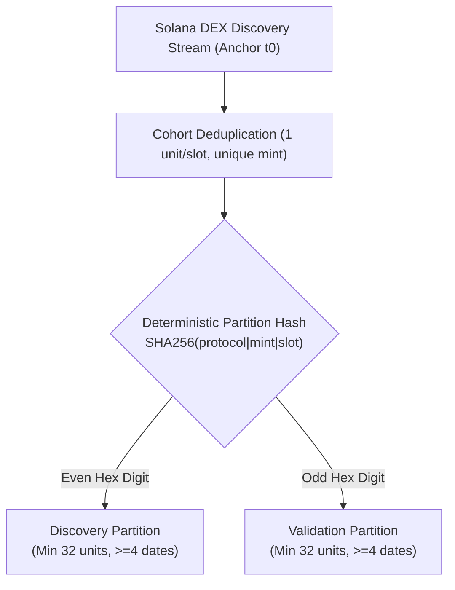
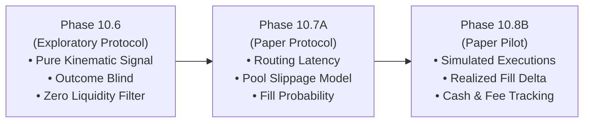

# Formulation B: Liquidity-Independent Momentum Acceleration Exploratory Protocol Design

Status: **DRAFT PROTOCOL DESIGN FOR REVIEW — NOT APPROVED FOR COLLECTION**

Date: 2026-09-24  
Author: Planning and Implementation Developer  
Decision Owner: User / Human Reviewer  
Governing Scope: [Approved Formulation B Protocol Design Scope](../research-planning/formulation-b-protocol-design-scope.md)  
Reference Brief: [Accepted Research-Question and Measurement-Requirements Brief](../research-planning/post-b4-research-question-measurement-requirements-brief.md)  

---

## 1. Formal Pre-Registration, Research Question, And Objective Statement

### 1.1 Research Question
```text
In early-stage Solana DEX discovery tokens, does decision-time kinematic price acceleration
(where 5-minute price velocity substantially exceeds 15-minute price velocity) identify persistent
buying pressure resulting in a statistically significant positive forward 60-minute price
continuation rate relative to the non-accelerating comparison population?
```

### 1.2 Formal Hypotheses
- **Null Hypothesis ($H_0$)**: Tokens satisfying the top-quartile Discovery price acceleration predicate exhibit a forward 60-minute positive return rate less than or equal to the non-accelerating comparison population:
  $$H_0: \text{PositiveRate}(\text{ACCELERATION\_\_HIGH\_V1}) \le \text{PositiveRate}(\text{Comparison})$$
- **Alternative Hypothesis ($H_1$)**: Tokens satisfying the top-quartile Discovery price acceleration predicate exhibit an independently replicated, statistically significant positive return rate advantage of at least 20 percentage points in Discovery and a positive rate difference in held Validation:
  $$H_1: \Delta_{\text{rate, disc}} \ge 0.20 \quad \land \quad \Delta_{\text{rate, val}} > 0.00$$

### 1.3 Candidate Selection Predicate
The candidate rule ID is fixed as `ACCELERATION__HIGH_V1`. It evaluates whether a unit's decision-time kinematic price acceleration is at or above the non-parametric third quartile ($Q_3$) derived exclusively from valid Discovery partition units:

$$\text{Predicate}(\text{unit}) = \begin{cases} \text{TRUE} & \text{if } \text{market.momentumAccelerationPct} \ge Q_3(\text{Discovery}) \\ \text{FALSE} & \text{if } \text{market.momentumAccelerationPct} < Q_3(\text{Discovery}) \end{cases}$$

- **Comparison Population**: All other valid units in the same partition that possess a finite available acceleration fact and do not satisfy the predicate ($\text{market.momentumAccelerationPct} < Q_3(\text{Discovery})$).

### 1.4 Pre-Registered Study Outcome Mappings
The study analysis command must emit exactly one of the following four mutually exclusive outcome classifications:

| Outcome State | Formal Meaning | Permitted Downstream Action |
| :--- | :--- | :--- |
| `PRE_REGISTRATION_READY_FOR_SEPARATE_APPROVAL` | Discovery effect $\ge 0.20$ AND Validation replication $> 0.00$, with all support, date diversity, concentration, and quality gates passing. | Authorizes drafting a formal, versioned Phase 10.6C Shadow Study Pre-Registration for human review. Does **not** authorize collection, strategy changes, PAPER, or trading. |
| `PRE_REGISTRATION_CANDIDATE_REJECTED` | Discovery effect $\ge 0.20$ but Validation replication fails ($\Delta_{\text{rate, val}} \le 0.00$) or fails validation support/date gates. | Preserve results in evidence ledger; reject candidate. No successor protocol authorized. |
| `NO_DEFENSIBLE_HYPOTHESIS` | Discovery effect fails ($\Delta_{\text{rate, disc}} < 0.20$) or Discovery support/date gates fail. | Preserve negative result; candidate discarded. |
| `DATA_INSUFFICIENT` | Cohort fails minimum valid unit count ($< 72$), partition minimums ($< 32$), date counts ($< 8$ total / $< 4$ per partition), date concentration ($> 20\%$), label coverage ($< 90\%$), or momentum availability ($< 90\%$). | Preserve incomplete cohort evidence and stop reasons; no candidate evaluation permitted. |

---

## 2. Population, Universe, Sampling, And Independence Design



### 2.1 Universe and Sampling Unit
- **Target Population**: New token liquidity pool creations and discovery events on the Solana network.
- **Sampling Anchor ($t_0$)**: The exact slot timestamp at discovery enrollment.
- **Sampling Rule**: Exactly one distinct token mint enrolled per discovery slot. Repeat mints within the same exploratory cohort are discarded at enrollment to prevent autocorrelation.

### 2.2 Deterministic Partitioning Rule
Partition assignment is computed deterministically from immutable token metadata at discovery enrollment, ensuring zero human intervention or post-hoc allocation:

$$\text{Partition}(\text{unit}) = \begin{cases} \text{DISCOVERY} & \text{if } \text{last\_hex\_digit}(\text{SHA256}(\text{"formulation-b-exploratory-protocol.v1"} \parallel \text{canonicalMint} \parallel \text{slotId})) \in \{0, 2, 4, 6, 8, a, c, e\} \\ \text{VALIDATION} & \text{if } \text{last\_hex\_digit}(\text{SHA256}(\text{"formulation-b-exploratory-protocol.v1"} \parallel \text{canonicalMint} \parallel \text{slotId})) \in \{1, 3, 5, 7, 9, b, d, f\} \end{cases}$$

- **Zero Overlap**: A token mint appearing in the Discovery partition cannot appear in the Validation partition ($\text{Mints}(\text{Discovery}) \cap \text{Mints}(\text{Validation}) = \emptyset$).

### 2.3 Planning Parameters and Independence Controls
- **Planned Cohort Size**: $N = 96$ units.
- **Minimum Valid Cohort Size**: $N_{min} = 72$ valid units.
- **Maximum Attempted Slots**: $S_{max} = 168$ slots.
- **Minimum Partition Sizes**: $\ge 32$ valid units in Discovery; $\ge 32$ valid units in Validation.
- **Date Diversity**: Total cohort must span $\ge 8$ distinct UTC dates; each partition must span $\ge 4$ distinct UTC dates.
- **Date Concentration Ceiling**: No single UTC date may supply more than $20.0\%$ of all valid cohort units ($N_{\text{date}} \le \lfloor 0.20 \times N_{\text{total}} \rfloor$).

---

## 3. Decision-Time Input Data Contract

### 3.1 Allowlisted Decision-Time Fields
All candidate selection features must be strictly observable at or before decision anchor $t_0$:

| Field Path | Type / Unit | Mathematical Semantics | Freshness & Temporal Limit | Purpose |
| :--- | :--- | :--- | :--- | :--- |
| `market.priceUsd_anchor` | Float (USD) | Instantaneous snapshot price: $P(t_0) > 0$. | $t_{obs} \le t_0$; $|t_0 - t_{obs}| \le 60\text{s}$. | Baseline anchor price for forward return computation. |
| `market.momentum5mPct` | Float (%) | 5-minute price percentage change: $\frac{P(t_0) - P(t_0 - 300\text{s})}{P(t_0 - 300\text{s})} \times 100$. | Window start: $[t_0 - 360\text{s}, t_0 - 240\text{s}]$; Window end: $t_0$. | Short-term price velocity. |
| `market.momentum15mPct` | Float (%) | 15-minute price percentage change: $\frac{P(t_0) - P(t_0 - 900\text{s})}{P(t_0 - 900\text{s})} \times 100$. | Window start: $[t_0 - 1020\text{s}, t_0 - 780\text{s}]$; Window end: $t_0$. | Intermediate price velocity. |
| `market.momentumAccelerationPct` | Float (%) | Kinematic price acceleration: $\text{momentum5mPct} - \text{momentum15mPct}$. | Derived synchronously from valid 5m and 15m momentum facts at $t_0$. | **Primary Candidate Feature**. |
| `market.assetAgeSeconds` | Integer (s) | Token age since genesis: $t_0 - t_{\text{creation}} \ge 0$. | Genesis timestamp $t_{\text{creation}} \le t_0$. | Descriptive cohort metadata. |

### 3.2 Explicit Prohibition of Liquidity Inputs
In accordance with Formulation B's approved design:
- `market.liquidityUsd`, pool reserve depths, and quote impact metrics are **strictly prohibited** from appearing as decision-time candidate inputs.
- No rule or predicate in this protocol may condition on, filter by, or impute liquidity depth.

### 3.3 Missingness Semantics
- Missing observations must be explicitly recorded using standard missingness codes (`MISSING_ANCHOR_PRICE`, `MISSING_MOMENTUM_5M`, `MISSING_MOMENTUM_15M`, `UNCOMPUTABLE_ACCELERATION`, `STALE_OBSERVATION`).
- If either base momentum fact is missing or non-finite, `market.momentumAccelerationPct` is recorded as `UNCOMPUTABLE_ACCELERATION`.
- Units with missing acceleration facts are excluded from candidate predicate evaluation; they are **never** imputed, assigned default zero values, or substituted.

---

## 4. Outcome Labeling, Horizons, And Temporal Isolation

### 4.1 Primary Candidate-Evaluation Label
The primary evaluation outcome is the forward 60-minute percentage return:

$$\text{return}_{60m} = \frac{P(t_0 + 3600\text{s}) - P(t_0)}{P(t_0)} \times 100$$

- **Observation Window**: Observation must occur within $t_0 + [3540\text{s}, 3660\text{s}]$ (target 60m $\pm 60\text{s}$).
- **Primary Binary Classification**:
  - `POSITIVE_60M`: Valid on-time observation with finite $\text{return}_{60m} > 0.00\%$.
  - `NON_POSITIVE_60M`: Valid on-time observation with finite $\text{return}_{60m} \le 0.00\%$.
  - `UNUSABLE_60M`: Missing observation, latency window exceeded ($> 60\text{s}$ error), non-finite price, or provider failure.

### 4.2 Secondary Descriptive Horizons
- Observations at 3 minutes ($t_0 + 180\text{s}$), 5 minutes ($t_0 + 300\text{s}$), and 15 minutes ($t_0 + 900\text{s}$) are recorded strictly for trajectory shape analysis and label quality verification.
- **Prohibition**: Secondary horizons are descriptive only; they must not be used to construct compound multi-horizon labels or modify candidate predicate selection.

### 4.3 Outcome Blindness and Structural Isolation
```text
┌────────────────────────────────────────────────────────────────────────┐
│                        TEMPORAL ISOLATION BARRIER                      │
├───────────────────────────────────┬────────────────────────────────────┤
│   Decision-Time Inputs (t <= t0)  │    Forward Outcome Labels (t > t0) │
├───────────────────────────────────┼────────────────────────────────────┤
│ • Anchor Price P(t0)              │ • Forward 3m, 5m, 15m Returns      │
│ • Momentum 5m & 15m               │ • Primary 60m Return Label         │
│ • Derived Acceleration            │ • Binary POSITIVE_60M /            │
│ • Quantile Threshold Q3           │   NON_POSITIVE_60M Classification  │
└───────────────────────────────────┴────────────────────────────────────┘
```
- Quantile threshold derivation ($Q_3$) and predicate assignment operate strictly within the `decisionTimeEvidence` data structure before consulting any forward outcome label.
- No forward price, return, or label value may be written into decision-time records.

---

## 5. Statistical Analysis Plan And Selection Gates

### 5.1 Discovery Quantile Derivation
1. Filter valid Discovery units possessing finite, available `market.momentumAccelerationPct` facts.
2. Construct sorted ascending vector of Discovery acceleration values $V_{\text{disc}} = \langle a_1, a_2, \dots, a_n \rangle$.
3. Compute third quartile index $k = \lceil 0.75 \times (n - 1) \rceil$.
4. Threshold $Q_3(\text{Discovery}) = V_{\text{disc}}[k]$.
5. No rounding, interpolation, winsorization, or label-guided tuning is permitted.

### 5.2 Discovery Selection Gates
The candidate rule `ACCELERATION__HIGH_V1` must satisfy all of the following fixed criteria in Discovery:

| Gate Identifier | Metric | Gate Requirement | Failure Consequence |
| :--- | :--- | :--- | :--- |
| `DISC_FEATURE_COVERAGE` | Available acceleration facts | $\ge 90.0\%$ of valid Discovery units | `DATA_INSUFFICIENT` |
| `DISC_RULE_SUPPORT` | Usable 60m units with Rule = TRUE | $N_{\text{rule, disc}} \ge 8$ usable units | `NO_DEFENSIBLE_HYPOTHESIS` |
| `DISC_COMP_SUPPORT` | Usable 60m units with Rule = FALSE | $N_{\text{comp, disc}} \ge 24$ usable units | `NO_DEFENSIBLE_HYPOTHESIS` |
| `DISC_DATE_DIVERSITY` | Distinct UTC dates with Rule support | $\ge 4$ distinct UTC dates | `NO_DEFENSIBLE_HYPOTHESIS` |
| `DISC_DATE_CONCENTRATION` | Max date share of Rule support | No single UTC date supplies $> 35.0\%$ of Rule support | `NO_DEFENSIBLE_HYPOTHESIS` |
| `DISC_EFFECT_GATE` | Positive rate difference | $\text{PositiveRate}_{\text{disc}}(\text{Rule}) - \text{PositiveRate}_{\text{disc}}(\text{Comp}) \ge 0.20$ | `NO_DEFENSIBLE_HYPOTHESIS` |

Where:
$$\text{PositiveRate}(\text{Group}) = \frac{\text{Count}(\text{POSITIVE\_60M in Group})}{\text{Count}(\text{Usable 60M Labels in Group})}$$

### 5.3 Validation Replication Gates
If Discovery selection passes, the exact Discovery threshold $Q_3(\text{Discovery})$ is applied to held Validation units without modification:

| Gate Identifier | Metric | Gate Requirement | Failure Consequence |
| :--- | :--- | :--- | :--- |
| `VAL_RULE_SUPPORT` | Usable 60m units with Rule = TRUE | $N_{\text{rule, val}} \ge 8$ usable units | `PRE_REGISTRATION_CANDIDATE_REJECTED` |
| `VAL_DATE_DIVERSITY` | Distinct UTC dates with Rule support | $\ge 4$ distinct UTC dates | `PRE_REGISTRATION_CANDIDATE_REJECTED` |
| `VAL_DATE_CONCENTRATION` | Max date share of Rule support | No single UTC date supplies $> 35.0\%$ of Rule support | `PRE_REGISTRATION_CANDIDATE_REJECTED` |
| `VAL_REPLICATION_GATE` | Positive rate difference | $\text{PositiveRate}_{\text{val}}(\text{Rule}) - \text{PositiveRate}_{\text{val}}(\text{Comp}) > 0.00$ | `PRE_REGISTRATION_CANDIDATE_REJECTED` |

If all Discovery and Validation gates pass, the study emits `PRE_REGISTRATION_READY_FOR_SEPARATE_APPROVAL`.

---

## 6. Downstream Execution-Modeling Interface And Prerequisites

Formulation B deliberately excludes liquidity depth from exploratory screening. To ensure end-to-end strategy validity before live execution, the protocol establishes strict requirements for downstream roadmap phases:



### 6.1 Prerequisites for Phase 10.7A (Paper-Pilot Protocol)
A positive exploratory finding under this protocol permits drafting Phase 10.7A, which must formally define:
1. **Order Latency Model**: Simulated interval between signal anchor $t_0$ and order placement $t_{\text{order}}$ ($\Delta t_{\text{exec}} \ge 2\text{s}$).
2. **Slippage & Impact Function**: Mathematical function modeling price impact as a function of trade size vs. pool reserve depth at $t_{\text{order}}$.
3. **Fill Probability & Rejection Function**: Explicit handling of illiquid, drained, or failed pools at execution time.

### 6.2 Prerequisites for Phase 10.8B (Controlled Paper Pilot)
1. Realized paper trade fills must record price delta relative to decision mark: $\Delta P_{\text{fill}} = P_{\text{fill}} - P(t_0)$.
2. All simulated transactions must account for transaction fees, priority fees, and DEX swap routing costs.

### 6.3 Non-Contamination Rule
Downstream execution simulation modeling belongs strictly to Phase 10.7A and 10.8B. Execution constraints must never be retroactively applied to alter the exploratory selection predicate in Phase 10.6.

---

## 7. Data Quality Gates, Safety Stops, And Non-Negotiable Floors

### 7.1 Preserved Frozen Availability Floor
- The protocol strictly enforces the frozen non-negotiable floor: **$\ge 90.0\%$ availability for required momentum facts (`market.momentum5mPct`, `market.momentum15mPct`) across valid units in both Discovery and Validation partitions**.
- If momentum availability falls below $90.0\%$ in either partition, the study fails closed with `DATA_INSUFFICIENT`.

### 7.2 Safety Stops
Collection must halt immediately and fail closed if any of the following conditions occur:
1. **Clock Drift Stop**: Local system clock drift relative to slot anchor $> 5.0\text{s}$.
2. **Schema Integrity Stop**: Received payload fails strict JSON schema validation, contains NaN/infinite floats, or omits required fields.
3. **Secret & Credential Stop**: Payload or log output contains strings resembling API keys, private keys, authorization headers, or environment secrets.
4. **Provider Concurrency & Rate Stop**: Exceeding 1 request per second or concurrency $> 1$ per provider category.

### 7.3 Zero Side-Effect Analysis Execution
In accordance with H1–H4 engineering standards:
- The analysis command executes as a pure read-only function over finalized immutable archive files.
- Zero network calls, zero provider requests, zero database reads/writes, zero filesystem writes, and zero wallet/transaction operations.

---

## 8. Archive Schema, Artifact Contract, And Provenance

The finalized archive must reside at an approved repository-relative path and contain exactly four immutable artifacts:

```text
data/archive/phase10.6a/formulation-b-<YYYYMMDD-HHMMZ>/
├── cohort-manifest.v1.json
├── units.v1.ndjson
├── source-inventory.v1.json
└── collection-summary.v1.json
```

### 8.1 Artifact Integrity Contract
1. **`cohort-manifest.v1.json`**:
   - Contains protocol SHA-256, collection launch metadata, final outcome, and exact SHA-256 hashes of `units.v1.ndjson`, `source-inventory.v1.json`, and `collection-summary.v1.json`.
   - Manifest must have `activeLock: false` and finalized state.
2. **`units.v1.ndjson`**:
   - Canonical line-delimited JSON. Each line is an immutable unit record containing `unitId`, `canonicalMint`, `slotId`, `partition`, `decisionTimeEvidence`, and `forwardOutcomeLabels`.
   - Canonically sorted ascending by `unitId`.
3. **`source-inventory.v1.json`**:
   - Sanitized provider provenance records, request counts, attempt counts ($= 1$), and latency buckets.
4. **`collection-summary.v1.json`**:
   - Aggregate statistics, partition unit counts, UTC date counts, date share percentages, and missingness tallies.

---

## 9. Approval And Governance Boundaries

### 9.1 Draft Status
This document is a **Draft Protocol Design for Review**. It establishes the complete experimental specification for Formulation B, but carries **zero operational authority**.

### 9.2 Explicit Default Denial
Approval of this protocol design document:
- Does **NOT** authorize creating an operational archive root;
- Does **NOT** authorize configuring or enabling the scheduler;
- Does **NOT** authorize invoking live network providers or collectors;
- Does **NOT** authorize modifying production analyzer or collector code;
- Does **NOT** authorize Phase 10.6C shadow validation or strategy activation; and
- Does **NOT** authorize PAPER trading, wallet loading, signing, order submission, or live execution.

### 9.3 Permitted Next Step
Upon human review and approval of this design document, the only permitted next step is to prepare a **bounded Scope Proposal for implementing and synthetically verifying the automated protocol validator and analysis tooling** under the H1–H4 isolated test framework (`scripts/verify-isolated.mjs`).
